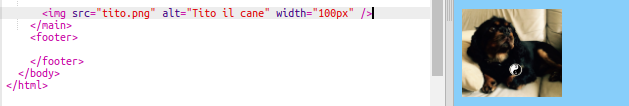

## Aggiungere foto

Aggiungiamo una foto!

- Vai alla scheda denominata `index.html`. Trova il tag `</main>` e digita quanto segue **sopra**: 

```html
    
```

Ecco come dovrebbe apparire il risultato:



Si noti che questo tag contiene alcune informazioni extra al suo interno. Sono chiamati **attributi**.

- Trova la parte di codice che dice `width = "100px"` e prova a sperimentare con numeri diversi per vedere se riesci a capire cosa fa questo attributo. Non cancellare le lettere `px`!

--- collapse ---
---
title: come funziona il tag `img`
---

Nota che il tag `` è diverso dagli altri tag che hai utilizzato fino ad ora - non esiste un tag `</img>` di chiusura. Invece, questo tag è **a chiusura automatica**: ha `/>` alla fine. Questo perché non c'è nessun 'inizio' e 'fine' per un elemento dell'immagine come per il testo sulla pagina.

Il tag contiene **attributi** con informazioni aggiuntive:

- L'attributo `src` indica al browser quale file utilizzare per l'immagine. 
- L'attributo `alt` è una breve descrizione che il browser mostrerà se non può visualizzare l'immagine. 'alt' è l'abbreviazione di 'alternativa'. Questo testo aiuta anche le persone che utilizzano uno screen reader per sapere quale sia l'immagine.
- L'attributo `width` indica al browser l'ampiezza con cui far apparire l'immagine. `100px` significa cento **pixel**, che sono i piccoli punti che compongono l'immagine che vedi sullo schermo. Se non si scrive questo attributo, l'immagine verrà visualizzata nella sua dimensione originale.

--- /collapse ---

Ora che conosci il codice per inserire un'immagine sul tuo sito web, probabilmente vorrai cambiare la foto, giusto?

- La prima cosa di cui avrai bisogno è, ovviamente, una foto! Puoi utilizzarne uno che hai già sul tuo computer, come una fotografia che hai scattato, o puoi prenderne uno da Internet.

[[[generic-get-picture-from-web]]]

**Nota:** non tutte le immagini che troverai su Internet sono liberamente utilizzabili da chiunque. Se si scarica un'immagine, è necessario assicurarsi che sia quella che si è autorizzati a utilizzare. Scopri di più su questo qui:

[[[images-permissions-to-use]]]

Una volta che hai una foto, puoi **caricare** il file su Trinket:

- Nel tuo trinket, fai clic sull'icona **immagine** accanto al segno **+**. 


Qui è dove puoi vedere le immagini che puoi impiegare nel tuo sito web. Dovresti vedere l'immagine di Tito, il cane di CoderDojo.

- Fare clic sul pulsante **Add Image** e quindi fare clic su **Upload**.

- Fare clic sul pulsante **Click To Select Images**. Trova e fai doppio clic sul file dell'immagine nella finestra apparirà.

- Fare clic su **Done**.


La tua foto verrà caricata e sarà pronta per l'uso.

- Vai al file `index.html` e trova il tag ``. Cambia il testo `tito.png` in modo che corrisponda esattamente al nome del file immagine che hai scelto. Nota che il suo nome potrebbe finire in `.jpg` invece di `.png`!

Il testo appena modificato è l'attributo chiamato `src`, che indica al browser quale file visualizzare.

**Nota:** il valore che scrivi per un attributo deve avere le virgolette `""` attorno ad esso!

--- challenge ---

## Sfida: cambia il testo alternativo dell'immagine

- Trova l'attributo `alt` del tuo elemento immagine e modifica il testo in esso contenuto in una breve descrizione della tua immagine. 

--- /challenge ---