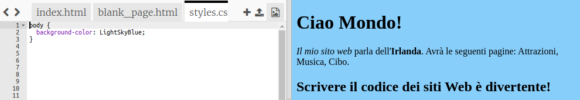
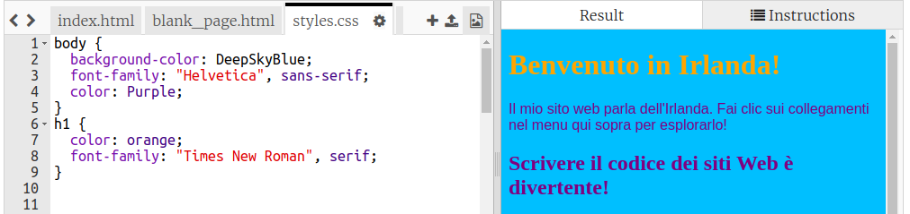

## Controllare come appare

Il codice che descrive l'aspetto di un sito web si chiama **CSS**.

- Guarda le schede nella parte superiore del pannello del codice e vai al file `styles.css` facendo clic sulla scheda con quel nome. Il file contiene il seguente testo:

```css
  body {
      background-color: white;
  }
```

- Modificare il `bianco` colore per `Lightskyblue` e guarda cosa succede. Il tuo sito web dovrebbe ora avere uno sfondo blu! 



## \--- collapse \---

## title: Come funziona?

Se guardi in cima al file `index.html` , vedrai la seguente riga:

```html
  <link type="text/css" rel="stylesheet" href="styles.css"/>
```

La riga precedente indica al browser di cercare un file speciale denominato `styles.css`. Questo file speciale è chiamato **foglio di stile**. È possibile riconoscere un file di fogli di stile dal `.css` nel suo nome.

Un foglio di stile contiene **regole** sul modo in cui deve apparire ogni elemento della pagina web.

Le parentesi graffe `{ }` e il codice tra loro sono un insieme di **regole CSS**. La parola `corpo` indica che le regole sono per tutti gli elementi `<body>` sul tuo sito web. Chiamiamo il bit davanti alle parentesi graffe un selettore ****. Quindi, in questo caso, è il selettore per gli elementi del corpo.

Ogni regola all'interno delle parentesi graffe è composta da:

- A **proprietà** a sinistra, seguita da un simbolo due punti `:`
- Un valore **** per la proprietà sul lato destro dopo i due punti
- Un simbolo di punto e virgola `;` alla fine

\--- /collapse \---

- Consente di aggiungere regole per modificare l'aspetto del testo. Aggiungi due nuove linee all'interno delle parentesi graffe:

```css
  body {
    background-color: LightSkyBlue;
    font-family: "Helvetica", sans-serif;
    color: purple;
  }
```

Guarda come questo ha cambiato la pagina web.

La proprietà `color` è sempre per il testo. Qui, si sta impostando il colore di tutto il testo nel `corpo` della pagina web.

- Puoi anche scrivere regole separate per le intestazioni e i paragrafi. Per `<h1>` le intestazioni, si utilizza il selettore `h1`. Sotto la parentesi graffa di chiusura contenente la regola CSS per il corpo, aggiungi il seguente codice.

```css
  h1 {
    color: orange;
    font-family: "Times New Roman", serif;
  }
```

Ora il testo della tua intestazione dovrebbe essere arancione, con il paragrafo viola come prima.



Notate come le lettere hanno anche un aspetto diverso oltre ad essere di un colore diverso? Questo perché hai cambiato la loro famiglia di font ****. Puoi trovare altri font [qui](http://dojo.soy/web-font-families).

- Prova ad aggiungere una serie di regole per i titoli `<h2>` , usando il selettore `h2`.

- Perché non sperimentare combinazioni di colori diverse per il testo e lo sfondo? Ci sono molti colori disponibili da usare. Trovi un elenco completo di loro [qui](http://dojo.soy/web-color-names).