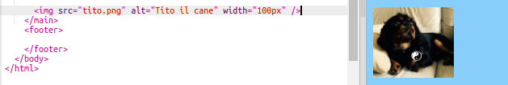

## Aggiungere foto

Aggiungiamo una foto!

- Vai alla scheda denominata `index.html`. Trova il tag `</main>` e digita il seguente **sopra**: 

```html
    
```

Ecco come dovrebbe apparire il risultato:



Si noti che questo tag contiene bit di informazioni extra al suo interno. Sono chiamati **attributi**.

- Trova il bit di codice che dice `width = "100px"` e prova a sperimentare con numeri diversi per vedere se riesci a capire cosa fa questo attributo. Non cancellare le lettere `px`!

\--- chiudi \---

* * *

## title: come funziona il tag ``

Nota che il tag `` è diverso dagli altri tag che hai utilizzato fino ad ora - non esiste un tag `</img>` chiusura. Invece, questo tag è **temporizzato**: ha `/>` alla fine. Questo perché non c'è nessun 'inizio' e 'fine' per un elemento dell'immagine come per il testo sulla pagina.

Il tag contiene **attributi** con informazioni aggiuntive:

- L'attributo `src` indica al browser quale file utilizzare per l'immagine. 
- L'attributo `alt` è una breve descrizione che il browser mostrerà se non può visualizzare l'immagine. 'alt' è l'abbreviazione di 'alternativa'. Questo testo aiuta anche le persone che utilizzano uno screen reader per sapere quale sia l'immagine.
- L'attributo `larghezza` indica al browser l'ampiezza per rendere l'immagine. `100px` significa cento **pixel**, che sono i piccoli punti che costituiscono ciò che vedi sullo schermo. Se non si include questo attributo, l'immagine verrà visualizzata nella sua dimensione originale.

\--- / chiudi \---

Ora che conosci il codice per inserire un'immagine sul tuo sito web, probabilmente vorrai cambiare la foto, giusto?

- La prima cosa di cui avrai bisogno è, ovviamente, una foto! Puoi utilizzarne uno che hai già sul tuo computer, come una fotografia che hai scattato, o puoi averne uno da Internet.

[[[generic-get-picture-from-web]]]

**Nota:** non tutte le immagini che troverai su Internet sono gratuite per chiunque lo usi. Se si scarica un'immagine, è necessario assicurarsi che sia quella che si è autorizzati a utilizzare. Scopri di più su questo qui:

[[[images-permissions-to-use]]]

Una volta che hai una foto, puoi **caricare** il file su Trinket:

- Nel tuo gingillo, fai clic sull'icona **immagine** accanto al segno **+**. 


Qui è dove puoi vedere le immagini che sei in grado di utilizzare sul tuo sito web. Dovresti vedere l'immagine di Tito, il cane CoderDojo.

- Fare clic sul pulsante **Aggiungi immagine** e quindi fare clic su **Carica**.

- Fare clic sul pulsante **Fare clic per selezionare i file**. Trova e fai doppio clic sul file immagine nella finestra che si apre.

- Fare clic su **Fatto**.


La tua foto verrà caricata e dovrebbe essere pronta per l'uso.

- Vai al file `index.html` e trova il tag ``. Cambia il testo `tito.png` modo che corrisponda esattamente al nome del file immagine che hai scelto. Nota che il suo nome potrebbe finire in `.jpg` invece di `.png`!

Il testo appena modificato è l'attributo chiamato `src`, che indica al browser quale file visualizzare.

**Nota:** il valore che scrivi per un attributo deve avere le virgolette `""` attorno ad esso!

\--- sfida \---

## Sfida: cambia il testo alternativo dell'immagine

- Trova l'attributo `alt` del tuo elemento immagine e modifica il testo in esso contenuto in una breve descrizione della tua immagine. 

\--- / challenge \---