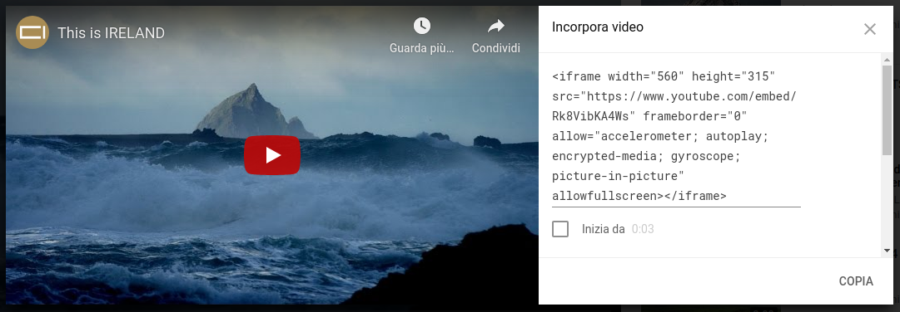

## Aggiungere una mappa o un video

YouTube offre un modo semplice per aggiungere i suoi video al tuo sito web. L'aggiunta di elementi da altre fonti online al tuo sito web viene anche chiamata **incorporamento o embedding**.

- Trova un video su YouTube che desideri mostrare sul tuo sito web.

- Fai clic sul pulsante **Condividi** sotto il video. Seleziona l'opzione **incorpora o embed**.

Vedrai una casella di testo con tutto il testo selezionato. Se per errore si deseleziona il testo, è possibile selezionarlo nuovamente facendo clic su di esso e premendo i tasti <kbd>Ctrl</kbd> (o <kbd>cmd</kbd> su un Mac) e <kbd>A</kbd> contemporaneamente.

- Premere i tasti <kbd>Ctrl</kbd> (o <kbd>cmd</kbd> su un Mac) e <kbd>C</kbd> insieme per copiare il testo.

- Quindi torna al codice HTML del tuo sito Web e fai clic nel punto in cui desideri inserire il video, ad esempio sotto un'intestazione o un paragrafo. **Incolla** il codice premendo <kbd>Ctrl</kbd> (o <kbd>cmd</kbd> su un Mac) e <kbd>V</kbd> sulla tastiera allo stesso tempo. Non preoccuparti di capire tutto il codice che hai appena incollato!

Dovresti vedere il video apparire sulla tua pagina web.

La stessa tecnica funziona anche per le mappe di Google. Provaci!

- Vai [qui](http://dojo.soy/google-maps) e cerca un luogo che vuoi mostrare sul tuo sito web. **Nota:** **non** condividere informazioni personali come il tuo indirizzo di casa su un sito web!

- Clicca sul risultato, quindi clicca sul pulsante **Condividi** e copia il codice per aggiungerlo al sito web come sopra. 

- Se osservi attentamente, dovresti trovare **gli attributi** `larghezza` e `altezza` nel codice incollato. Puoi cambiare i loro valori per far apparire la mappa più grande o più piccola.

