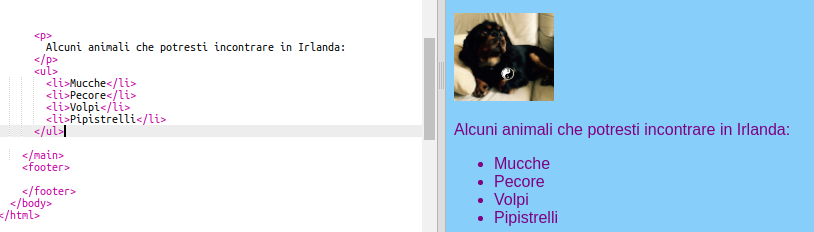
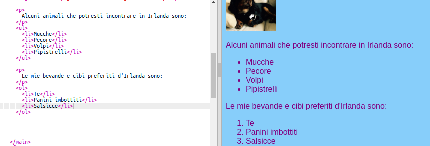

## Fare una lista

Ora imparerai come trasformare una lista di elementi, come "unicorni, robot, gatti", in una lista dall'aspetto più gradevole con cui potrai fare cose interessanti più tardi.

- Nel file `index.html` , aggiungi il seguente codice appena sopra la riga con `</main>` su di esso:

```html
    <ul>
        <li>Mucche</li>
        <li>Pecore</li>
        <li>Volpi</li>
        <li>Pipistrelli</li>
    </ul>
```

Il risultato dovrebbe essere una bella lista come questa:



Si noti c'è una coppia separata di tag `<li> </li>` attorno a ciascun elemento nell'elenco.

Questa è una lista di alcuni animali che potresti vedere in Irlanda. Puoi modificare gli elementi nell'elenco con ciò cheha senso per il tuo sito web e aggiungere un paragrafo sopra l'elenco per descrivere di cosa si tratta, se ti piace!

Che ne dici se volessi una lista numerata? È quasi la stessa cosa, ma invece di `<ul>`, usi `<ol>`. Un elenco numerato è anche chiamato elenco **ordinato**.

- Aggiungere il seguente codice sotto il codice appena scritto - assicurarsi che sia **sotto** del `</ul>` tag!

```html
    <p>
        Il cibo e le bevande dell'Irlanda che preferisco sono:
    </p>
    <ol>
        <li>Tè</li>
        <li>Panini croccanti</li>
        <li>Salsicce</li>
    </ol>
```

Ecco come dovrebbe apparire ora:



\--- challenge \---

## Sfida: aggiungi stile ai tuoi elenchi

- Verifica se puoi aggiungere **regole CSS** al tuo foglio di stile per modificare l'aspetto dei tuoi elenchi.

\--- /challenge \---