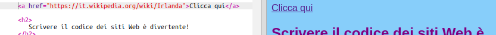

## Creare collegamenti

Su questa scheda imparerai come creare un collegamento che ti porta in un'altra pagina quando viene cliccato.

- Aggiungi il seguente codice alla sezione body di `index.html`:

```html
  <a href="">Clicca qui</a>
```

I tag `<a> </a>` trasformano tutto ciò che è in mezzo a loro in un link.

- Prova a fare clic sul tuo link per vedere cosa succede. Non fa niente, giusto?

Questo perché l'attributo `href` è vuoto al momento. Deve contenere l'URL **** (indirizzo web) della pagina a cui si desidera collegare.

- Vai su Wikipedia e trova una pagina su qualcosa sul tuo sito web. Userò la pagina sull'Irlanda.

- Fai clic sulla barra degli indirizzi e seleziona tutto il testo in i5. Questo è l'URL completo della pagina in cui ti trovi. premi il <kdb>Ctrl</kdb> (o <kdb>cmd</kdb>) e <kdb>C</kdb> chiavi allo stesso tempo per copiarlo.
    
    

- Nel tuo gingillo, clicca tra le virgolette dopo `href =` e premi il tasto <kdb>Ctrl</kdb> (o <kdb>cmd</kdb>) e <kdb>V</kdb> chiavi allo stesso tempo per incollare l'URL appena copiato. Il tuo codice dovrebbe apparire in questo modo ora:

```html
  <a href="https://en.wikipedia.org/wiki/Ireland">Clicca qui</a>
```

Hai appena creato il tuo primo link! Fare clic su di esso per vedere se funziona ora.



## \--- chiudi \---

## titolo: collegamenti ad altri siti web

Trinket ha problemi con alcuni indirizzi web. Puoi provare URL di siti diversi da Wikipedia, se preferisci, ma potrebbero non funzionare nel tuo gingillo. Tuttavia, se dovessi scaricare il tuo progetto e visualizzare i file in un browser web, vedresti che i collegamenti funzionano.

\--- / chiudi \---

- Prova a mettere una foto tra i tag `<a> </a>` invece delle parole `Fai clic qui`, in questo modo:

```html
  <a href="https://en.wikipedia.org/wiki/Ireland">
      
  </a>
```

- Clicca sulla tua foto Vedi che è stato trasformato in un link?

Puoi inserire un link anche in altri elementi della tua pagina web, ad esempio in un paragrafo o anche in un elenco. Ecco un esempio di una frase con un link in esso:

```html
  <p>
    <a href="https://en.wikipedia.org/wiki/Ireland">Clicca qui</a> per leggere la pagina di Wikipedia!
  </p>
```

\--- sfida \---

## Sfida: inserisci un link in una lista

- Verifica se è possibile creare un elenco che contiene un collegamento all'interno di una delle voci dell'elenco.

\--- / challenge \---