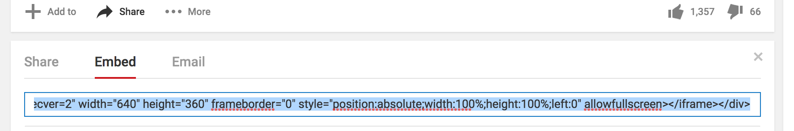

## マップとビデオの追加

- ボーナス: ビデオを追加しましょう。YouTubeは、ウェブサイトに動画を**埋め込む \(embed\) **ための簡単な方法を用意しています。あなたのサイトに埋め込みたいビデオを探しましょう。

- "共有" ボタンボタンをクリックして、"埋め込みコード" を選びます。

- 選択済みのテキストボックスを見ることが出来ます。\(もし、テキストが選択されていなければ、テキストエリアをクリックして **Ctrl** \(もしくは **cmd**\) を押しながら、**A** キーを事前に押してください。\) そして、**Ctrl** \(もしくは **cmd**\) を **C**キーと一緒に押します。クリップボードにテキストがコピーされます。
  

- HTMLコードに戻ります。そして、ビデオを挿入したい場所をクリックします。例えば、見出しや段落の後などです。**Ctrl** \(もしくは **cmd**\) と **V** キーを一緒に押して、テキストをペーストしてください。今回、ペーストしたコードの中身については理解する必要はありません!
  

- Run をクリックして、ビデオが表示されているかを確認しましょう。

- 同じようなテクニックをGoogle Mapでも利用することができます。やってみましょう。[dojo.soy/google-maps](maps.google.com)  に行き、ウェブサイトで表示したい場所を探します。そして、共有ボタンを押してコードを手に入れてあなたのウェブサイトに同じように埋め込みます。 
  

- よくみると貼り付けたタグの中に`width` と `height` 属性を見るけることが出来ます。 この値を変更することで、マップを大きくしたり小さくしたりすることができます。
  

