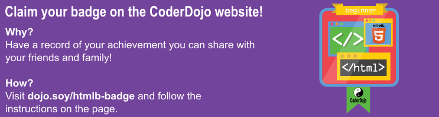

## プロジェクトのダウンロード

- 作ったコードをダウンロードしましょう。コードパネルの左上にある3つの線のあるボタンをクリックしてください。そしてダウンロードをクリックします。 
  

- A zip file will be downloaded. It contains all the files for your website. コンピューターに zip ファイルがダウンロードされます。 このファイルには、作成したすべてのファイルが入っています。

- zipファイルを開き、その中にある index.html というファイルを見つけることができます。知っての通り、このファイルはホームページです。ダブルクリックすると、**ブラウザ**により開かれます。リンクをクリックしてあなたの作った素晴らしい成果を探検してみましょう!

- ブラウザの画面の上部にページのタイトルを見つけることができますか? これは、それぞれのページのタイトルになります。この文字列は、`<title> </title>` タグの中身です。
  

- 開いている画面を閉じて、ファイル一覧の画面に戻りましょう。index.html を再び探します。そして、今度は右クリックをして \(Macで"右クリック"をするには、Ctrlを押しながらクリックするか、2本指でクリックしてください!\), "プログラムから開く &gt;" を選択し、Notepad, Notepad++, Sublime Text といったエディタを選択してください。Trinketのコードパネルにあった、すべてのHTMLタグを見ることが出来ます。
  Mac を使っている場合は、テキストエディタを先にインストールする必要があります。

- 知っての通り、ウェブページはただのタグによって作られたテキストによって作られています。ウェブページとコードが実際のところ同じファイルであることがわかります。ただし、**ブラウザ**で見るとテキストデータが見えて、**テキストエディタ**で見ると**コード** \(テキストやタグ\)が見えるのです。

- おめでとうございます。プロジェクトを他の人にぜひシェアしてください! Save ボタンの右に、Share ボタンがあります。
  

