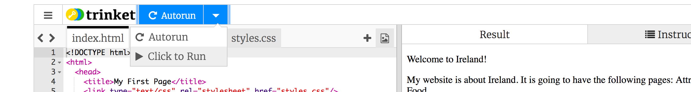

## はじめに

- もしアカウントをまだ持っていなかったら dojo.soy/trinket のページにアクセスし、"Sign Up For Your Free Account" をクリックします。サインアップするにはメールアドレスが必要です。 

- メールアドレスとパスワードを入力するか、誰かにやり方を聞きましょう。

- アカウントを作成すると、作業を保存してどのコンピュータからでもアクセスできます。また、他の誰かがあなたと共有しているプロジェクトのコピーを作成して、独自の変更を加えることもできます。

- dojo.soy/html-sushi-project のページにアクセスします。サンプルが書かれているウェブサイトが表示されます。右側はウェブサイトで、左側がウェブサイトを作るためのコードです。
  サインインをしてない場合、プロジェクトをリミックスをするためにはメールアドレスとパスワードを入力する必要があります。

- プロジェクトの右上にある"Remix"ボタンをクリックします（ボタンが緑色ではない場合、再度サインインしボタンをクリックします。）これにより、作業するプロジェクトのコピーが作成されます。それをクリックすると "Remix"と表示されるはずです。

- ユーザー名とドロップダウンメニューはページの右上の角の"Sign Out"ボタンのそばにあります。（小さな三角形はドロップダウンがあることを意味します）。それをクリックするとメニューが表示され"My Trinkets"を選択します。
  
  
  Trinketでは、プロジェクトのことを"Trinkets"と呼びます。

- リミックスしたプロジェクトはその他のプログラミング言語のプロジェクトと一緒に表示される。"My First Website Remix"と書かれています。クリックすると編集ができます！

- ページの主要部分は2つのパネルに分割されています。左側はコードを書くところです。違うコードファイルはタブとして表示されます。右側はWEBサイトです！間にある灰色のバーは、ドラッグしてウェブサイトとコードパネルの幅を調整するためのスライダーです。

- コードパネルの左上には、プロジェクトの名前が表示されます。もし名前を変更したいなら、それをクリックし、新しい名前を入力し、エンターを押すと変更できます。スシカードのWEBサイトはアイルランドについて書かれていますが、あなたの好きなものについて書いても大丈夫です。

- "Autorun"ボタンの側にある三角のアイコンをクリックし、"Click To Run"を選択します。
  

- コーディングを開始する準備ができました！

