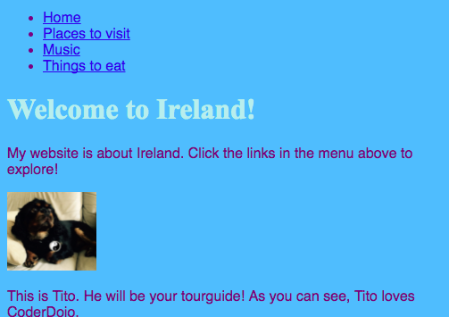

## ನಿಮ್ಮ ವೆಬ್‌ಸೈಟ್ ಅನ್ನು ಸಂಚರಣಿಸುವುದು

ಪುಟಗಳ ನಡುವೆ ಭೇಟಿ ನೀಡಲು ಸಂದರ್ಶಕರಿಗೆ ಸಹಾಯ ಮಾಡಲು ಅನೇಕ ವೆಬ್‌ಸೈಟ್‌ಗಳು **ನ್ಯಾವಿಗೇಷನ್** ಮೆನುವನ್ನು ಹೊಂದಿವೆ. ಈಗ ನೀವು ಪ್ರತಿ ಪುಟಕ್ಕೆ ಪುಟಗಳ ಗುಂಪೇ, ಮುಖಪುಟ ಮತ್ತು ಲಿಂಕ್‌ಗಳನ್ನು ಪಡೆದುಕೊಂಡಿದ್ದೀರಿ, ಪ್ರತಿ ಪುಟದ ಮೇಲ್ಭಾಗದಲ್ಲಿರುವ ಸಂಚರಣೆಯ ವಿಭಾಗಕ್ಕೆ ಲಿಂಕ್‌ಗಳ ಪಟ್ಟಿಯನ್ನು ಸರಿಸೋಣ.



- ಹಿಂದಿನ ಹಂತದಲ್ಲಿ ನೀವು ರಚಿಸಿದ ಲಿಂಕ್‌ಗಳ ಪಟ್ಟಿಗಾಗಿ ಕೋಡ್ ಅನ್ನು ಹುಡುಕಿ.

- ಆರಂಭಿಕ `<ul>` ಟ್ಯಾಗ್‌ಗೆ ಸ್ವಲ್ಪ ಮೊದಲು, ಹೊಸ ಖಾಲಿ ರೇಖೆಯನ್ನು ರಚಿಸಲು **ಎಂಟರ್** ಅನ್ನು ಒತ್ತಿ, ನಂತರ ಹೊಸ ಸಾಲಿನಲ್ಲಿ ಈ ಮುಂದಿನ ಟ್ಯಾಗ್ ಅನ್ನು ಟೈಪ್ ಮಾಡಿ: `<nav>`. Trinket ಸ್ವಯಂಚಾಲಿತವಾಗಿ ಮುಕ್ತಾಯದ ಟ್ಯಾಗ್ ಅನ್ನು ಸೇರಿಸುತ್ತದೆ, ಆದರೆ ನೀವು ಅದನ್ನು ಅಳಿಸಬಹುದು - ಅದು ಸರಿಯಾದ ಸ್ಥಳದಲ್ಲಿಲ್ಲ.

- ಮುಚ್ಚುವ `</ul>` ಟ್ಯಾಗ್‌ನ **ನಂತರ**, ಹೊಸ ಖಾಲಿ ರೇಖೆಯನ್ನು ರಚಿಸಲು **ಎಂಟರ್** ಅನ್ನು ಒತ್ತಿ, ಮತ್ತು ಅಲ್ಲಿ ಮುಚ್ಚುವ ಟ್ಯಾಗ್ `</nav>` ಅನ್ನು ಟೈಪ್ ಮಾಡಿ.

- ಈಗ ಆರಂಭಿಕ `<nav>` ಟ್ಯಾಗ್‌ಗೆ ಸ್ವಲ್ಪ ಮೊದಲು ಕ್ಲಿಕ್ ಮಾಡುವ ಮೂಲಕ ಮತ್ತು ಮುಚ್ಚುವ `</nav>` ಟ್ಯಾಗ್‌ನ ನಂತರ ಮೌಸ್ ಅನ್ನು ಎಲ್ಲಾ ರೀತಿಯಲ್ಲಿ ಎಳೆಯುವ ಮೂಲಕ ನಿಮ್ಮ ಸಂಪೂರ್ಣ `<nav>` ವಿಭಾಗ ಮತ್ತು ಪಟ್ಟಿಯನ್ನು ಆಯ್ಕೆ ಮಾಡಿ, ಇದರಿಂದಾಗಿ ಆರಂಭಿಕ ಮತ್ತು ಮುಚ್ಚುವ ಟ್ಯಾಗ್‌ಗಳು ಸೇರಿದಂತೆ ಎಲ್ಲಾ ಪಠ್ಯಗಳು ಹೈಲೈಟ್ ಆಗುತ್ತವೆ. ಪ್ರಾರಂಭ ಮತ್ತು ಕೊನೆಯಲ್ಲಿ ಎಲ್ಲಾ **ಕೋನ ಆವರಣಗಳು** `<` ಮತ್ತು `>` ಅನ್ನು ಹೈಲೈಟ್ ಮಾಡಲಾಗಿದೆಯೆ ಎಂದು ಖಚಿತಪಡಿಸಿಕೊಳ್ಳಿ!


- ನೀವು ನಕಲಿಸುವ ಬದಲು ಈ ಬಾರಿ **ಕತ್ತರಿಸಲಿದ್ದೀರಿ**. <kbd>Ctrl</kbd> (ಅಥವಾ <kbd>cmd</kbd>) ಕೀಲಿಯನ್ನು ಒತ್ತಿಹಿಡಿಯಿರಿ ಮತ್ತು ಅದನ್ನು ಹಿಡಿದಿಟ್ಟುಕೊಳ್ಳುವಾಗ, <kbd>X</kbd> ಕೀಲಿಯನ್ನು ಒತ್ತಿ. ಹೈಲೈಟ್ ಮಾಡಿದ ಕೋಡ್ ಕಣ್ಮರೆಯಾಗುತ್ತದೆ, ಆದರೆ ಭಯಪಡಬೇಡಿ!

- ಫೈಲ್‌ನ ಮೇಲ್ಭಾಗದಲ್ಲಿ, `<header> </header>` ಟ್ಯಾಗ್‌ಗಳ ನಡುವಿನ ಜಾಗದಲ್ಲಿ ಕ್ಲಿಕ್ ಮಾಡಿ. ಅಲ್ಲಿ ಕರ್ಸರ್ ಮಿನುಗುತ್ತಿರುವುದನ್ನು ನೀವು ನೋಡಿದ್ದೀರಾ ಎಂದು ಖಚಿತಪಡಿಸಿಕೊಳ್ಳಿ. ಈಗ ಎಂದಿನಂತೆ <kbd>Ctrl</kbd> (ಅಥವಾ <kbd>cmd</kbd>) ಮತ್ತು <kbd>V</kbd> ಅನ್ನು ಒತ್ತುವ ಮೂಲಕ ಕೋಡ್ ಅಂಟಿಸಿ. ಕೋಡ್ ಈ ರೀತಿ ಕಾಣಬೇಕು:

```html
    <header>
        <nav>
            <ul>
            <li><a href="index.html">Home</a></li>
            <li><a href="attractions.html">Places to visit</a></li>
            <li><a href="music.html">Music</a></li>
            <li><a href="food.html">Things to eat</a></li>
            </ul>
        </nav>
    </header>
```

--- collapse ---
---
title: ರದ್ದುಗೊಳಿಸಿ!
---

ನೀವು ತಪ್ಪು ಮಾಡಿದರೆ, <kbd>Ctrl</kbd> (ಅಥವಾ <kbd>cmd</kbd>) ಮತ್ತು <kbd>Z</kbd> ಅನ್ನು ಒಟ್ಟಿಗೆ ಒತ್ತುವ ಮೂಲಕ ನೀವು ಅದನ್ನು **ರದ್ದುಗೊಳಿಸಬಹುದು**. ಕೊನೆಯ ಕೆಲವು ಬದಲಾವಣೆಗಳನ್ನು ರದ್ದುಗೊಳಿಸಲು ನೀವು ಸಾಮಾನ್ಯವಾಗಿ ಈ ಕೀ ಸಂಯೋಜನೆಯನ್ನು ಕೆಲವು ಬಾರಿ ಒತ್ತಿ. ನೀವು ಅನೇಕ ಪ್ರೋಗ್ರಾಮ್ಗಳಲ್ಲಿ ಬಳಸಬಹುದಾದ ಮತ್ತೊಂದು ಸೂಕ್ತ ಕೀಬೋರ್ಡ್ ಶಾರ್ಟ್‌ಕಟ್ ಇದು!

--- /collapse ---

- ನಿಮ್ಮ ಲಿಂಕ್‌ಗಳು ಇನ್ನೂ ಕಾರ್ಯನಿರ್ವಹಿಸುತ್ತಿದೆಯೆ ಎಂದು ಖಚಿತಪಡಿಸಿಕೊಳ್ಳಲು ಪ್ರಯತ್ನಿಸಿ.

--- challenge ---

## ಸವಾಲು: ಎಲ್ಲಾ ಪುಟಗಳಿಗೆ ಸಂಚರಣೆ ಮೆನುಗಳು

- ಈ ಕೋಡ್ ವಿಭಾಗವನ್ನು ನೀವು ರಚಿಸಿದ ಪ್ರತಿ HTML ಫೈಲ್‌ನ ಹೆಡರ್ ವಿಭಾಗಕ್ಕೆ ಇರಿಸಿ. ಇದು ನಿಮ್ಮ ವೆಬ್‌ಸೈಟ್‌ನಲ್ಲಿನ ಪ್ರತಿ ಪುಟದ ಮೇಲ್ಭಾಗದಲ್ಲಿ ಸಂಚರಣೆ ಮೆನು ಕಾಣುವಂತೆ ಮಾಡುತ್ತದೆ.
    
--- hints ---
--- hint ---

ನೀವು ಮೊದಲು ಮಾಡಿದಂತೆ ಸಂಪೂರ್ಣ `<nav>` ವಿಭಾಗವನ್ನು ಆಯ್ಕೆ ಮಾಡಿ, ಮತ್ತು ಅದನ್ನು ನಕಲಿಸಲು <kbd>Ctrl</kbd> (ಅಥವಾ <kbd>cmd</kbd>) ಮತ್ತು <kbd>C</kbd> ಕೀಗಳನ್ನು ಒಟ್ಟಿಗೆ ಒತ್ತಿರಿ.

ನಂತರ, ನಿಮ್ಮ ಪ್ರತಿಯೊಂದು `.html` ಫೈಲ್‌ಗಳಲ್ಲಿ, `<header> </header>` ವಿಭಾಗದ ಒಳಗೆ ಕ್ಲಿಕ್ ಮಾಡಿ ಮತ್ತು ನೀವು ಮೊದಲಿನಂತೆಯೇ ಕೋಡ್ ಅನ್ನು ಅಂಟಿಸಿ.

--- /hint ---

--- /hints ---

ಈಗ ನೀವು ಯಾವ ಪುಟದಲ್ಲಿದ್ದರೂ ಲಿಂಕ್‌ಗಳನ್ನು ಕ್ಲಿಕ್ ಮಾಡಲು ನಿಮಗೆ ಸಾಧ್ಯವಾಗುತ್ತದೆ.

--- /challenge ---