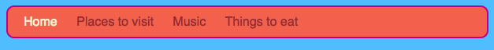
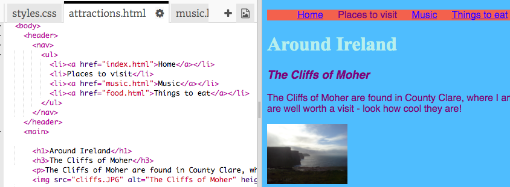

## ಮೆನು ಬಾರ್ ಮಾಡುವುದು

ಸ್ಟೈಲ್ ಶೀಟ್‌ನಲ್ಲಿ ಹೆಚ್ಚಿನ CSS ನಿಯಮಗಳನ್ನು ಸೇರಿಸುವ ಮೂಲಕ ನಿಮ್ಮ ಸಂಚರಣೆ ಮೆನುವನ್ನು ಅದ್ಭುತವಾಗಿ ಕಾಣುವ ಮೆನು ಬಾರ್ ಆಗಿ ಹೇಗೆ ಪರಿವರ್ತಿಸಬಹುದು ಎಂಬುದನ್ನು ಈ ಕಾರ್ಡ್‌ನಲ್ಲಿ ನೀವು ನೋಡುತ್ತೀರಿ.



- `style.css` ಟ್ಯಾಬ್‌ನಲ್ಲಿ ಸ್ಟೈಲ್ ಶೀಟ್ ಫೈಲ್‌ಗೆ ಹೋಗಿ. ಮುಚ್ಚುವ ಸುರುಳಿಯಾಕಾರದ ಕಟ್ಟುಪಟ್ಟಿಯ `}` **ಕೆಳಗೆ** ಕ್ಲಿಕ್ ಮಾಡಿ, ಮತ್ತು ಹೊಸ ಖಾಲಿ ರೇಖೆಯನ್ನು ರಚಿಸಲು **ಎಂಟರ್** ಒತ್ತಿರಿ. ಕೆಳಗಿನ CSS ನಿಯಮವನ್ನು ಸೇರಿಸಿ:

```css
    nav ul {
        background-color: tomato;
    }
```

ಒಂದರ ಬದಲು ನೀವು ಎರಡು ಸೆಲೆಕ್ಟರ್‌ಗಳನ್ನು ಹೇಗೆ ಬಳಸಿದ್ದೀರಿ ಎಂಬುದನ್ನು ಗಮನಿಸಿ? ನೀವು `ul` ಸೆಲೆಕ್ಟರ್ ಅನ್ನು ಸ್ವಂತವಾಗಿ ಬಳಸಿದರೆ, ನಿಯಮವು ನಿಮ್ಮ ವೆಬ್‌ಸೈಟ್‌ನಲ್ಲಿನ ಎಲ್ಲಾ ಕ್ರಮವಿಲ್ಲದ ಪಟ್ಟಿಗಳ ಮೇಲೆ ಪರಿಣಾಮ ಬೀರುತ್ತದೆ. `nav` ಸೆಲೆಕ್ಟರ್ ಅನ್ನು ಸೇರಿಸುವುದರಿಂದ ಇದು `nav` ಟ್ಯಾಗ್‌ಗಳ ನಡುವೆ ಇರುವ ಪಟ್ಟಿಗಳಿಗೆ ಮಾತ್ರ ಅನ್ವಯಿಸುತ್ತದೆ.


ಬುಲೆಟ್ ಪಾಯಿಂಟ್‌ಗಳನ್ನು ತೊಡೆದುಹಾಕೋಣ. ಪ್ರತಿ ಪಟ್ಟಿ ಐಟಂನ ಮುಂದೆ ಇರುವ ಚುಕ್ಕೆಗಳು ಅವು.

- `style.css` ಫೈಲ್‌ಗೆ ಈ ಕೆಳಗಿನವುಗಳನ್ನು ಸೇರಿಸಿ. ಮತ್ತೆ, ಒಂದು `}` ನಂತರ ಅದನ್ನು ಹೊಸ ಸಾಲಿನಲ್ಲಿ ಟೈಪ್ ಮಾಡಿ ಆದ್ದರಿಂದ ಅದು ಬೇರೆ ಯಾವುದೇ ನಿಯಮಗಳ ಒಳಗೆ ಇಲ್ಲ.

```css
    nav ul li {
        list-style-type: none;
    }
```

ಈ ನಿಯಮಗಳ ಗುಂಪಿನಲ್ಲಿ ಮೂರು ಸೆಲೆಕ್ಟರ್‌ಗಳಿವೆ ಎಂಬುದನ್ನು ಗಮನಿಸಿ: ಇದು `ul` ಪಟ್ಟಿಯಲ್ಲಿರುವ ಎಲ್ಲಾ `li` ಅಂಶಗಳನ್ನು ಆಯ್ಕೆ ಮಾಡುತ್ತದೆ, ಅದು `nav` ವಿಭಾಗದಲ್ಲಿದೆ. ಅಯ್ಯೋ!


ಈಗ ಪಟ್ಟಿಯನ್ನು ಲಂಬ (ಕೆಳಗೆ) ಬದಲಿಗೆ ಸಮತಲ (ಅಡ್ಡಲಾಗಿ) ಮಾಡೋಣ.

- ನೀವು ಇದೀಗ ರಚಿಸಿದ ಹೊಸ CSS ನಿಯಮದ ಒಳಗೆ, ಈ ಕೆಳಗಿನ ಸಾಲನ್ನು ಸೇರಿಸಿ: `display: inline;`.


- ಮೆನು ಐಟಂಗಳನ್ನು ಈಗ ಒಟ್ಟಿಗೆ ಜೋಡಿಸಲಾಗಿದೆ, ಆದ್ದರಿಂದ ಅವುಗಳನ್ನು ಸ್ವಲ್ಪಮಟ್ಟಿಗೆ ಸ್ಥಳಾಂತರಿಸಲು `margin-right` ಮತ್ತು `margin-left` ಗುಣಲಕ್ಷಣಗಳನ್ನು ಕೂಡ ಸೇರಿಸೋಣ. CSS ಕೋಡ್ನ ಬ್ಲಾಕ್ ಈಗ ಈ ರೀತಿ ಇರಬೇಕು:

```css
    nav ul li {
        list-style-type: none;
        display: inline;
        margin-right: 10px;
        margin-left: 10px;
    }
```

ನೆನಪಿಡಿ: `10px` ಎಂದರೆ ಹತ್ತು ಪಿಕ್ಸೆಲ್‌ಗಳು.

ನೀವು ಯಾವ ಪುಟದಲ್ಲಿದ್ದೀರಿ ಎಂದು ಹೇಳಲು ಮೆನು ಬದಲಾವಣೆಯನ್ನು ಮಾಡುವುದು ಹೇಗೆ? ಈ ಭಾಗವು ಸ್ಟೈಲ್ ಶೀಟ್‌ನಲ್ಲಿ ಇರುವುದಿಲ್ಲ.

- ಮುಖಪುಟದಿಂದ ಪ್ರಾರಂಭಿಸಿ. `index.html` ಫೈಲ್‌ಗೆ ಹೋಗಿ. ಮೆನು ಲಿಂಕ್‌ಗಳ ಪಟ್ಟಿಯಲ್ಲಿ, `Home` ಪದದ ಮೊದಲು ಮತ್ತು ನಂತರ ಲಿಂಕ್ ಟ್ಯಾಗ್‌ಗಳನ್ನು ತೆಗೆದುಹಾಕಿ, ಇದರಿಂದಾಗಿ ಮುಖಪುಟದ ಪಟ್ಟಿ ಐಟಂ `<li> </li>` ಟ್ಯಾಗ್‌ಗಳ ನಡುವೆ ಕೇವಲ ಪಠ್ಯವಾಗಿರುತ್ತದೆ, ಈ ರೀತಿಯಾಗಿ: `<li>Home</li>`.

- ಈಗ ನಿಮ್ಮ ಪ್ರತಿಯೊಂದು ಫೈಲ್‌ಗಳಿಗೆ ಹೋಗಿ, ಮತ್ತು ಅದೇ ಸಮಯದಲ್ಲಿ ಮಾಡಿ, ಪ್ರತಿ ಬಾರಿ ನೀವು ಸಂಪಾದಿಸುತ್ತಿರುವ ಪುಟಕ್ಕಾಗಿ ಲಿಂಕ್ ಟ್ಯಾಗ್‌ಗಳನ್ನು ತೆಗೆದುಹಾಕಿ. ಆದ್ದರಿಂದ, ಉದಾಹರಣೆಗೆ, `music.html` ಫೈಲ್‌ನಲ್ಲಿ, ನಾನು `Music` ಪಟ್ಟಿ ಐಟಂನಲ್ಲಿನ ಲಿಂಕ್ ಟ್ಯಾಗ್‌ಗಳನ್ನು ತೆಗೆದುಹಾಕಿದ್ದೇನೆ:

```html
    <header>
        <nav>
            <ul>
            <li><a href="index.html">Home</a></li>
            <li><a href="attractions.html">Places to visit</a></li>
            <li>Music</li>
            <li><a href="food.html">Things to eat</a></li>
            </ul>
        </nav>
    </header>
```

- ಲಿಂಕ್‌ಗಳನ್ನು ಕ್ಲಿಕ್ ಮಾಡುವ ಮೂಲಕ ನಿಮ್ಮ ಪುಟಗಳನ್ನು ಅನ್ವೇಷಿಸಿ. ಲಿಂಕ್‌ನ ಬದಲು ನೀವು ಇರುವ ಪುಟವನ್ನು ಮೆನು ಬಾರ್ ಹೇಗೆ ತೋರಿಸುತ್ತದೆ ಎಂಬುದನ್ನು ನೋಡಿ? 



ಮುಂದಿನ ಕಾರ್ಡ್‌ನಲ್ಲಿ ನೀವು ಮೆನು ಬಾರ್ ಅದ್ಭುತವಾಗಿ ಕಾಣುವಂತೆ ಇನ್ನಷ್ಟು ಸಿಎಸ್ಎಸ್ ತಂತ್ರಗಳನ್ನು ಕಲಿಯುವಿರಿ.