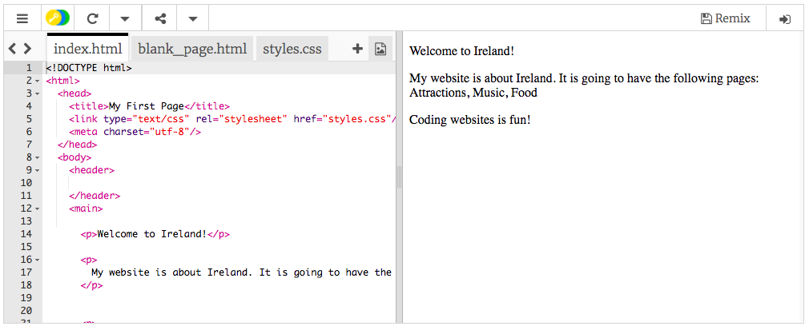
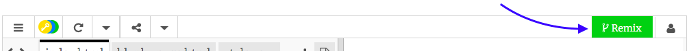

## ಹೊಂದಿಸಲಾಗುತ್ತಿದೆ

- [the starter trinket](http://dojo.soy/html-b-start) ಗೆ ಹೋಗಿ. ಉದಾಹರಣೆ ವೆಬ್‌ಸೈಟ್ ಯೋಜನೆ ಹೊಂದಿರುವ ಪೆಟ್ಟಿಗೆಯನ್ನು ನೀವು ನೋಡುತ್ತೀರಿ. ಬಲಗೈಯಲ್ಲಿ ವೆಬ್‌ಸೈಟ್ ಇದೆ, ಮತ್ತು ಎಡಗೈಯಲ್ಲಿ ವೆಬ್‌ಸೈಟ್ ಮಾಡುವ ಕೋಡ್ ಇದೆ. 

--- collapse ---
---
title: ನನಗೆ Trinket ಖಾತೆ ಇದೆ
---

- ಯೋಜನೆಯ ಮೇಲಿನ ಬಲಭಾಗದಲ್ಲಿರುವ **Remix** ಗುಂಡಿಯನ್ನು ಕ್ಲಿಕ್ ಮಾಡಿ. ನೀವು ಸೈನ್ ಇನ್ ಆಗದಿದ್ದರೆ, ಹಾಗೆ ಮಾಡಲು ನಿಮ್ಮನ್ನು ಕೇಳಲಾಗುತ್ತದೆ. ನೀವು ಸೈನ್ ಇನ್ ಮಾಡಿದ ನಂತರ, ನೀವು ಮತ್ತೆ **Remix** ಕ್ಲಿಕ್ ಮಾಡಬೇಕಾಗುತ್ತದೆ. ಈ ಗುಂಡಿಯನ್ನು ಕ್ಲಿಕ್ ಮಾಡುವುದರಿಂದ ನೀವು ಕೆಲಸ ಮಾಡಲು ಯೋಜನೆಯ ನಕಲನ್ನು ರಚಿಸುತ್ತದೆ. 

ನೀವು ಅದನ್ನು ಕ್ಲಿಕ್ ಮಾಡಿದ ನಂತರ ಅದು **Remixed** ಎಂದು ಹೇಳಬೇಕು:

--- /collapse ---

--- collapse ---
---
title: ನನಗೆ Trinket ಖಾತೆ ಇಲ್ಲ
---

**Share** ಮೆನುವಿನಲ್ಲಿರುವ ಆಯ್ಕೆಗಳಲ್ಲಿ ಒಂದನ್ನು ಬಳಸಿಕೊಂಡು ನಿಮ್ಮ ಕೆಲಸವನ್ನು ನೀವು ಉಳಿಸಬಹುದು. ನೀವು ಎಲ್ಲೋ ಉಳಿಸಬಹುದಾದ ಲಿಂಕ್ ಅನ್ನು ನೀವು ಪಡೆಯುತ್ತೀರಿ, ಉದಾಹರಣೆಗೆ ಡಾಕ್ಯುಮೆಂಟ್‌ನಲ್ಲಿ, ಅಥವಾ ಇಮೇಲ್ ಮೂಲಕ ಯಾರಿಗಾದರೂ ಕಳುಹಿಸಬಹುದು. **ಗಮನಿಸಿ:** ಪ್ರತಿ ಬಾರಿ ನೀವು ಬದಲಾವಣೆ ಮಾಡಿದಾಗ, ನೀವು ಹೊಸ ಲಿಂಕ್ ಅನ್ನು ಪಡೆಯುತ್ತೀರಿ.

ನೀವು Trinker ‌ನಲ್ಲಿ ಖಾತೆಯನ್ನು ರಚಿಸಲು ಬಯಸಿದರೆ, ಕೆಳಗಿನ ಹಂತಗಳನ್ನು ಅನುಸರಿಸಿ. ಇದು ಯಾವುದೇ ಕಂಪ್ಯೂಟರ್‌ನಿಂದ ನಿಮ್ಮ ಕೆಲಸವನ್ನು ಸುಲಭವಾಗಿ ಪ್ರವೇಶಿಸಲು ಮತ್ತು ಬೇರೊಬ್ಬರು ನಿಮ್ಮೊಂದಿಗೆ ಹಂಚಿಕೊಂಡಿರುವ **remix** ಯೋಜನೆಗಳಿಗೆ ಅನುಮತಿಸುತ್ತದೆ. ರೀಮಿಕ್ಸ್ ಮಾಡುವುತು ಎಂದರೆ ನೀವು ಯೋಜನೆಯ ನಕಲನ್ನು ಉಳಿಸುತ್ತೀರಿ ಆದ್ದರಿಂದ ನೀವು ನಿಮ್ಮದೇ ಆದ ಬದಲಾವಣೆಗಳನ್ನು ಮಾಡಬಹುದು.

- [Trinket ವೆಬ್‌ಸೈಟ್](http://dojo.soy/trinket) ಗೆ ಹೋಗಿ ಮತ್ತು **Sign Up For Your Free Account** ಕ್ಲಿಕ್ ಮಾಡಿ. ಸೈನ್ ಅಪ್ ಮಾಡಲು ನಿಮಗೆ ಇಮೇಲ್ ವಿಳಾಸದ ಅಗತ್ಯವಿದೆ.

- ನಿಮ್ಮ ಇಮೇಲ್ ವಿಳಾಸವನ್ನು ನಮೂದಿಸಿ ಮತ್ತು ಪಾಸ್‌ವರ್ಡ್ ಆಯ್ಕೆ ಮಾಡಿ, ಅಥವಾ ನಿಮಗಾಗಿ ಇದನ್ನು ಮಾಡಲು ಯಾರನ್ನಾದರೂ ಕೇಳಿ.

- ನಿಮ್ಮ ಬಳಕೆದಾರಹೆಸರನ್ನು ಕ್ಲಿಕ್ ಮಾಡುವ ಮೂಲಕ ಮತ್ತು **My Trinkets** ಗೆ ಹೋಗುವ ಮೂಲಕ ನೀವು ಈಗ ನಿಮ್ಮ ಉಳಿಸಿದ ಅಥವಾ ರೀಮಿಕ್ಸ್ ಮಾಡಿದ ಎಲ್ಲಾ ಯೋಜನೆಗಳನ್ನು ಪ್ರವೇಶಿಸಬಹುದು. 

--- /collapse ---

ಕೋಡಿಂಗ್ ಪ್ರಾರಂಭಿಸೋಣ!