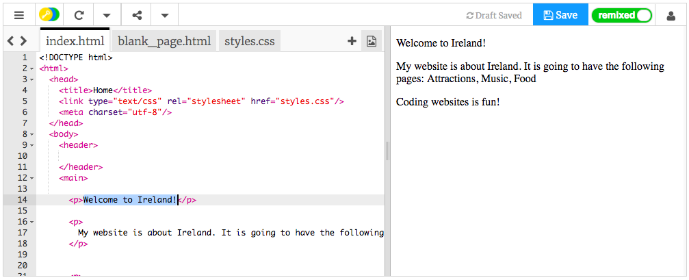

## ನಿಮ್ಮ ಮೊದಲ ಅಂತರ್ಜಾಲ ಪುಟ!

- ಎಡಗೈ ಫಲಕದಲ್ಲಿ, **ಕೋಡ್ ಪ್ಯಾನಲ್**, `index.html` ಎಂದು ಹೇಳುವ ಟ್ಯಾಬ್‌ನಲ್ಲಿ ಕ್ಲಿಕ್ ಮಾಡಿ.

- `Welcome to Ireland!` ಎಂದು ಹೇಳುವ ಸಾಲನ್ನು ಹುಡುಕಿ ಮತ್ತು ಅದನ್ನು ನಿಮ್ಮ ಸ್ವಂತ ಸಂದೇಶಕ್ಕೆ ಬದಲಾಯಿಸಿ - ಸಾಲಿನ ಪ್ರಾರಂಭದಲ್ಲಿ `<p>` ಮತ್ತು ಸಾಲಿನ ಕೊನೆಯಲ್ಲಿ `</p>` ಟ್ಯಾಗ್‌ಗಳನ್ನು **ಅಳಿಸದಂತೆ** ಜಾಗರೂಕರಾಗಿರಿ. ನಿಮ್ಮ ವೆಬ್‌ಪುಟದ ನವೀಕರಣವನ್ನು ನೀವು ಬಲಗೈ ಫಲಕದಲ್ಲಿ ನೋಡಬೇಕು.



- ಈಗ ಅದೇ ಸಾಲಿನಲ್ಲಿ, `<p>` ಮತ್ತು ` </p> ` ಅನ್ನು `<h1>` ಮತ್ತು ` </h1> ` ಗೆ ಬದಲಾಯಿಸಿ. ಬಲಭಾಗದಲ್ಲಿರುವ ಫಲಿತಾಂಶದಲ್ಲಿ ಯಾವುದೇ ಬದಲಾವಣೆಯನ್ನು ನೀವು ಗಮನಿಸುತ್ತೀರಾ?

```html
  <h1>Welcome to Ireland!</h1>
```

--- collapse ---
---
title: HTML ಮತ್ತು ಟ್ಯಾಗ್‌ಗಳನ್ನು ವಿವರಿಸಲಾಗಿದೆ
---

**HTML** ಅಂತರ್ಜಾಲ ಪುಟವನ್ನು ಮಾಡುವ ಕೋಡ್ ಆಗಿದೆ.

ಫೈಲ್ ಹೆಸರಿನಲ್ಲಿರುವ `.html` ಫೈಲ್ ಅಂತರ್ಜಾಲ ಪುಟ ಎಂದು ಬ್ರೌಸರ್‌ಗೆ ಹೇಳುತ್ತದೆ, ಆದ್ದರಿಂದ ಏನು ಪ್ರದರ್ಶಿಸಬೇಕು ಎಂದು ಹೇಳುವ **ಟ್ಯಾಗ್**‌ಗಳನ್ನು ನೋಡಲು ಬ್ರೌಸರ್‌ಗೆ ತಿಳಿದಿದೆ. (ವೆಬ್‌ಸೈಟ್‌ಗಳನ್ನು ನೋಡಲು ನೀವು ಬಳಸುವ ಪ್ರೋಗ್ರಾಂ ಬ್ರೌಸರ್, ಉದಾಹರಣೆಗೆ ಕ್ರೋಮ್ ಅಥವಾ ಫೈರ್‌ಫಾಕ್ಸ್.)

`<p>` ಮತ್ತು `</p>` ನಂತಹ HTML ಟ್ಯಾಗ್‌ಗಳು ಪುಟದ ವಿಭಿನ್ನ ತುಣುಕುಗಳನ್ನು ವ್ಯಾಖ್ಯಾನಿಸುತ್ತವೆ, ಉದಾಹರಣೆಗೆ ಪ್ಯಾರಾಗಳು, ಶೀರ್ಷಿಕೆಗಳು ಅಥವಾ ದೇಹ. ತುಣುಕುಗಳನ್ನು ಎಲ್ಲಾ **ಅಂಶಗಳು** ಎಂದು ಕರೆಯಲಾಗುತ್ತದೆ. ಅವುಗಳನ್ನು ಬಿಲ್ಡಿಂಗ್ ಬ್ಲಾಕ್ಸ್ ಎಂದು ಯೋಚಿಸಿ.

### ನನಗೆ ಎರಡು ಟ್ಯಾಗ್‌ಗಳು ಏಕೆ ಬೇಕು?

ಅಂಶಗಳು ಎಲ್ಲಿ **ಪ್ರಾರಂಭವಾಗುತ್ತವೆ** ಮತ್ತು **ಕೊನೆಗೊಳ್ಳುತ್ತವೆ** ಎಂಬುದನ್ನು ಬ್ರೌಸರ್‌ಗೆ ಹೇಳಲು ನಿಮಗೆ **ಆರಂಭಿಕ** ಮತ್ತು **ಮುಕ್ತಾಯದ** ಟ್ಯಾಗ್ ಅಗತ್ಯವಿದೆ. ಆದ್ದರಿಂದ ಪ್ಯಾರಾಗ್ರಾಫ್‌‌ಗೆ, ಆರಂಭಿಕ `<p>` ಟ್ಯಾಗ್ "ಇಲ್ಲಿ ನೀವು ಕೆಲವು ಪ್ಯಾರಾಗ್ರಾಫ್‌ನಂತೆ ಪ್ರದರ್ಶಿಸಲು ಬಯಸುವ ಕೆಲವು ಪಠ್ಯ ಬರುತ್ತದೆ" ಎಂದು ಹೇಳುತ್ತದೆ. ಪ್ಯಾರಾಗ್ರಾಫ್ ಎಲ್ಲಿ ಕೊನೆಗೊಳ್ಳುತ್ತದೆ ಎಂದು ಮುಚ್ಚುವ `</p>` ಟ್ಯಾಗ್ ಬ್ರೌಸರ್‌ಗೆ ಹೇಳುತ್ತದೆ.

`<body>` ಮತ್ತು `</body>` ಟ್ಯಾಗ್‌ಗಳ ನಡುವೆ ಇರುವ ಎಲ್ಲವೂ ನಿಮ್ಮ ಅಂತರ್ಜಾಲ ಪುಟ.

- ಮುಚ್ಚುವ ಟ್ಯಾಗ್ **ಯಾವಾಗಲೂ** ಫಾರ್ವರ್ಡ್ ಸ್ಲ್ಯಾಷ್ `/` ಅನ್ನು ಹೇಗೆ ಹೊಂದಿದೆ ಎಂಬುದನ್ನು ಗಮನಿಸಿ.

--- /collapse ---

- ಅವರು ನಿಮಗೆ ನೀಡುವ ವಿಭಿನ್ನ ಗಾತ್ರಗಳನ್ನು ನೋಡಲು ನಿಮ್ಮ **ಶೀರ್ಷಿಕೆ** ಟ್ಯಾಗ್‌ಗಳಲ್ಲಿನ ಸಂಖ್ಯೆಗಳನ್ನು ಬದಲಾಯಿಸಲು ಪ್ರಯತ್ನಿಸಿ. ಅವರು `<h1>` ರಿಂದ `<h6>` ವರೆಗೆ ಹೋಗಬಹುದು. ಆರಂಭಿಕ ಮತ್ತು ಮುಚ್ಚುವ ಟ್ಯಾಗ್ ಎರಡನ್ನೂ ಬದಲಾಯಿಸಲು ಮರೆಯದಿರಿ ಇದರಿಂದ ಅವು ಹೊಂದಿಕೆಯಾಗುತ್ತವೆ.

- `My website is about Ireland.` ಎಂದು ಹೇಳುವ ಪ್ಯಾರಾಗ್ರಾಫ್‌ಗಾಗಿ ಕೋಡ್ ಅನ್ನು ಹುಡುಕಿ ಮತ್ತು ಅದನ್ನು ಬದಲಾಯಿಸಿ ಇದರಿಂದ ಅದು ಈ ರೀತಿ ಕಾಣುತ್ತದೆ:

```html
  <p>
    <em>My website</em> is about <strong>Ireland</strong>. 
    It is going to have the following pages: Attractions, Music, Food
  </p>
```

`<em> </em>` ಮತ್ತು `<strong> </strong>` ಟ್ಯಾಗ್‌ಗಳು ಏನು ಮಾಡುತ್ತವೆ ಎಂಬುದನ್ನು ನೀವು ಅರ್ಥಮಾಡಿಕೊಳ್ಳಬಹುದೇ?


--- challenge ---

## ಸವಾಲು: ನಿಮ್ಮದೇ ಆದ ಇನ್ನೂ ಕೆಲವು ಪಠ್ಯವನ್ನು ಸೇರಿಸಿ

- ನೀವು ಕಲಿತ ಕೆಲವು ಟ್ಯಾಗ್‌ಗಳನ್ನು ಬಳಸಿಕೊಂಡು ಹೊಸ ಪ್ಯಾರಾಗ್ರಾಫ್ ಸೇರಿಸಲು ಅಥವಾ ನಿಮ್ಮ ಪುಟಕ್ಕೆ ಹೋಗಲು ಪ್ರಯತ್ನಿಸಿ.

--- hints ---


--- hint ---

ನೀವು ಪುಟದಲ್ಲಿ ಪಠ್ಯವನ್ನು ಹಾಕಲು ಬಯಸಿದಾಗ, ನಿಮ್ಮ ಪಠ್ಯವನ್ನು ಹೇಗೆ ಪ್ರದರ್ಶಿಸಬೇಕು ಎಂದು ನಿಮ್ಮ ಬ್ರೌಸರ್‌ಗೆ ಹೇಳುವ ಎರಡು ಟ್ಯಾಗ್‌ಗಳ ನಡುವೆ ನೀವು ಅದನ್ನು ಹಾಕಬೇಕಾಗುತ್ತದೆ. ಉದಾಹರಣೆಗೆ, `<p> </p>` ಟ್ಯಾಗ್‌ಗಳು ಬ್ರೌಸರ್‌ಗೆ ಅವುಗಳ ನಡುವೆ ಇರುವುದು ಪಠ್ಯದ ಹೊಸ ಪ್ಯಾರಾಗ್ರಾಫ್ ಎಂದು ಹೇಳುತ್ತದೆ, ಮತ್ತು `<h1> </h1>` ಟ್ಯಾಗ್‌ಗಳು ಅದರ ನಡುವಿನ ಪಠ್ಯವು ಶೀರ್ಷಿಕೆಯಾಗಿದೆ ಎಂದು ಹೇಳುತ್ತದೆ.

--- /hint ---

--- hint ---

ಪ್ಯಾರಾಗಳ ಕೋಡ್ ಈ ರೀತಿ ಕಾಣುತ್ತದೆ:

```html
  <p>This is one paragraph of text.</p>

  <p>This is another paragraph.
  Everything in between one set of p tags is 
  displayed together in one long line on the webpage.</p>
```

--- /hint ---

--- hint ---

ಶೀರ್ಷಿಕೆಗಳ ಕೋಡ್ ಈ ರೀತಿ ಕಾಣುತ್ತದೆ:

```html
  <h1>This is a heading.</h1>
```

ಶೀರ್ಷಿಕೆಗಳನ್ನು ಸಾಮಾನ್ಯವಾಗಿ ಪ್ಯಾರಾಗಳಿಗಿಂತ ದೊಡ್ಡದಾಗಿ ಅಥವಾ ದಪ್ಪವಾಗಿ ಪ್ರದರ್ಶಿಸಲಾಗುತ್ತದೆ.

--- /hint ---

--- /hints ---

--- /challenge ---

ಅಭಿನಂದನೆಗಳು, ನಿಮ್ಮ ಮೊದಲ ಅಂತರ್ಜಾಲ ಪುಟವನ್ನು ನೀವು ನಿರ್ಮಿಸಿದ್ದೀರಿ! ಮುಂದಿನ ಕಾರ್ಡ್‌ನಲ್ಲಿ, ಅದು ಹೇಗೆ ಕಾಣುತ್ತದೆ ಎಂಬುದನ್ನು ನಿಯಂತ್ರಿಸುವುದು ಹೇಗೆ ಎಂದು ನೀವು ಕಂಡುಕೊಳ್ಳುತ್ತೀರಿ.