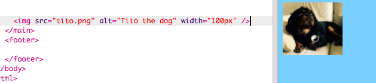
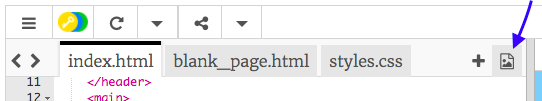

## ಚಿತ್ರಗಳನ್ನು ಸೇರಿಸುವುದು

ಚಿತ್ರವನ್ನು ಸೇರಿಸೋಣ!

- ` index.html` ಹೆಸರಿನ ಟ್ಯಾಬ್‌ಗೆ ಹೋಗಿ. `</main>` ಟ್ಯಾಗ್ ಅನ್ನು ಹುಡುಕಿ ಮತ್ತು ಅದರ **ಮೇಲೆ** ಈ ಕೆಳಗಿನವುಗಳನ್ನು ಟೈಪ್ ಮಾಡಿ: 

```html
    
```

ಫಲಿತಾಂಶ ಹೇಗಿರಬೇಕು ಎಂಬುದು ಇಲ್ಲಿದೆ:



ಈ ಟ್ಯಾಗ್ ಅದರೊಳಗೆ ಹೆಚ್ಚುವರಿ ಮಾಹಿತಿಯನ್ನು ಹೊಂದಿದೆ ಎಂಬುದನ್ನು ಗಮನಿಸಿ. ಅವುಗಳನ್ನು **ಗುಣಲಕ್ಷಣಗಳು(attributes)** ಎಂದು ಕರೆಯಲಾಗುತ್ತದೆ.

- `width="100px"` ಎಂದು ಹೇಳುವ ಬಿಟ್ ಕೋಡ್ ಅನ್ನು ಹುಡುಕಿ ಮತ್ತು ಈ ಗುಣಲಕ್ಷಣವು ಏನು ಮಾಡುತ್ತದೆ ಎಂಬುದನ್ನು ನೀವು ಕಂಡುಹಿಡಿಯಬಹುದೇ ಎಂದು ನೋಡಲು ವಿಭಿನ್ನ ಸಂಖ್ಯೆಗಳೊಂದಿಗೆ ಪ್ರಯೋಗಿಸಲು ಪ್ರಯತ್ನಿಸಿ. `px` ಅಕ್ಷರಗಳನ್ನು ಅಳಿಸಬೇಡಿ!

## \--- collapse \---

## title: `img` ಟ್ಯಾಗ್ ಹೇಗೆ ಕಾರ್ಯನಿರ್ವಹಿಸುತ್ತದೆ

`` ಟ್ಯಾಗ್ ನೀವು ಇಲ್ಲಿಯವರೆಗೆ ಬಳಸಿದ ಇತರ ಟ್ಯಾಗ್‌ಗಳಿಗಿಂತ ಭಿನ್ನವಾಗಿದೆ ಎಂಬುದನ್ನು ಗಮನಿಸಿ - ಮುಕ್ತಾಯದ `</img>` ಟ್ಯಾಗ್ ಇಲ್ಲ. ಬದಲಾಗಿ, ಈ ಟ್ಯಾಗ್ **ಸ್ವಯಂ-ಮುಚ್ಚುವಿಕೆಯಾಗಿದೆ**: ಇದು ಕೊನೆಯಲ್ಲಿ `/>` ಹೊಂದಿದೆ. ಪುಟದ ಪಠ್ಯಕ್ಕಾಗಿ ಇರುವಂತೆ ಚಿತ್ರದ ಅಂಶಕ್ಕೆ 'ಪ್ರಾರಂಭ' ಮತ್ತು 'ಅಂತ್ಯ' ಇಲ್ಲದಿರುವುದು ಇದಕ್ಕೆ ಕಾರಣ.

ಟ್ಯಾಗ್ ಹೆಚ್ಚುವರಿ ಮಾಹಿತಿಯೊಂದಿಗೆ **ಗುಣಲಕ್ಷಣಗಳನ್ನು** ಒಳಗೊಂಡಿದೆ:

- ಚಿತ್ರಕ್ಕಾಗಿ ಯಾವ ಫೈಲ್ ಅನ್ನು ಬಳಸಬೇಕೆಂದು `src` ಗುಣಲಕ್ಷಣವು ಬ್ರೌಸರ್‌ಗೆ ಹೇಳುತ್ತದೆ. 
- `alt` ಗುಣಲಕ್ಷಣವು ಒಂದು ಸಣ್ಣ ವಿವರಣೆಯಾಗಿದ್ದು, ಚಿತ್ರವನ್ನು ಪ್ರದರ್ಶಿಸಲು ಸಾಧ್ಯವಾಗದಿದ್ದರೆ ಬ್ರೌಸರ್ ತೋರಿಸುತ್ತದೆ. 'ಆಲ್ಟ್' ಎನ್ನುವುದು 'ಪರ್ಯಾಯ'ದ ಕಿರು ರೂಪ. ಈ ಪಠ್ಯವು ಸ್ಕ್ರೀನ್ ರೀಡರ್ ಬಳಸುವ ಜನರಿಗೆ ಚಿತ್ರ ಯಾವುದು ಎಂದು ತಿಳಿಯಲು ಸಹಾಯ ಮಾಡುತ್ತದೆ.
- `width` ಗುಣಲಕ್ಷಣವು ಚಿತ್ರವನ್ನು ಎಷ್ಟು ಅಗಲವಾಗಿ ಮಾಡಬೇಕೆಂದು ಬ್ರೌಸರ್‌ಗೆ ಹೇಳುತ್ತದೆ. `100px` ಎಂದರೆ ನೂರು **ಪಿಕ್ಸೆಲ್‌ಗಳು**, ಅಂದರೆ ನಿಮ್ಮ ಪರದೆಯಲ್ಲಿ ನೀವು ನೋಡುವುದನ್ನು ರೂಪಿಸುವ ಸಣ್ಣ ಚುಕ್ಕೆಗಳು. ನೀವು ಈ ಗುಣಲಕ್ಷಣವನ್ನು ಸೇರಿಸದಿದ್ದರೆ, ಚಿತ್ರವನ್ನು ಅದರ ಮೂಲ ಗಾತ್ರದಲ್ಲಿ ಪ್ರದರ್ಶಿಸಲಾಗುತ್ತದೆ.

\--- /collapse \---

ನಿಮ್ಮ ವೆಬ್‌ಸೈಟ್‌ನಲ್ಲಿ ಚಿತ್ರವನ್ನು ಹಾಕುವ ಕೋಡ್ ಈಗ ನಿಮಗೆ ತಿಳಿದಿದೆ, ನೀವು ಬಹುಶಃ ಚಿತ್ರವನ್ನು ಬದಲಾಯಿಸಲು ಬಯಸುತ್ತೀರಿ, ಸರಿ?

- ಸಹಜವಾಗಿ, ನಿಮಗೆ ಬೇಕಾಗಿರುವುದು ಮೊದಲನೆಯದು, ಒಂದು ಚಿತ್ರ! ನಿಮ್ಮ ಕಂಪ್ಯೂಟರ್‌ನಲ್ಲಿ ನೀವು ಈಗಾಗಲೇ ಪಡೆದಿರುವದನ್ನು ನೀವು ಬಳಸಬಹುದು, ಉದಾಹರಣೆಗೆ ನೀವು ತೆಗೆದ ಛಾಯಾಚಿತ್ರ, ಅಥವಾ ನೀವು ಇಂಟರ್ನೆಟ್‌ನಿಂದ ಒಂದನ್ನು ಪಡೆಯಬಹುದು.

[[[generic-get-picture-from-web]]]

**ಗಮನಿಸಿ:** ಅಂತರ್ಜಾಲದಲ್ಲಿ ನೀವು ಕಾಣುವ ಎಲ್ಲಾ ಚಿತ್ರಗಳು ಯಾರಿಗೂ ಬಳಸಲು ಉಚಿತವಲ್ಲ. ನೀವು ಚಿತ್ರವನ್ನು ಡೌನ್‌ಲೋಡ್ ಮಾಡಿದರೆ, ಅದು ನಿಮಗೆ ಬಳಸಲು ಅನುಮತಿಸಲಾಗಿದೆ ಎಂದು ನೀವು ಖಚಿತಪಡಿಸಿಕೊಳ್ಳಬೇಕು. ಇದರ ಬಗ್ಗೆ ಇನ್ನಷ್ಟು ತಿಳಿದುಕೊಳ್ಳಿ:

[[[images-permissions-to-use]]]

ಒಮ್ಮೆ ನೀವು ಚಿತ್ರವನ್ನು ಹೊಂದಿದ್ದರೆ, ನೀವು ಫೈಲ್ ಅನ್ನು Trinket ‌ಗೆ **ಅಪ್‌ಲೋಡ್** ಮಾಡಬಹುದು:

- ನಿಮ್ಮ trinket ‌ನಲ್ಲಿ, **+** ಚಿಹ್ನೆಯ ಪಕ್ಕದಲ್ಲಿರುವ **ಚಿತ್ರ** ಐಕಾನ್ ಅನ್ನು ಕ್ಲಿಕ್ ಮಾಡಿ. 



ನಿಮ್ಮ ವೆಬ್‌ಸೈಟ್‌ನಲ್ಲಿ ನೀವು ಬಳಸಲು ಸಾಧ್ಯವಾಗುವ ಚಿತ್ರಗಳನ್ನು ನೀವು ಇಲ್ಲಿ ನೋಡಬಹುದು. CoderDojo ನಾಯಿ, ಟಿಟೊ ಚಿತ್ರವನ್ನು ನೀವು ನೋಡಬಹುದು.

- **Add Image** ಬಟನ್ ಕ್ಲಿಕ್ ಮಾಡಿ ಮತ್ತು ನಂತರ **Upload** ಕ್ಲಿಕ್ ಮಾಡಿ.

- **Click To Select Files** ಬಟನ್ ಕ್ಲಿಕ್ ಮಾಡಿ. ತೆರೆಯುವ ವಿಂಡೋದಲ್ಲಿ ನಿಮ್ಮ ಚಿತ್ರದ ಫೈಲ್ ಅನ್ನು ಹುಡುಕಿ ಮತ್ತು ಡಬಲ್ ಕ್ಲಿಕ್ ಮಾಡಿ.

- **Done** ಕ್ಲಿಕ್ ಮಾಡಿ.


ನಿಮ್ಮ ಚಿತ್ರವು ಅಪ್‌ಲೋಡ್ ಮಾಡಲಾಗುತ್ತದೆ ಮತ್ತು ಬಳಸಲು ಸಿದ್ಧರಾಗಿರಬೇಕು.

- `index.html` ಫೈಲ್‌ಗೆ ಹೋಗಿ ಮತ್ತು `` ಟ್ಯಾಗ್ ಅನ್ನು ಹುಡುಕಿ. `tito.png` ಪಠ್ಯವನ್ನು ಬದಲಾಯಿಸಿ ಇದರಿಂದ ನೀವು ಆಯ್ಕೆ ಮಾಡಿದ ಇಮೇಜ್ ಫೈಲ್‌ನ ಹೆಸರಿಗೆ ಅದು ಹೊಂದಿಕೆಯಾಗುತ್ತದೆ. ಅದರ ಹೆಸರು `.png` ಬದಲಿಗೆ `.jpg` ನಲ್ಲಿ ಕೊನೆಗೊಳ್ಳಬಹುದು ಎಂಬುದನ್ನು ಗಮನಿಸಿ!

ನೀವು ಈಗ ಬದಲಾಯಿಸಿದ ಪಠ್ಯವು `src` ಎಂಬ ಗುಣಲಕ್ಷಣವಾಗಿದೆ, ಅದು ಯಾವ ಫೈಲ್ ಅನ್ನು ಪ್ರದರ್ಶಿಸಬೇಕೆಂದು ಬ್ರೌಸರ್‌ಗೆ ಹೇಳುತ್ತದೆ.

**ಗಮನಿಸಿ:** ಗುಣಲಕ್ಷಣಕ್ಕಾಗಿ ನೀವು ಟೈಪ್ ಮಾಡಿದ ಮೌಲ್ಯವು ಅದರ ಸುತ್ತಲೂ ಉದ್ಧರಣ ಚಿಹ್ನೆಗಳನ್ನು `""` ಹೊಂದಿರಬೇಕು!

\--- challenge \---

## ಸವಾಲು: ಚಿತ್ರದ ಆಲ್ಟ್ ಪಠ್ಯವನ್ನು ಬದಲಾಯಿಸಿ

- ನಿಮ್ಮ ಇಮೇಜ್ ಅಂಶದ `ಆಲ್ಟ್(alt)` ಗುಣಲಕ್ಷಣವನ್ನು ಹುಡುಕಿ ಮತ್ತು ಅದರಲ್ಲಿರುವ ಪಠ್ಯವನ್ನು ನಿಮ್ಮ ಚಿತ್ರದ ಸಣ್ಣ ವಿವರಣೆಗೆ ಬದಲಾಯಿಸಿ. 

\--- /challenge \---