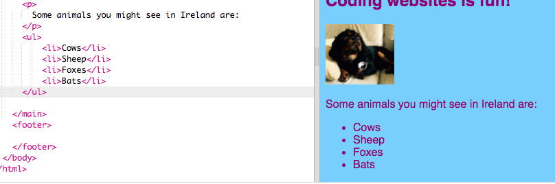

## ಪಟ್ಟಿಯನ್ನು ತಯಾರಿಸುವುದು

"ಕುದುರೆಗಳು, ರೋಬೋಟ್‌ಗಳು, ಬೆಕ್ಕುಗಳು" ನಂತಹ ವಸ್ತುಗಳ ಪಟ್ಟಿಯನ್ನು ಉತ್ತಮವಾಗಿ ಕಾಣುವ ಪಟ್ಟಿಯನ್ನಾಗಿ ಮಾಡುವುದು ಹೇಗೆ ಎಂದು ಈಗ ನೀವು ಕಲಿಯುವಿರಿ, ನಂತರ ನೀವು ಅದ್ಭುತವಾದ ಕೆಲಸಗಳನ್ನು ಮಾಡಬಹುದು.

- `index.html` ಫೈಲ್‌ನಲ್ಲಿ, ಈ ಕೆಳಗಿನ ಕೋಡ್ ಅನ್ನು ಸಾಲಿನ ಮೇಲಿರುವ `</main>` ನೊಂದಿಗೆ ಸೇರಿಸಿ:

```html
    <ul>
        <li>Cows</li>
        <li>Sheep</li>
        <li>Foxes</li>
        <li>Bats</li>
    </ul>
```

ಫಲಿತಾಂಶವು ಈ ರೀತಿಯ ಉತ್ತಮ ಪಟ್ಟಿಯಾಗಿರಬೇಕು:



ಪಟ್ಟಿಯಲ್ಲಿ ಪ್ರತಿಯೊಂದು ವಸ್ತು ಸುತ್ತಲೂ ಪ್ರತ್ಯೇಕ ಜೋಡಿ `<li> </li>` ಟ್ಯಾಗ್‌ಗಳಿವೆ ಎಂಬುದನ್ನು ಗಮನಿಸಿ.

ಐರ್ಲೆಂಡ್‌ನಲ್ಲಿ ನೀವು ನೋಡಬಹುದಾದ ಕೆಲವು ಪ್ರಾಣಿಗಳ ಪಟ್ಟಿ ಇದು. ನಿಮ್ಮ ವೆಬ್‌ಸೈಟ್‌ಗೆ ಅರ್ಥವಾಗುವಂತಹ ವಿಷಯಗಳಿಗೆ ನೀವು ಪಟ್ಟಿಯಲ್ಲಿರುವ ವಸ್ತುಗಳನ್ನು ಬದಲಾಯಿಸಬಹುದು ಮತ್ತು ನೀವು ಬಯಸಿದರೆ ಅದು ಯಾವ ಪಟ್ಟಿಯೆಂದು ವಿವರಿಸಲು ಪಟ್ಟಿಯ ಮೇಲೆ ಒಂದು ಪ್ಯಾರಾಗ್ರಾಫ್ ಅನ್ನು ಸೇರಿಸಿ!

ನೀವು ಸಂಖ್ಯೆಯ ಪಟ್ಟಿಯನ್ನು ಬಯಸಿದರೆ ಹೇಗೆ? ಇದು ಬಹುತೇಕ ಒಂದೇ ಆಗಿರುತ್ತದೆ, ಆದರೆ `<ul>` ಬದಲಿಗೆ, ನೀವು `<ol>` ಅನ್ನು ಬಳಸುತ್ತೀರಿ. ಸಂಖ್ಯೆಯ ಪಟ್ಟಿಯನ್ನು **ಆದೇಶಿಸಿದ** ಪಟ್ಟಿ ಎಂದೂ ಕರೆಯಲಾಗುತ್ತದೆ.

- ನೀವು ಈಗ ಬರೆದ ಕೋಡ್‌ನ ಕೆಳಗೆ ಈ ಕೆಳಗಿನ ಕೋಡ್ ಸೇರಿಸಿ - ಅದು `</ul>` ಟ್ಯಾಗ್‌ಗಿಂತ **ಕೆಳಗಿದೆ** ಎಂದು ಖಚಿತಪಡಿಸಿಕೊಳ್ಳಿ!

```html
    <p>
        My favourite things to eat and drink in Ireland are:
    </p>
    <ol>
        <li>Tea</li>
        <li>Crisp sandwiches</li>
        <li>Sausages</li>
    </ol>
```

ಈಗ ಅದು ಹೇಗಿರಬೇಕು ಎಂಬುದು ಇಲ್ಲಿದೆ:


--- challenge ---

## ಸವಾಲು: ನಿಮ್ಮ ಪಟ್ಟಿಗಳಿಗೆ ಶೈಲಿಯನ್ನು ಸೇರಿಸಿ

- ನಿಮ್ಮ ಪಟ್ಟಿಗಳು ಹೇಗೆ ಕಾಣುತ್ತವೆ ಎಂಬುದನ್ನು ಬದಲಾಯಿಸಲು ನಿಮ್ಮ ಸ್ಟೈಲ್‌ಶೀಟ್‌ಗೆ **CSS ನಿಯಮಗಳನ್ನು** ಸೇರಿಸಬಹುದೇ ಎಂದು ನೋಡಿ.

--- /challenge ---