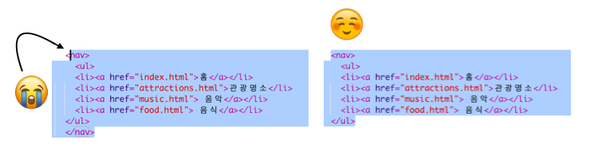

## 웹 사이트 탐색하기

많은 웹 사이트에는 **탐색** 메뉴가 있습니다. 이 메뉴를 사용하여 방문자가 페이지를 손쉽게 이동할 수 있습니다. 이제는 많은 페이지, 홈페이지 및 각 페이지에 대한 링크를 알고 있으니, 링크 목록을 모든 페이지 상단의 탐색 메뉴로 이동시킵시다.


- 이전 단계에서 작성한 링크 리스트에 대한 코드를 찾으세요.

- `<ul>` 오프닝 태그를 입력하기 전에 ** Enter **를 눌러 새 줄을 만든 다음 새 줄부터 `<nav>` 태그를 입력하세요. Trinket은 자동으로 종료 태그를 추가하지만 삭제할 수 있습니다. - 올바른 위치에 있지 않습니다.

- 종료 태그인 `</ul>` 태그를 **입력한 후에**, **Enter**를 눌러 새 줄을 만든 후, 새 줄부터 `</nav>` 태그를 입력하세요.

- `<nav>`이 포함되도록 `<nav>` 부터 `</nav>` 까지의 모든 영역을 복사하세요. `<` 과 `>` **브라켓이 꼭 선택되어야 합니다.**



- 이번에는 복사하는 대신에 이 영역을 **자를** 것입니다. <kbd>Ctrl</kbd>(Mac에서는 <kbd>cmd</kbd>) 을 누른 상태로 <kbd>X</kbd> 키를 누릅니다. 선택한 영역의 코드는 사라지지만, 클립보드에는 복사되므로 당황하지 마세요!

- 파일 상단에 `<header> </header>` 태그를 클릭하세요. 마우스 커서가 영역 안에 있는지 확인하고, <kbd>Ctrl</kbd>(Mac에서는 <kbd>cmd</kbd>)와 <kbd>V</kbd>를 눌러 붙여넣기를 합니다. 작성한 코드는 아래와 같습니다:

```html
    <header>
        <nav>
            <ul>
            <li><a href="index.html">홈</a></li>
            <li><a href="attractions.html">관광 명소</a></li>
            <li><a href="music.html">음악</a></li>
            <li><a href="food.html">음식</a></li>
            </ul>
        </nav>
    </header>
```

## \--- collapse \---

## 제목: 실행 취소!

만약에 실수로 다른 영역을 건드려 **실행 취소**를 해야 하는 경우, <kbd>Ctrl</kbd>(Mac에서는 <kbd>cmd</kbd>) 와 <kbd>Z</kbd> 키를 같이 눌러 실행 취소를 할 수 있습니다. 일반적으로 이 조합을 몇 번 눌러 마지막 몇 가지 변경 사항을 실행 취소 할 수 있습니다. 이것은 많은 프로그램에서 사용할 수있는 또 다른 편리한 키보드 단축키입니다!

\--- /collapse \---

- 링크가 작동하는지 확인해보십시오.

\--- challenge \---

## 과제: 모든 페이지의 탐색 메뉴

- 이 코드 섹션을 작성한 각 HTML 파일의 헤더 섹션에 넣으세요. 이렇게하면 네비게이션 메뉴가 웹 사이트의 모든 페이지 상단에 나타납니다.
    
    \--- hints \---
    
    \--- hint \--- 이전과 같이 전체 `<nav>` 섹션을 선택하여 <kbd>Ctrl</kbd>(Mac에서는 <kbd>cmd</kbd>)와 <kbd>C</kbd>를 눌러 복사를 합니다.

그런 다음 각 `.html` 파일에서 `<header> </header>` 내부를 클릭하여, 코드를 붙여 넣으십시오. \--- /hint \---

\--- /hints \---

이제 어느 페이지에 있든 상관없이 링크를 클릭 할 수 있습니다.

\--- /challenge \---