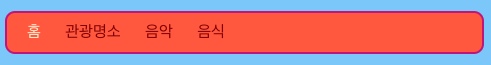
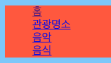
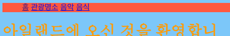
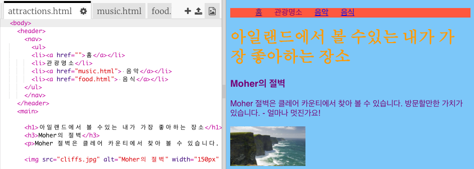

## 메뉴바 만들기

이 장에서는 스타일 시트에 더 많은 CSS 규칙을 추가하는 것으로 멋진 메뉴바를 만드는 방법에 대해 알 수 있습니다.



- 스타일 시트 파일 `styles.css` 탭으로 이동하세요. `}`을 **클릭** 하여, **Enter**를 누른 후 새로운 빈 줄을 만드세요. 아래와 같은 CSS 규칙을 추가합니다.

```css
    nav ul {
        background-color: tomato;
    }
```

여러분은 지금 두 개의 태그를 선택했습니다. 만약 `ul`를 선택한 경우 이 규칙은 모든 웹페이지의 정렬되지 않은 리스트에 영향을 미칩니다. `nav` 셀렉터를 추가하여 `nav` 태그 안에 있는 리스트에만 적용되도록 두 개의 태그를 선택합니다.


이제 이 이상한 동그라미를 없애 봅시다. 이 동그라미는 각 리스트 항목 앞에 찍히도록 설계되어 있습니다.

- 아래와 같은 코드를 `style.css` 에 추가합시다. 다시 한번, `}` 을 클릭하여 Enter를 누른 후 새로운 빈 줄을 만들어 추가해야 합니다. 다른 규칙 안에 있으면 안됩니다.

```css
    nav ul li {
        list-style-type: none;
    }
```

이번에는 3개의 태그를 선택했습니다. `li`, `ul`, 그리고 `nav`를 선택하였습니다. 휴...



이제 이 리스트를 세로 대신 수평(가로)으로 설계해 봅시다.

- 아까 만든 CSS 규칙에 `display: inline;` 을 추가하면 됩니다.



- 메뉴 항목들이 너무 뭉쳐 있습니다. `margin-right` 및 `margin-left` 속성을 조절하여 조금씩 간격을 줘 봅시다. CSS 코드 블록은 다음과 같아야 합니다:

```css
    nav ul li {
        list-style-type: none;
        display: inline;
        margin-right: 10px;
        margin-left: 10px;
    }
```

기억하세요: `10px`는 10 픽셀을 의미합니다.

메뉴를 변경하여 현재 어느 페이지에 있는지 알려주는 것은 어떨까요? 이 부분은 스타일 시트에서 설정할 수 없습니다.

- 예를 들어 홈페이지에서 시작한다고 해 봅시다. `index.html` 파일로 들어가면, 메뉴 리스트가 있는 것을 볼 수 있습니다. 여기서, 현재 우리는 `홈`에 있으므로, `<li> </li>` 안에 있는 하이퍼링크가 걸려 있는 홈 텍스트를 `<li>홈</li>` 과 같이 설정하여 하이퍼링크를 제거합니다.

- 이제 다른 파일로 이동하여 해당 영역의 하이퍼링크를 모두 텍스트로 만드세요. 예를 들어 `music.html` 파일의 `음악` 텍스트는 아래와 같이 설정해 주면 됩니다.

```html
    <header>
        <nav>
            <ul>
            <li><a href="index.html">홈</a></li>
            <li><a href="attractions.html">관광 명소</a></li>
            <li>음악</li>
            <li><a href="food.html">음식</a></li>
            </ul>
        </nav>
    </header>
```

- 링크를 클릭하여 페이지를 탐색하십시오. 메뉴 막대에서 해당 페이지가 링크 대신 일반 텍스트로 표시되는지 확인하세요. 



다음 장에서는 메뉴 바를 더 멋지게 만들기 위한 CSS 기술을 배워 보도록 하겠습니다.