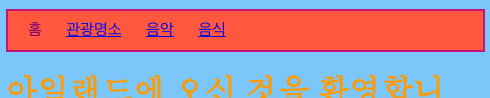
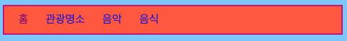
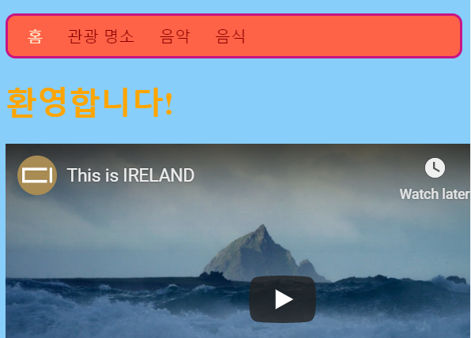

## 메뉴바 꾸미기

CSS를 사용하면 메뉴바를 멋지게 꾸밀 수 있는 가능성은 무한합니다.

- 재미있는 마법이 일어나는 공간인 `styles.css`로 이동합시다!

- `nav ul` 선택자로 이동하여, 새로운 규칙을 아래와 같이 추가합니다:

```css
  nav ul {
    background-color: tomato;
    border-style: solid;
    border-color: MediumVioletRed;
    border-width: 2px;
    padding: 10px;
  }
```

`padding` 속성은 테두리와 컨텐츠 사이에 여백을 추가합니다. 각각의 속성이 하는 역할을 알아낼 수 있나요? 다른 색깔과 픽셀로 실험을 해 보세요.



- 각 메뉴에 대한 밑줄을 제거하려면 `nav ul li` 규칙의 닫는 중괄호 `}` 뒤에서 Enter를 누르고, 새 행에 아래 코드를 추가하세요. 어떤 `}` 뒤에서 시작해도 괜찮으나, 관련된 속성을 모아서 찾기 쉽도록 하는 게 좋을 것입니다!

```css
  nav ul li a {
      text-decoration: none;
  }
```

이 규칙은 `<nav>` 안의 `<ul>` 안의 `<li>`의 `<a>` 링크 속성에 적용됩니다. 이번엔 4개의 태그를 지정했습니다!



어떤 페이지에 있는지 쉽게 볼 수 있도록 `<nav>`의 일부 리스트 항목에서 링크 태그를 제거한 방법을 기억하나요? 링크가 아닌 탐색 리스트 항목의 텍스트 색상을 변경하는 건 어떨까요?

- `nav ul li` 선택자를 찾아서, 중괄호 **안에** 다음과 같은 행을 추가합니다:

```css
  color: PapayaWhip;
```

원하는 색상을 선택할 수 있습니다!

`nav ul li a` 안에 `color` 규칙을 설정하여 메뉴 링크에 다른 색을 칠할 수 있습니다.

- 메뉴에 둥근 모서리를 만드는 건 어떨까요? `nav ul` 안에 다음 코드를 추가하면 어떤 일이 일어나는지 보세요: ` border-radius: 10px;`

`border-radius` 속성은 조금 더 멋있게 보이게 하는 정말 쉬운 방법입니다!



\--- challenge \---

## 과제: 사진에 둥근 모서리가 생기게 하기

- 스타일 시트에서 `img` 선택자를 사용하여 `border-radius` 규칙을 추가합니다.

\--- /challenge \---