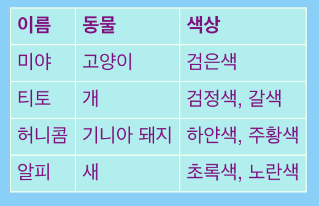

## 테이블 추가하기

때로는 테이블에 정보를 표시하는 것이 유용 할 수 있습니다. 예를 들어, 지역 스포츠 클럽이나 학교의 웹 사이트에 회원 정보를 나열하거나 좋아하는 10가지 곡에 대한 정보를 나열할 수 있습니다.

표는 **행(row)**과 **열(column)**로 구성됩니다. 대부분의 테이블에는 **헤더(header)**라는 각 열의 맨 위에 제목이 있습니다. 아래 예제를 참고하세요:



- `page_with_table.html` 파일로 이동하세요. `<table> </table>` 태그 안에 있는 다양한 코드를 볼 수 있을 겁니다.

- 여는 태그 `<table>` 부터 닫는 태그 `</table>` 까지의 코드를 전부 선택하여 복사하세요. 그런 다음, 표를 넣고 싶은 파일을 찾아 코드에 붙여 넣으십시오.

여러분의 테이블은 현재 비어 있습니다.

- 당신이 원하는 무엇이든 테이블에 채워 보세요! `<td> </td>` 태그 사이와, `<th> </th>` 태그에 텍스트를 추가하세요. 필요한 경우 더 많은 태그를 추가할 수도 있습니다.

## \--- collapse \---

## title: 예제 코드

위에 표시된 테이블의 HTML 코드는 다음과 같습니다.

```html
  <table>
    <tr>
      <th>이름</th>
      <th>동물</th>
      <th>색상</th>
    </tr>
    <tr>
      <td>미야</td>
      <td>고양이</td>
      <td>검은색</td>
    </tr>
    <tr>
      <td>티토</td>
      <td>개</td>
      <td>검정색, 갈색</td>
    </tr>
    <tr>
      <td>허니콤</td>
      <td>기니아 돼지</td>
      <td>하얀색, 주황색</td>
    </tr>
    <tr>
      <td>알피</td>
      <td>새</td>
      <td>초록색, 노란색</td>
    </tr>
  </table>
```

\--- /collapse \---

다른 **행**을 추가하려면, `<tr> </tr>` 태그 세트를 추가하세요. 그 사이에 동일한 수의 **데이터**를 넣어 `<td> </td>` 태그를 다른 행에 있는 것처럼 사용하세요.

다른 **열**을 추가하려면, `<td> </td>` 태그 세트로 더 많은 **데이터**를 **모든** 행에 추가하세요. 물론 첫 행에 `<th> </th>`을 사용해서 **header**도 추가해야 합니다. 

## \--- collapse \---

## title: 어떻게 동작하나요?

태그를 모두 살펴 보겠습니다. 이 코드는 리스트와 비슷하면서도 (`<ul>` 과 `<ol>` 을 기억하세요) 더 수준 높은 코드입니다.

각 쌍의 `<tr> </tr>`은 행이고, 두 태그 사이의 모든 내용이 한 행에 표시됩니다.

첫 번째 행에는 `<th> </th>` 태그가 포함됩니다. 이는 주로 헤더로 사용되고, 열 제목이 이 사이에 들어갑니다. 테이블에 있는 각 열에 대해 하나의 쌍이 있습니다.

`<td> </td>` 태그는 테이블 데이터라는 것을 정의하며, 이는 다른 모든 행에 적용됩니다. 이것들은 목록 항목 태그 `<li> </li>`와 비슷합니다: 그 둘 사이에 있는 모든 텍스트가 테이블 행에 있는 하나의 항목입니다.

\--- /collapse \---

- `styles.css` 파일의 끝 부분을 보면, 테이블을 나타내는 CSS 코드를 볼 수 있습니다. 당신은 그것 모두를 이해할 필요가 없습니다! 그러나 텍스트, 테두리 및 배경색을 변경하여 자신만의 스타일을 디자인 해 볼 수 있습니다.

```css
  table, th, td {
    border: 1px solid HoneyDew;
    border-collapse: collapse;
  }
  tr {
    background-color: PaleTurquoise;
  }
  th, td {
    vertical-align: top;
    padding: 5px;
    text-align: left;
  }
  th {
    color: purple;
  }
  td {
    color: purple;
  }
```

일부 선택자가 쉼표를 사용하는데 이것은 무엇일까요? (예 : ` table, th, td`) 이는 **셀렉터 목록**을 뜻합니다: 이는 모든 `<th>` 요소와 `<td>` 요소에 적용됨을 의미합니다. 각 선택자에 대해 동일한 규칙을 입력할 필요가 없습니다!