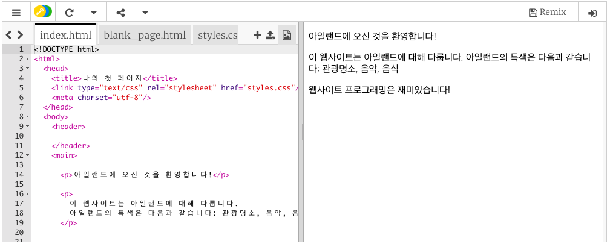
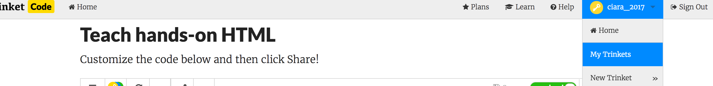

## 설정하기

- 이 [스타터 trinket](https://trinket.io/html/071e06e026)을 열어 주세요. 예제 웹사이트 프로젝트가 들어 있는 박스가 나타날 것입니다. 오른쪽에는 웹 사이트가 있고 왼쪽에는 웹 사이트의 소스 코드가 있습니다. 

--- collapse ---
---
title: Trinket 계정을 가지고 있는 경우
---

- 우측 상단의 **Remix** 버튼을 클릭하세요. 로그인하지 않은 경우, 로그인을 하라는 메시지가 표시됩니다. 로그인 한 다음 **Remix**를 다시 클릭합니다. 이 버튼을 클릭하면 자신의 계정에 프로젝트 복사본이 생성됩니다. 

버튼을 클릭한 뒤엔 **remixed**라고 표시됩니다:

--- /collapse ---

--- collapse ---
---
title: Trinket 계정을 가지고 있지 않은 경우
---

**공유** 메뉴의 옵션 중 하나를 사용하여 작업을 저장할 수 있습니다. 예를 들어 문서로 저장하거나 이메일을 통해 보낼 수 있는 링크를 얻을 수 있습니다. **참고:** 수정을 할 때마다 새로운 링크가 생깁니다.

Trinket에 계정을 만들려면 다음 단계를 따르세요. 이렇게 하면 다른 컴퓨터에서 **Remix**하여 다른 사람이 나와 공유한 작업 및 프로젝트에 쉽게 접근할 수 있습니다. Remixing은 프로젝트의 사본을 저장하여 사용자가 직접 변경할 수 있음을 의미합니다.

- [Trinket 웹 사이트](http://dojo.soy/trinket) 로 이동하여 **Sign Up For Your Free Account**을 클릭하세요. 가입하려면 이메일 주소가 필요합니다.

- 이메일 주소를 입력하고 암호를 입력하세요. 혹은 다른 사람에게 요청하세요.

- 이제 사용자 이름을 클릭하고 **My Trinkets**에서 리믹스 된 모든 프로젝트에 접근할 수 있습니다. 

--- /collapse ---

코딩을 시작합시다!