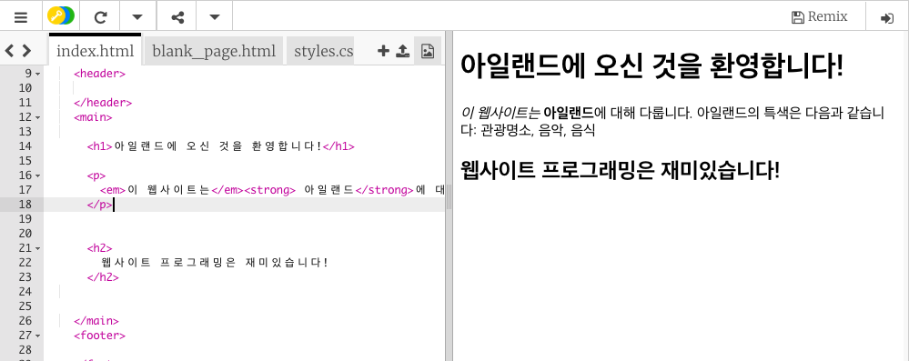

## 첫 번째 웹 페이지!

- 왼쪽의 **코드 패널**에서, `index.html` 탭을 클릭하세요.

- `Welcome to Ireland!`라고 써진 줄을 찾아 메시지를 변경하세요. 이때 줄의 시작 부분의 `<p>` 태그와 끝 부분에 있는 `</p>`를 지우지 **않도록** 주의하세요. 오른쪽 패널에 웹 페이지가 업데이트 되어 표시되어야 합니다.


- 이제 동일한 줄에서, `<p>`과 `</p>`를 `<h1>`과 `</h1>`으로 변경하세요. 오른쪽 결과가 변경되어 표시되나요?

```html
  <h1>아일랜드에 오신 것을 환영합니다!</h1>
```

## \--- collapse \---

## title: HTML과 태그

**HTML**은 웹 페이지를 만드는 코드입니다.

파일 이름에있는 `.html`은 브라우저에게 파일이 웹 페이지임을 알려주고, 브라우저는 표시 할 내용을 알려주는 **태그**(레이블)를 찾습니다. (브라우저는 웹 사이트를 볼 때 사용하는 프로그램입니다. Chrome, Internet Explorer, Firefox 등이 있습니다.)

`<p>` 와 ` </p> `과 같은 HTML 태그는 단락, 제목 또는 내용과 같이 페이지의 다른 부분들을 정의합니다. 이러한 부분을 **요소** 라고 합니다. 그들을 빌딩 블록이라고 생각하세요.

### 왜 두 개의 태그가 필요할까요?

태그의 **시작**과 **끝**을 브라우저에게 알려주어, 태그가 **시작**되는 영역과 **끝나는** 영역을 제대로 알 수 있도록 하기 위함입니다. 예를 들어 어떠한 문장을 표시할 때는, `<p>` 태그가 "여기에 문장으로 표시하기를 원하는 텍스트가 있습니다." 라는 것을 알려줍니다. 그리고 닫기 `</p>` 태그는 문장이 끝나는 위치를 알려줍니다.

모든 홈페이지의 영역은 `<body>`에서 시작하여 `</body>`에서 끝납니다.

- 끝 태그는 **항상** 앞에 `/`가 추가되어 있다는 걸 알 수 있을 겁니다.

\--- /collapse \---

- **heading** 숫자를 바꾸어 다양한 크기의 글자를 만들어 보세요. `<h1>` 부터 `<h6>` 까지 입력이 가능합니다. 꼭 시작 태그와 닫기 태그가 일치하도록 변경해야 합니다.

- `이 웹사이트는 아일랜드에 대해 다룹니다.` 라는 문단이 들어 있는 코드를 찾아보세요. 그리고 아래와 같이 바꿔 보세요.

```html
  <p>
    <em>이 웹사이트</em>는 <strong>아일랜드</strong>에 대해 다룹니다. 
    다음과 같은 페이지가 있습니다: 관광 명소, 음악, 음식
  </p>
```

`<em> </em>` 과 `<strong> </strong>` 태그는 어떤 역할을 하는지 알아낼 수 있나요?



\--- challenge \---

## 도전: 더 많은 텍스트 추가하기

- 배운 태그 중 일부를 사용하여 페이지에 새로운 문장이나 제목을 추가해보십시오.

\--- hints \---

\--- hint \---

페이지에 텍스트를 넣기 위해서는 브라우저에 텍스트를 표시하는 방법을 알려주는 두 개의 태그 사이에 텍스트를 넣어야 합니다. 예를 들어 `<p> </p>` 태그는 브라우저에 그 사이에 있는 것이 뭐든 간에 텍스트의 새로운 문장임을 알려주고, `<h1> </h1>` 태그는 중간에있는 텍스트가 제목임을 알려줍니다.

\--- /hint \---

\--- hint \---

단락의 코드는 다음과 같습니다.

```html
  <p>이것은 하나의 텍스트 단락입니다.</p>

  <p>이것은 또 다른 단락입니다.  
  하나의 p 태그 안에 있는 모든 문장들은 
  웹 페이지에 하나의 긴 줄에 함께 표시됩니다.</p>
```

\--- /hint \---

\--- hint \---

헤딩의 코드는 다음과 같습니다.

```html
  <h1>이것은 헤딩입니다.</h1>
```

헤딩은 일반적으로 단락보다 크거나 굵게 표시됩니다.

\--- /hint \---

\--- /hints \---

\--- /challenge \---

축하합니다. 첫 번째 웹 페이지를 만들었습니다! 다음 장에서는, 어떻게 웹 페이지의 디자인을 제어할지 알 수 있습니다.