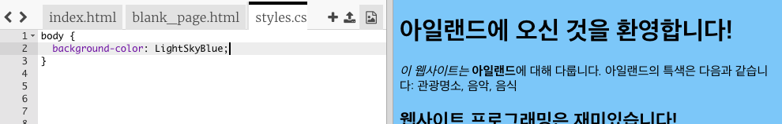
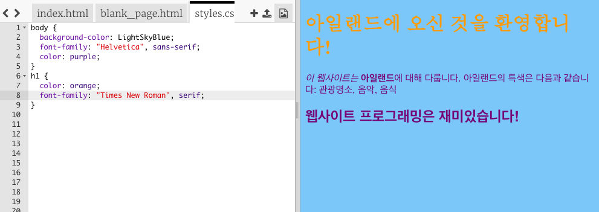

## 레이아웃 조정하기

웹 사이트의 모양을 나타내는 코드를 **CSS** 라고 합니다.

- 코드 패널의 상단에 있는 탭에서 `styles.css` 파일로 이동하세요. 해당 이름의 탭을 클릭하면 됩니다. 아래와 같은 텍스트가 보일 것입니다.

```css
  body {
      background-color: white;
  }
```

- `white` 색상을 `LightSkyBlue` 로 바꾸고 어떤 일이 일어나는지 보세요. 당신의 웹 사이트는 이제 파란색 배경을 가지게 됩니다! 



--- collapse ---
---
title: 어떻게 동작하나요?
---

`index.html` 파일의 맨 위를 보면 다음과 같은 코드가 있습니다.

```html
  <link type="text/css" rel="stylesheet" href="styles.css"/>
```

위의 코드는 브라우저에게 `styles.css`라는 특수 파일을 찾도록 지시합니다. 이 특수 파일을 **스타일 시트** 라고 부릅니다. 파일 이름에 있는`.css`를 통해 스타일 시트 파일임을 알 수 있습니다.

스타일 시트는 웹 페이지의 각 요소들이 어떻게 보여야 하는지에 대한 **규칙**을 포함합니다.

중괄호 `{ }` 사이에 있는 코드는 **CSS 규칙** 집합입니다. `body`는 웹 사이트 안의 모든 `<body>` 요소를 지정하겠다는 뜻입니다. 이렇게 중괄호 앞에 있는 비트를 **선택자(selector)**라고 부릅니다. 그럼 이 경우에는, body 요소의 선택자가 됩니다.

중괄호 안의 각 규칙은 다음으로 구성됩니다.

- **속성**은 콜론 (`:`) 왼쪽에 나타냄
- 속성에 대한 **값**은 콜론(:) 뒤에 나타냄
- 세미콜론(`;`)을 맨 끝에 붙임 

--- /collapse ---

- 규칙을 추가하여 텍스트 모양을 변경해 봅시다. 중괄호 안에 두 개의 새로운 행을 추가하세요.

```css
  body {
    background-color: LightSkyBlue;
    font-family: "Helvetica", sans-serif;
    color: purple;
  }
```

이제 웹 페이지가 어떻게 바뀌었는지 보세요.

`color` 속성은 항상 텍스트를 위한 것입니다. 이 코드는 `body` 안에 있는 모든 텍스트에 대해 색깔을 설정합니다.

- 헤딩와 단락에 대해 별도의 규칙을 작성할 수도 있습니다. `<h1>` 헤딩의 경우에는 `h1` 선택자를 사용할 수 있습니다. body의 중괄호를 닫은 다음, 그 밑에 아래와 같은 코드를 추가해 보세요.

```css
  h1 {
    color: orange;
    font-family: "Times New Roman", serif;
  }
```

이전과 마찬가지로 단락은 보라색으로, 제목 텍스트는 주황색으로 바뀌었을 겁니다.



색 뿐만 아니라 글자의 모양이 왜 달라지는지 눈치채셨나요? **폰트 그룹(font family)**을 변경했기 때문이죠. 다양한 글꼴을 [여기서](http://dojo.soy/web-font-families) 찾아볼 수 있습니다.

- `<h2>` 헤딩의 경우에는 `h2` 선택자를 사용할 수 있습니다.

- 텍스트와 배경에 다른 색상 조합을 넣어 보는 것은 어떻습니까? 사용할 수 있는 색상은 정말 많이 있습니다. 좀 더 많은 색상을 [여기서](http://dojo.soy/web-color-names) 찾아 보세요.