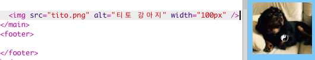

## 사진 추가하기

사진을 추가해 봅시다!

- ` index.html` 탭으로 이동하세요. ` </main> ` 태그를 찾아 **그 위에** 입력하십시오: 

```html
    
```

아래와 같이 보일 것입니다:



이 태그에는 추가 정보가 들어 있습니다. 그것들은 **속성**이라고 부릅니다.

- `width="100px"`가 포함된 코드를 찾으세요. 이 속성이 어떤 역할을 하는지 파악할 수 있도록 하기 위해 다른 숫자로 실험해 보세요. 절대 `px` 문자를 지우지 마세요!

## \--- collapse \---

## title: How the `img` tag works

Notice that the `` tag is different from the other tags you've used so far — there is no closing `</img>` tag. Instead, this tag is **self-closing**: it has `/>` at the end. This is because there is no 'start' and 'end' to an image element like there is for text on the page.

The tag contains **attributes** with extra information:

- `src`는 이미지의 경로를 나타냅니다. 
- `alt` 는 이미지의 대안을 뜻하며, 그림을 표시할 수 없는 경우에 브라우저에 표시되는 간단한 설명입니다. 'alt' 는 'Alternate(대체하다)' 의 줄임말입니다. 이 텍스트는 시각장애인과 같은 사람들에게 스크린 리더를 활용하여 이미지의 속성을 알 수 있도록 합니다.
- `width` 속성은 이미지의 너비를 지정합니다. `100px` 은 100 **pixels** 을 나타냅니다. 이는 화면에 보이는 것을 구성하는 작은 점들입니다. 만약에 이 속성을 지정하지 않으면 그림이 원래 크기로 표시됩니다.

\--- /collapse \---

Now that you know the code to put a picture on your website, you probably want to change the picture, right?

- 물론 가장 먼저 필요한 것은 그림입니다! 찍은 사진과 같이 이미 컴퓨터에 있는 사진을 사용하거나 인터넷에서 사진을 가져올 수 있습니다.

[[[generic-get-picture-from-web]]]

**Note:** not all images you will find on the internet are free for anyone to use. If you download a picture, you should make sure it is one that you are allowed to use. Find out more about this here:

[[[images-permissions-to-use]]]

Once you have a picture, you can **upload** the file to Trinket:

- Trinket에서는, **이미지 아이콘 옆의** **+** 을 클릭합니다. 


This is where you can see the pictures that you are able to use on your website. You should see the picture of Tito, the CoderDojo dog.

- **Add Image**을 클릭하고 **Upload**을 클릭하십시오.

- ** 클릭하여 파일 선택하기 ** 버튼을 클릭하십시오. 창에서 이미지 파일을 찾아 더블 클릭하십시오.

- **Done**을 클릭하세요.


Your picture will be uploaded and should be ready to use.

- ` index.html` 파일로 이동하여 `` 태그를 찾습니다. 텍스트를 `tito.png`로 변경하면 당신이 선택한 이미지 파일의 이름과 정확히 일치합니다. 파일 확장자는 `.png` 가 아닌 `.jpg`로 끝나야 할 것입니다!

The text you just changed is the attribute called `src`, which tells the browser which file to display.

**Note:** the value you type for an attribute must have quotation marks `""` around it!

\--- challenge \---

## Challenge: change the alt text of the picture

- `alt` 속성을 변경하여 그 안에있는 텍스트를 그림의 간단한 설명으로 변경하십시오. 

\--- /challenge \---