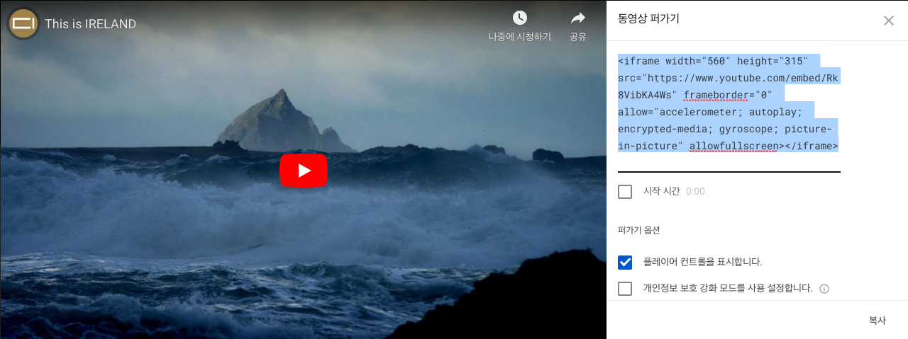
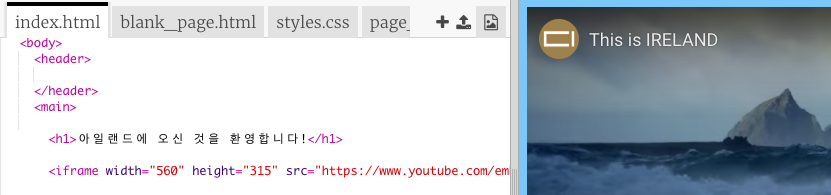
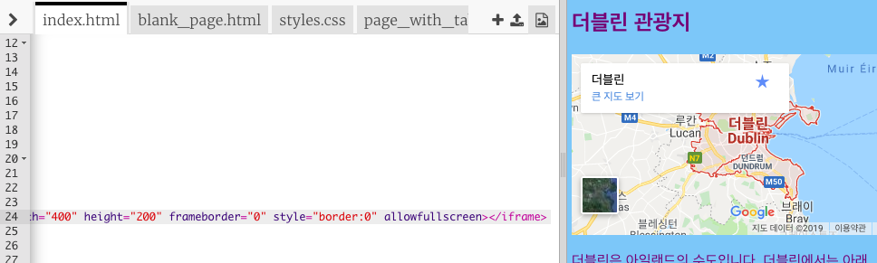

## 지도 또는 비디오 추가

YouTube는 동영상을 웹 사이트에 쉽게 추가 할 수있는 방법을 제공합니다. 다른 온라인 소스의 요소를 웹 사이트에 추가하는 것을 **임베딩**이라고 합니다.

- 웹 사이트에 표시 할 YouTube 동영상을 찾습니다.

- ** 공유** 버튼을 클릭하십시오. **Embed** 옵션을 선택합니다.

모든 텍스트가 선택된 텍스트 상자가 나타납니다. 실수로 텍스트의 선택을 취소 한 경우, 텍스트를 다시 선택하고 <kbd> Ctrl </kbd> (Mac의 경우 <kbd>cmd</kbd>) 및 <kbd>A</kbd> 키를 동시에 누릅니다.

- <kbd> Ctrl </kbd> 키를 누릅니다. (Mac의 경우 <kbd> cmd </kbd>) 및 <kbd> C </kbd> 키를 함께 사용하여 텍스트를 복사하십시오.

- 그런 다음 웹 사이트의 HTML 코드로 돌아가서 동영상을 넣을 위치를 선택(예: 제목이나 단락 아래)하십시오. 이후 텍스트를 **붙여넣으세요**. <kbd>Ctrl</kbd> (Mac의 경우 <kbd> cmd </kbd>) 및 <kbd> V </kbd> 키를 함께 사용하여 텍스트를 붙여넣으세요. 붙여 넣은 모든 코드를 이해해야 된다는 걱정은 하지 마십시오!

비디오가 웹 페이지에 나타나는 것을 볼 수 있습니다.

동일한 기술이 Google 지도에도 적용됩니다. 한번 써보세요!

- 여기로 [ 이동하여](http://dojo.soy/google-maps) 웹 사이트에 표시 할 장소를 검색하십시오. **참고:** 절대로 집 주소와 같은 개인정보를 공유하지 **마십시오!**

- 결과를 조회한 후 **공유**를 클릭하세요. 이후 코드를 복사하여 웹사이트에 붙여넣으세요. 

- 주의깊게 코드를 살펴보면 `width`와 `height` **속성**이 있는 것을 볼 수 있습니다. 값을 변경하여 지도를 더 크게 또는 더 작게 표시 할 수 있습니다.

