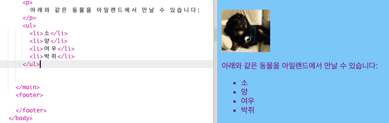
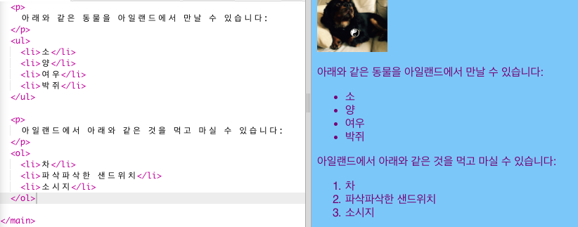

## 리스트 만들기

이제 "유니콘, 로봇, 고양이"와 같은 항목의 목록을 좀 더 멋지게 표현된 리스트로 바꾸는 방법을 배워봅시다.

- `index.html` 파일에서, `</main>` 위에 아래 내용을 추가하세요:

```html
    <ul>
        <li>소</li>
        <li>양</li>
        <li>여우</li>
        <li>박쥐</li>
</ul>
```

아래와 같이 결과가 도출될 것입니다.



각각의 `<li> </li>` 쌍은 각 항목마다 있어야 합니다.

이것은 아일랜드에서 볼 수있는 동물의 목록입니다. 리스트의 항목을 웹 사이트에 적합하게 변경하고, 리스트 위에 있는 단락을 추가하여 리스트를 설명할 수도 있습니다.

번호가 매겨진 목록을 원한다면 어떨까요? 번호가 매겨진 리스트를 만들기 위해서는 `<ul>` 대신 `<ol>`을 사용합니다. 번호가 매겨진 리스트은 **순서가 있는** 리스트입니다.

- 방금 작성한 코드 아래에 다음 코드를 추가하십시오 - 추가한 코드가 `</ul>` 태그 **아래에** 있는지 잘 확인하세요!

```html
    <p>
        아일랜드에서 내가 가장 좋아하는 음식:
    </p>
    <ol>
        <li>녹차</li>
        <li>크리스피 샌드위치</li>
        <li>소시지</li>
    </ol>
```

다음과 같이 보일 것입니다:



--- challenge ---

## 과제: 목록에 스타일 추가

- **CSS 규칙**을 스타일 시트에 추가해 리스트 모양을 변경할 수 있나요?

--- /challenge ---