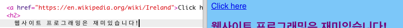

## 링크 만들기

이 장에서는 특정 링크를 클릭하면 다른 페이지로 연결되는 링크를 만드는 방법을 배우게 됩니다.

- `index.html`의 body 섹션에 다음 코드를 추가합니다:

```html
  <a href="">여기를 클릭하세요.</a>
```

`<a> </a>` 태그는 둘 사이에 있는 모든 내용을 링크로 바꾸는 역할을 합니다.

- 링크를 클릭하면 어떻게 되는지 확인해 보세요. 아무것도 안 바뀌죠?

왜냐하면 `href` 속성이 현재 비어 있기 때문입니다. 연결시키고 싶은 **URL** (웹 주소)을 href 속성에 써줘야 합니다.

- Wikipedia로 이동하여 여러분의 웹 사이트에 연결할 만한 페이지를 찾아보세요. 저는 아일랜드에 관한 페이지를 사용하겠습니다.

- 주소 표시줄을 클릭하고 그 안의 모든 텍스트를 선택하십시오. 현재 실행한 페이지의 전체 URL입니다. <kdb>Ctrl 키</kdb> (Mac에서는 <kdb>cmd</kdb>) <kdb>와 C 키를</kdb> 동시에 눌러 복사하세요.
    
    

- Trinket에서, `href=` 다음에 있는 따옴표 사이를 클릭해 <kdb>Ctrl 키</kdb> (Mac에서는 <kdb>cmd</kdb>) <kdb>와 V</kdb> 키를 동시에 눌러 방금 복사한 URL을 붙여 넣습니다. 작성된 코드는 아래와 같습니다:

```html
  <a href="https://en.wikipedia.org/wiki/Ireland">여기를 클릭하세요.</a>
```

처음으로 링크를 만들었습니다! 어떻게 동작하는지 확인해 봅시다.



--- collapse ---
---
title: 다른 웹사이트에 링크 걸기
---

Trinket은 일부 웹 주소에 들어가는 것에 일부 문제가 있습니다. 원하는 경우 Wikipedia 이외의 웹 사이트 URL을 사용해 볼 수도 있지만, Trinket에서는 작동하지 않을 수 있습니다. 그러나 프로젝트를 다운로드하고 웹 브라우저에서 파일을 볼 경우 링크가 작동하는 것을 볼 수 있습니다.

--- /collapse ---

- `<a> </a>` 태그 사이에 `여기를 클릭하세요.` 등의 텍스트가 아닌 사진을 넣어보세요:

```html
  <a href="https://en.wikipedia.org/wiki/Ireland">
      
  </a>
```

- 사진을 클릭해서 링크로 바뀌었는지 확인하세요.

문장이나 리스트과 같이 웹 페이지의 다른 요소에도 링크를 넣을 수 있습니다. 다음은 링크가 있는 문장의 예입니다.

```html
  <p>
    <a href="https://en.wikipedia.org/wiki/Ireland">여기를 클릭해서</a> Wikipedia 페이지를 읽으세요!
  </p>
```

--- challenge ---

## 과제: 리스트에 링크 넣기

- 리스트 항목 중에 링크가 포함된 리스트를 제작해 보세요.

--- /challenge ---