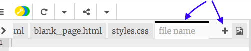

## 페이지 추가하기

이 장에서는 웹 사이트에 페이지를 추가하는 방법을 보여줍니다.

- 코드 패널 상단에서 **+** 기호를 누르고, 새 파일의 이름을 입력하십시오. 파일 명은 `.html` (도트 포함!) 로 끝나야 브라우저가 웹 페이지임을 알 수 있습니다.



--- collapse ---
---
title: 파일 이름 바꾸기 또는 삭제하기
---

만약에 파일 이름을 변경하고 싶다면, 파일 이름 우측에 있는 **톱니바퀴** 아이콘을 클릭하고 **연필** 아이콘을 클릭하세요. 새로운 이름을 입력하고 **Enter**를 누릅니다. **연필** 아이콘 대신 **쓰레기통** 아이콘을 눌러 파일을 삭제할 수 있습니다.


왜 `index.html` 파일의 이름을 변경할 수 없는지 궁금할 것입니다. `index.html` 은 **웹사이트의 홈페이지** 를 나타내는 지정된 특수 이름으로, 여러분이 웹 사이트를 방문할 때 첫 번째로 방문하게 되는 페이지입니다. 웹 사이트에 접속할 때마다 브라우저는 `index.html` 파일을 찾아 화면에 표시합니다.

--- /collapse ---

- `blank_page.html` 파일을 찾고, 모든 내용을 복사해 새로 만든 파일에 붙여 넣으세요. 전체 내용을 복사하고자 하는 경우 코드의 아무 곳이나 클릭하고 키보드의 단축키 <kbd>Ctrl</kbd> (Mac에서는 <kbd>cmd</kbd>) 과 <kbd>A</kbd>를 눌러 모든 내용을 선택할 수 있습니다.

- `<title></title>` 태그를 사용하여 새 페이지의 적합한 제목을 지정하세요. Trinket은 이 제목을 표시하지 않지만, 프로젝트를 다운로드하면 브라우저 창 상단에 표시됩니다.


- 새 파일의 `<main></main>` 태그 사이에 단락, 헤더, 이미지 및 목록과 같은 태그를 사용해 보세요!

- 추가하려는 각 새 페이지에 대해 위의 단계를 반복하십시오.

Trinket에 실행된 탭이 너무 많을 경우엔, 탭의 왼쪽 상단에 있는 **<**, **>** 아이콘을 사용하여 스크롤 할 수 있습니다.


이제 각각의 새로운 페이지로 이동할 수 있도록 링크를 만들어야 합니다! 모든 링크를 리스트에 넣어봅시다.

- `index.html` 파일에 다음 코드를 웹 페이지의 body 부분에 추가하세요.

```html
    <ul>
        <li><a href="index.html">홈</a></li>
        <li><a href="attractions.html">관광 명소</a></li>
        <li><a href="music.html">음악</a></li>
        <li><a href="food.html">음식</a></li>
    </ul>
```

- 각 링크의 `href` 값을 변경하세요. (따옴표 안에 텍스트가 들어가야 한다는 것을 꼭 기억하세요) 각 HTML 파일의 이름과 정확히 일치해야 합니다.

- `<a> </a>` 태그 사이의 내용을 페이지에 적절하게 변경하세요.

이제 새로운 페이지로 이동할 수 있습니다!

