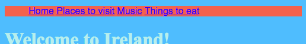

## मेनू बार बनवणे

ह्या कार्डवर आपण बघाल कि कसं स्टाईल शीटमध्ये अधिक सीएसएस (CSS) नियम जोडून आपल्या मार्गनिर्देशक (नॅव्हिगेशन) menuला एका मस्त दिसणार्‍या menu bar मध्ये बदलतात.


- `styles.css` टॅब मध्ये स्टाईल शीट फाईलीवर जा. एका बंद होणाऱ्या कंसाच्या `}` **खाली** क्लिक करा, आणि **एंटर (Enter)** दाबून एक नवी रिकामी ओळ तयार करा. पुढील सीएसएस (CSS) code जोडा:

```css
    nav ul {
        background-color: tomato;
    }
```

लक्षात आलं आपण कसं एका ऐवजी दोन निवडक (सिलेक्टर्स) वापरले? आपण जर `ul` निवडक (सिलेक्टर) वापरलात तर आपल्या संकेतस्थळावर नियम स्वतःहून सर्व अनऑर्डर्ड याद्यांना प्रभावित करेल. `nav` हा निवडक (सिलेक्टर) सुद्धा जोडल्यास तो `nav` टॅग्स मध्ये असलेल्या लिस्टवरच लागू होईल.


चला बुलेट बिंदूंपासून सुटका मिळवू. ते यादीतल्या प्रत्येक आयटम समोर असणारे ठिपके आहेत.

- `styles.css` मध्ये पुढील कोड जोडा. पुन्हा, `}` नंतर एका नव्या ओळीवर ते टंकलेखित करा जेणेकरून ते इतर कुठल्या नियमांच्या ब्लॉक मध्ये नसेल.

```css
    nav ul li {
        list-style-type: none;
    }
```

लक्षात घ्या ह्या नियमांच्या संचामध्ये (सेटमध्ये) तीन निवडक (सिलेक्टर्स) आहेत: ते सर्व `li` एलिमेंट्सना निवडते जे `ul` ह्या लिस्ट आहेत जी एका `nav` विभागात (सेक्शन मध्ये) आहे. हुश्श!


चला आता एका उभ्या (खाली जाणाऱ्या) यादी ऐवजी आडवी (क्षितिजाला समांतर असलेली) यादी बनवू.

- आपण आत्ताच तयार केलेल्या नवीन सीएसएस (CSS) नियमात पुढील ओळ जोडा: `display: inline;`.



- आता सर्व मेनू आयटम्स एकदुसऱ्यात कोंबले गेले आहेत, तर मग थोडी जागा करण्यास अजून गुणधर्म `margin-right` आणि `margin-left` देखील जोडूया. आता सीएसएस (CSS) कोडचा ब्लॉक असा दिसला पाहिजे:

```css
    nav ul li {
        list-style-type: none;
        display: inline;
        margin-right: 10px;
        margin-left: 10px;
    }
```

लक्षात ठेवा: `10px` म्हणजे दहा पिक्सेल्स.

आपण कोणत्या पृष्ठावर आहात हे सांगण्यासाठी मेनू बदलून बघूयात? हा भाग स्टाईल शीटमध्ये नसेल.

- मुख्यपृष्ठाहुन सुरु करा. `index.html` ह्या फाईल मध्ये जा. मेनू लिंकच्या लिस्ट `Home` ह्या शब्दाच्या आधी आणि नंतर असलेल्या लिंक टॅग्सना काढा जेणेकरून मुख्यपेजसाठी (होमपेजसाठी) लिस्ट आयटम फक्त `<li></li>` ह्या टॅग्स मधला टेक्स्ट असेल, हे असं `<li>Home</li>`.

- आता आपल्या इतर प्रत्येक fileलवर जा आणि आपण संपादित (एडिट) करत असलेल्या पृष्ठामधून प्रत्येक वेळी लिंक टॅग काढा. तर, उदाहरणार्थ `music.html` ह्या file मध्ये मी `Music` ह्या लिस्ट आयटम मधील लिंक टॅग्स काढले आहेत:

```html
    <header>
        <nav>
            <ul>
            <li><a href="index.html">Home</a></li>
            <li><a href="attractions.html">Places to visit</a></li>
            <li>Music</li>
            <li><a href="food.html">Things to eat</a></li>
            </ul>
        </nav>
    </header>
```

- लिंकवर क्लिक करून आपल्या पेजचं अन्वेषण (एक्सप्लोर) करा. बघितलंत कसं मेनू बार आपण ज्या पृष्ठावर आहात त्याला लिंक ऐवजी साधा टेक्स्ट म्हणून दाखवतंय ते'? 


पुढील कार्डवर आपण मेनू बार मस्तं दिसण्यासाठी आणखी सीएसएस (CSS) युक्त्या शिकाल.