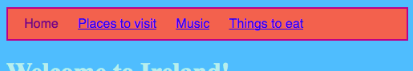
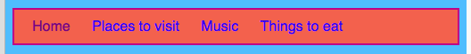

## मेनू बारची शैली (स्टाईल) ठरवणे

सीएसएस (CSS) सह, आपला मेनू बार उत्कृष्ट दिसणाच्या शक्यता अंतहीन आहेत.

- परत `styles.css` fileलवर जा - ती जागा जेथे झकास गोष्टी होतात!

- `nav ul` निवडकाला (सिलेक्टरला) शोधून त्यात आणखी नियम (रूल्स) जोडा जेणेकरून ते असं दिसेल:

```css
  nav ul {
    background-color: tomato;
    border-style: solid;
    border-color: MediumVioletRed;
    border-width: 2px;
    padding: 10px;
  }
```

`padding` हा गुणधर्म जागा जोडतो. आपण प्रत्येक इतर गुणधर्म काय करतात ह्याचा अंदाज लावू शकता का? वेगवेगळ्या रंगांबरोबर आणि पिक्सेल्सच्या अंकांबरोबर प्रयोग करून पहा.



- पेज अधोरेखित (अंडरलाइन) न व्हावेत ह्यासाठी `nav ul li`च्या बंद होणाऱ्या कुरळ्या कंसानंतर `}` एका नव्या ओळीवर पुढील code जोडावा. आपण त्या codeला कोणत्याही `}` नंतर टाकू शकता, पण संबंधित सामग्री एकत्र ठेवणे हि एक चांगली कल्पना आहे जेणेकरून त्याला नंतर शोधणे सोपे जाईल!

```css
  nav ul li a {
      text-decoration: none;
  }
```

वरील नियम त्या `<a>` लिंक्सवर लागू होतात जे एका मार्गनिर्देशक (नॅव्हिगेशन) विभागाच्या (सेक्शनच्या) आंत `<nav>` एका अनऑर्डर्ड लिस्ट `<ul>` च्या आयटम्सच्या आंत `<li>` असतात. व्वा, ते चार निवडक आहेत!



आपल्याला आठवलं आपण कसे दुवा टॅग्सना `<nav>` च्या आतल्या काही यादी आयटम्समधून काढले होते जेणेकरून आपण कुठल्या पानावर आहात हे आरामात पाहू शकाल? दुवे नसलेल्या त्या मार्गनिर्देशन (नॅव्हिगेशन) सूची आयटम्सचा मजकूर रंग देखील बदलून पाहुयात का!

- आपल्या `nav ul li` निवडकाला शोधा, आणि कुरळ्या कंसाच्या **आंत** हि ओळ जोडा:

```css
  color: PapayaWhip;
```

आपण आपल्या आवडीचा कोणताही रंग निवडू शकता!

आपल्याला आपल्या वेबसाइटवरील मेनू लिंकना इतर लिंकपासून वेगळ्या रंगात करायचे असल्यास आपण `color` हा गुणधर्म `nav ul li a` नियमाला सुद्धा जोडू शकता.

- आपल्या मेनूसाठी काही वळसा असलेल्या कोपऱ्यांबद्दल (राऊंडेड कॉर्नर्स बद्दल) काय म्हणता? `nav ul` नियमात पुढील code जोडून काय होतं ते बघा `border-radius: 10px;`.

`border-radius` हा प्रॉपर्टी कुठल्याही गोष्टीला मस्तं बनवण्यासाठी खरंच एक सोपा मार्ग आहे!


\--- challenge \---

## आव्हान: आपल्या छायाचित्रांचे कोपरे गोल करा

- आपल्या शैली पत्रकात (स्टाइल शीट मध्ये), ` img` हा निवडक (सिलेक्टर) वापरून छायाचित्रांसाठी नियमांचा (रूल्सचा) एक नवीन संच (सेट) तयार करा, आणि तेथे एक `border-radius` नियम (रूल) जोडा.

\--- /challenge \---