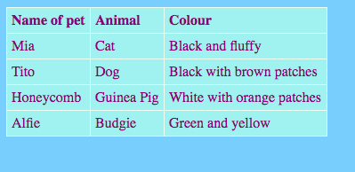

## एक टेबल जोडणे

कधीकधी तक्त्यामध्ये माहिती दर्शवणं उपयुक्त ठरू शकतं. उदाहरणार्थ, आपण एखाद्या स्थानिक क्रीडा मंडळ किंव्हा शाळेसाठी वेबसाइटवर आपल्या सदस्यांची माहिती किंव्हा आपल्या दहा सर्वात आवडत्या गाण्यांबद्दल माहिती सूचीबद्ध करू शकता.

एक तक्ता **पंक्त्या (rows)** आणि **स्तंभांनी (columns)** ह्यांनी बनलेली एक जाळी असते. बहुतेक तक्त्यांमध्ये प्रत्येक स्तंभाच्या (कॉलमच्या) शीर्षस्थानी शीर्षके सुद्धा असतात ज्यांना **हेडर (header)** असे म्हणतात. उदाहरणार्थ:



- `page_with_table.html` हि file उघडा. तेथे आपल्याला `<table></table>` ह्या टॅग्स मध्ये code चा एक घड (गट) दिसेल.

- `<table>` ह्या टॅगच्या सुरुवातीपासून ते शेवटी बंद होणाऱ्या `</table>` ह्या टॅग पर्यंत असलेला सर्व code निवडा आणि तो कॉपी करा. त्यानंतर आपण ज्या file मध्ये तक्ता टाकू इच्छिता ती file उघडा आणि त्यात तो code paste करा.

ह्या क्षणी तुमचा तक्ता रिकामा आहे.

- आपला तक्ता आपल्याला आवडणाऱ्या कुठल्याही गोष्टीनी भरा! `<td></td>` ह्या आणि `<th></th>` ह्या टॅग्स मध्ये टेक्स्ट टाका. आपल्याला गरज असल्यास आपण अधिक टॅग्स जोडू शकता.

## \--- collapse \---

## उदाहरण कोड

वर दाखवलेल्या तक्त्यासाठी असणारा HTML कोड असा दिसतो:

```html
  <table>
    <tr>
      <th>Name of pet</th>
      <th>Animal</th>
      <th>Colour</th>
    </tr>
    <tr>
      <td>Mia</td>
      <td>Cat</td>
      <td>Black and fluffy</td>
    </tr>
    <tr>
      <td>Tito</td>
      <td>Dog</td>
      <td>Black with brown patches</td>
    </tr>
    <tr>
      <td>Honeycomb</td>
      <td>Guinea Pig</td>
      <td>White with orange patches</td>
    </tr>
    <tr>
      <td>Alfie</td>
      <td>Budgie</td>
      <td>Green and yellow</td>
    </tr>
  </table>
```

\--- /collapse \---

आणखी एक **पंक्ती (row)** जोडण्यासाठी, `<tr></tr>` ह्या टॅग्सचा दुसरा संच जोडा. त्यांमध्ये, आपण `<td></td>` ह्या टॅग्स मध्ये तेव्हडेच **डाटा (data)** आयटम्स टाका जेव्हडे इतर पंक्त्यांमध्ये (rows मध्ये) आहेत.

आणखी एक **स्तंभ (column)** जोडण्यासाठी, एक अतिरिक्त `<td></td>` ह्या टॅग्स सोबत **डाटा (data)**चे संच (सेट) **प्रत्येक** पंक्तीमध्ये जोडा. भरीला `<th></th>` ह्या टॅग्सनां वापरून एक अतिरिक्त **हेडर (header)** आयटम पहिल्या पंक्तीमध्ये जोडा.

## \--- collapse \---

## हे कसं काम करतं?

चला त्या सर्व टॅग्सवर एक नजर टाकूया. हे थोडेफार लिस्टच्या code (`<ul>` आणि `<ol>` लक्षात ठेवा) सारखेच आहे फक्त ह्यात अधिक स्तर आहेत.

`<tr></tr>` ह्या टॅग्सची प्रत्येक जोडी एक पंक्ती (रो) आहे, म्हणून त्यांमधील प्रत्येक गोष्ट एका ओळीवर दाखवली जाईल.

पहिल्या पंक्तीमध्ये `<th></th>` हे टॅग्स आहेत. ह्यांना हेडर्स(headers)साठी वापरले जाते, म्हणून स्तंभ शीर्षके त्यांमध्ये जातात. आपल्या तक्त्यामधील प्रत्येक स्तंभासाठी एक जोडी आहे.

`<td></td>` टॅग्स तक्ता डाटा(table data)ला परिभाषित करतात आणि इतर सर्व पंक्तींमध्ये तेच असतात. हे यादी आयटम टॅग्स `<li></li>` सारखे असतात: त्यांमधील सर्वकाही आपल्या तक्त्याच्या पंक्तीमधील एक आयटम आहे.

\--- /collapse \---

- आपण जर `styles.css` ह्या फाईलच्या शेवटी पाहिलं तर आपल्याला तक्ता कसा दिसला पाहिजे ह्याचं वर्णन देणारा CSS code दिसेल. आपल्याला हे सर्वकाही समझण्याची गरज नाही! पण आपल्याला आपली स्वतःची शैली डिझाइन करण्यासाठी मजकूर (टेक्स्ट), सीमा (बॉर्डर) आणि पार्श्वभूमीचे (बॅकग्राऊंडचे) रंग बदलून प्रयोग करू शकता.

```css
  table, th, td {
    border: 1px solid HoneyDew;
    border-collapse: collapse;
  }
  tr {
    background-color: PaleTurquoise;
  }
  th, td {
    vertical-align: top;
    padding: 5px;
    text-align: left;
  }
  th {
    color: purple;
  }
  td {
    color: purple;
  }
```

काही निवडक (सिलेक्टर्स) स्वल्पविराम (कॉमा) कसे वापरतात हे आपल्या लक्षात आलं का, उदाहरणार्थ `table, th, td`? ती **निवडकांची एक लिस्ट** आहे: ह्याचा हा अर्थ कि ते सर्व `<th>` एलिमेन्ट्स(elements)साठी आणि सर्व `<td>`एलिमेन्ट्स (elements)साठी लागू होते. त्याने प्रत्येक निवडकासाठी त्याच नियमांचे संच (सेट) टंकलेखित करणे वाचते!