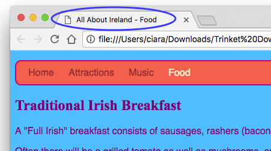

## आणखी पाने जोडणे

हे कार्ड आपल्या वेबसाईटवर आणखी वेब पेजेस कशी जोडायची हे दाखवेल.

- Code पॅनलच्या वर टॅब्सच्या बाजूला असलेल्या **+** चिन्हावर क्लिक करा आणि आपल्या नवीन fileला नाव द्या. ते (बिंदूसह!) `.html` मध्ये समाप्त होणे आवश्यक आहे जेणेकरून ब्राउझरला हे माहीत होईल की ते एक वेब पेजआहे.


## \--- collapse \---

## title: fileचे नाव बदलणे किंव्हा डीलीट करून टाकणे

आपण fileचे नाव बदलू इच्छित असल्यास, fileच्या नावाच्या उजवीकडे **cog** चिन्हावर क्लिक करा, आणि मग **pencil** चिन्हावर क्लिक करा. नावं नाव टंकलेखित करा आणि **Enter** दाबा. आपण **pencil** चिन्ह वापरण्याऐवजी **bin**चिन्हावर क्लिक करून देखील file काढू शकता.


आपल्याला आपण `index.html` फाईलचं नाव का नाही बदलू शकत हा प्रश्न पडला असेल. `index.html` हे एक विशिष्ट नाव आहे जे वेबसाइटच्या **मुख्यपेजवर (homepage)**साठी वापरण्यात येतं. हे पहिलं पान आहे जे आपण संकेतस्थळाला भेट दिल्यावर उघडेल. जेंव्हा केंव्हा आपण वेबसाइटच्या मुख्यपानावर जाता, तेंव्हा browser एका fileला शोधतो ज्याला `index.html` असे म्हणतात आणि त्याला आपल्या स्क्रीनवर दाखवतो.

\--- /collapse \---

- `blank_page.html` ह्या fileला शोधा आणि त्यामधील सर्व code कॉपी करून आपल्या नव्या fileमध्ये पेस्ट करा. आपण संपूर्ण गोष्ट कॉपी करू इच्छित असल्याने आपण codeवर कोठेही क्लिक करू शकता आणि कीबोर्ड शॉर्टकट <kbd>Ctrl</kbd> (किंव्हा <kbd>cmd</kbd>) आणि <kbd>A</kbd> वापरून सर्व एकाच वेळी निवडू शकता.

- `<title></title>` ह्या टॅग्स मधील टेक्स्ट बदला ज्याने आपल्या नव्या पानाला योग्य शीर्षक मिळेल. Trinket शीर्षक दाखवणार नाही, पण आपण आपले प्रकल्प (प्रोजेक्ट) डाउनलोड केल्यास शीर्षक आपल्या browser windowवर असलेला पाहू शकता.



- नवीन file मध्ये `<main> </main>` टॅग्सच्यामध्ये, आपण पानावर जोडायला शिकलेले टॅग्स जसे कि परिच्छेद, शीर्षके, प्रतिमा आणि लिस्ट वापरा!

- आपण जोडू इच्छित असलेल्या प्रत्येक नव्या पानासाठी वरील क्रम पुन्हा करा.

जेंव्हा Trinketमध्ये एकाचवेळी दाखवायला बरेचशे टॅब्स होऊन जातात, तेंव्हा आपण टॅब्स मध्ये वर डाव्या कोपऱ्यात असलेले **<** आणि **>** हे चिन्हे वापरून त्यांमध्ये स्क्रॉल करू शकता.


आता आपल्याला लिंक तयार करण्याची गरज आहे जेणेकरून आपण आपल्या प्रत्येक नवीन पानांवर जाऊ शकाल! चला सर्व लिंक लिस्टमध्ये टाकूया.

- `index.html` ह्या file मध्ये, आपल्या वेब पेजच्या बॉडीला पुढील code जोडा:

```html
    <ul>
        <li><a href="index.html">Home</a></li>
        <li><a href="attractions.html">Places to visit</a></li>
        <li><a href="music.html">Music</a></li>
        <li><a href="food.html">Things to eat</a></li>
    </ul>
```

- प्रत्येक लिंकसाठी `href` च्या व्हॅल्युला (लक्षात ठेवा कि तो अवतरण (कोटेशन) चिन्हांमधील टेक्स्ट आहे) बदला जेणेकरून ते आपण तयार केलेल्या प्रत्येक HTML fileच्या नावाशी अचूक जुळेल.

- `<a> </a>` ह्या टॅग्समधील टेक्स्ट आपल्या पानांच्या योग्य वर्णनांमध्ये बदला.

आता आपण आपल्या नवीन पेज वर मार्गनिर्देशन (नॅव्हिगेट) करू शकता!

