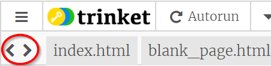

## Meer pagina's toevoegen

Deze kaart laat zien hoe je meer pagina's aan je website kunt toevoegen.

- Klik bovenaan het codepaneel op het ** + ** symbool naast de tabbladen en typ een naam voor je nieuwe bestand. Het moet eindigen op `.html ` (inclusief de punt!) zodat de browser weet dat het een webpagina is.


## \--- collapse \---

## title: een bestand hernoemen of verwijderen

Als je de naam van een bestand wilt wijzigen, klik je op het **tandwiel ** pictogram rechts van de bestandsnaam en klik vervolgens op het **potlood ** icoon. Typ de nieuwe naam in en druk op ** Enter **. Je kunt een bestand ook verwijderen door in plaats van op het **potlood ** pictogram, op het **vuilnisbak** pictogram te klikken. 

Je vraagt je misschien af ​​waarom je de naam van de ` index.html` niet kunt wijzigen. ` index.html ` is een speciale naam die wordt gebruikt voor de ** startpagina ** van een website. Dat is de eerste pagina waarop je terechtkomt wanneer je een website bezoekt. Wanneer je naar de startpagina van een website gaat, zoekt de browser naar het bestand met de naam ` index.html ` en geeft het op je scherm weer.

\--- /collapse \---

- Zoek het bestand ` blank_page.html ` en kopieer en plak alle code ervan in je nieuwe bestand. Omdat je alles wilt kopiëren, kunt je overal op de code klikken en de sneltoets <kbd> Ctrl</kbd> (of <kbd> cmd </kbd>) en <kbd> A </kbd> gebruiken om alles in één keer te selecteren.

- Wijzig de tekst tussen de `<title> </title>` tags zodat je nieuwe pagina een geschikte titel heeft. Trinket geeft de titel niet weer, maar je kunt dit bovenaan in je browservenster zien als je jouw project downloadt.


- Gebruik tussen de `<main> </main>` tags (in het nieuwe bestand) de tags waarvan je weet dat ze dingen toevoegen aan de pagina, zoals alinea's, koppen, afbeeldingen en lijsten!

- Herhaal de bovenstaande stappen voor elke nieuwe pagina die je wilt toevoegen.

When there are too many tabs for Trinket to show at once, you can use the **<** and **>** icons in the top left-hand corner of the tabs to scroll between them.



Now you need to make links so that you can get to each of your new pages! Let's put all the links in a list.

- In the `index.html` file, add the following code to the body of your webpage:

```html
    <ul>
        <li><a href="index.html">Home</a></li>
        <li><a href="attractions.html">Places to visit</a></li>
        <li><a href="music.html">Music</a></li>
        <li><a href="food.html">Things to eat</a></li>
    </ul>
```

- Change the value of the `href` attribute for each link (remember, that's the text inside the quotation marks) so that it exactly matches the name of each HTML file that you have created.

- Change the text in between the `<a> </a>` tags to suitable descriptions of your pages.

Now you can navigate to your new pages!

