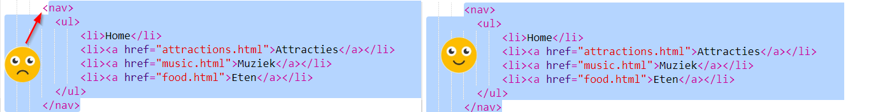

## Navigeren door je website

Veel websites hebben een **navigatie** menu om bezoekers tussen pagina's te laten navigeren. Nu je meerdere pagina's, een startpagina en koppelingen naar elke pagina hebt, kunt je de lijst met koppelingen verplaatsen naar een navigatie gedeelte boven aan elke pagina.


- Zoek de code voor je lijst met links die je in de vorige stap hebt gemaakt.

- Druk vlak voor de opening `<ul>` tag op **Enter** om een ​​nieuwe lege regel te maken, typ dan op de nieuwe regel de volgende tag: `<nav>`. Trinket voegt de sluit tag automatisch toe, maar deze kun je verwijderen - hij staat niet op de juiste plaats.

- Druk vlak **na** de sluittag `</ul>` op **Enter** om een ​​nieuwe lege regel te maken, typ dan op de nieuwe regel de volgende tag: `</nav>`.

- Selecteer nu je gehele `<nav>` gedeelte en lijst door net vóór de `<nav>` tag te klikken en de muis helemaal naar beneden te slepen tot net na de `</nav>` tag, zodat alle tekst inclusief de open en sluit tags worden gemarkeerd. Zorg ervoor dat alle **punthaken** `<` en `>` aan het begin en einde ook zijn gemarkeerd!



- Je gaat deze keer **knippen** in plaats van kopiëren. Houd de <kbd>Ctrl</kbd> (of <kbd>cmd</kbd>) toets ingedrukt terwijl je op de toets <kbd>X</kbd> drukt. De gemarkeerde code verdwijnt, maar raak niet in paniek!

- Klik boven in het bestand in de spatie tussen `<header> </header>` tags. Zorg ervoor dat de cursor daar knippert. Plak nu de code door zoals gewoonlijk op <kbd>Ctrl</kbd> (of <kbd>cmd</kbd>) en <kbd>V</kbd> te drukken. Je code zou er als volgt uit moeten zien:

```html
    <header>
        <nav>
            <ul>
            <li><a href="index.html">Home</a></li>
            <li><a href="attractions.html">Attracries</a></li>
            <li><a href="music.html">Muziek</a></li>
            <li><a href="food.html">Eten</a></li>
            </ul>
        </nav>
    </header>
```

--- collapse ---
---
title: Ongedaan maken!
---

Als je een fout maakt, kun je het **ongedaan maken** door tegelijkertijd op <kbd>Ctrl</kbd> (of <kbd>cmd</kbd>) en <kbd>Z</kbd> te drukken. Je kunt deze toetscombinatie meestal meerdere keren indrukken om de laatste paar wijzigingen ongedaan te maken. Dit is een handige sneltoets die je in veel programma's kunt gebruiken!

--- /collapse ---

- Probeer je links om er zeker van te zijn dat ze nog steeds werken.

--- challenge ---

## Uitdaging: navigatiemenu's voor alle pagina's

- Plaats deze code in het kop gedeelte van elk HTML-bestand dat je hebt gemaakt. Hierdoor zal het navigatiemenu aan de bovenkant van elke pagina op je website verschijnen.
    
--- hints ---
--- hint --- 

Selecteer de hele `<nav>` sectie zoals je eerder deed, en druk tegelijkertijd op de <kbd>Ctrl</kbd> (of <kbd>cmd</kbd>) en <kbd>C</kbd> toets om het te kopiëren.

Klik vervolgens in elk van je `.html` bestanden in de `<header> </header>` sectie en plak de code precies zoals je al eerder deed.

--- /hint ---
--- /hints ---

Nu kun je op de links klikken, ongeacht op welke pagina je je bevindt.

--- /challenge ---
