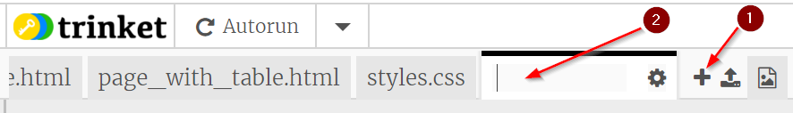

## Meer pagina's toevoegen

Deze kaart laat zien hoe je meer pagina's aan je website kunt toevoegen.

- Klik bovenaan het codepaneel op het ** + ** symbool naast de tabbladen en typ een naam voor je nieuwe bestand. Het moet eindigen op `.html ` (inclusief de punt!) zodat de browser weet dat het een webpagina is.



## \--- collapse \---

## title: een bestand hernoemen of verwijderen

Als je de naam van een bestand wilt wijzigen, klik je op het **tandwiel ** pictogram rechts van de bestandsnaam en klik vervolgens op het **potlood ** icoon. Typ de nieuwe naam in en druk op ** Enter **. Je kunt een bestand ook verwijderen door in plaats van op het **potlood ** pictogram, op het **vuilnisbak** pictogram te klikken. 

Je vraagt je misschien af ​​waarom je de naam van de ` index.html` niet kunt wijzigen. ` index.html ` is een speciale naam die wordt gebruikt voor de ** startpagina ** van een website. Dat is de eerste pagina waarop je terechtkomt wanneer je een website bezoekt. Wanneer je naar de startpagina van een website gaat, zoekt de browser naar het bestand met de naam ` index.html ` en geeft het op je scherm weer.

\--- /collapse \---

- Zoek het bestand ` blank_page.html ` en kopieer en plak alle code ervan in je nieuwe bestand. Omdat je alles wilt kopiëren, kunt je overal op de code klikken en de sneltoets <kbd> Ctrl</kbd> (of <kbd> cmd </kbd>) en <kbd> A </kbd> gebruiken om alles in één keer te selecteren.

- Wijzig de tekst tussen de `<title> </title>` tags zodat je nieuwe pagina een geschikte titel heeft. Trinket geeft de titel niet weer, maar je kunt dit bovenaan in je browservenster zien als je jouw project downloadt.


- Gebruik tussen de `<main> </main>` tags (in het nieuwe bestand) de tags waarvan je weet dat ze dingen toevoegen aan de pagina, zoals alinea's, koppen, afbeeldingen en lijsten!

- Herhaal de bovenstaande stappen voor elke nieuwe pagina die je wilt toevoegen.

Als er te veel tabbladen zijn die de Trinket in één keer kan weergegeven, kunt je de ** < ** en ** > ** pictogrammen in de linkerbovenhoek van de tabbladen gebruiken om tussen de verschillende pagina's te bladeren.


Nu moet je koppelingen maken, zodat kunt je naar elke nieuwe pagina kunt gaan! Laten we alle links in een lijst plaatsen.

- In het ` index.html ` bestand, voeg je aan de body van je webpagina de volgende code toe:

```html
    <ul>
        <li><a href="index.html">Home</a></li>
        <li><a href="attractions.html">Plaatsen om te bezoeken</a></li>
        <li><a href="music.html">Muziek</a></li>
        <li><a href="food.html">Dingen om te eten</a></li>
</ul>
```

- Wijzig de waarde van het ` href ` attribuut voor elke koppeling (denk eraan, dat is de tekst binnen de aanhalingstekens) zodat deze exact overeenkomt met de naam van elk HTML-bestand dat je hebt gemaakt.

- Wijzig de tekst tussen de `<a> </a>` tags naar geschikte beschrijvingen voor je pagina's.

Nu kun je naar je nieuwe pagina's navigeren!

