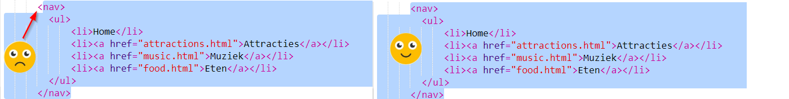

## Navigeren door je website

Veel websites hebben een ** navigatie ** menu om bezoekers tussen pagina's te laten navigeren. Nu je meerdere pagina's, een startpagina en koppelingen naar elke pagina hebt, kunt je de lijst met koppelingen verplaatsen naar een navigatie gedeelte boven aan elke pagina.


- Zoek de code voor je lijst met links die je in de vorige stap hebt gemaakt.

- Druk vlak voor de opening `<ul>` -tag op ** Enter ** om een ​​nieuwe lege regel te maken, typ dan op de nieuwe regel de volgende tag: `<nav>`. Trinket voegt de sluit tag automatisch direct hierna toe, maar je kunt die verwijderen - hij staat niet op de juiste plaats.

- Druk vlak **na** de sluit `</ul>` -tag op ** Enter ** om een ​​nieuwe lege regel te maken, typ dan op de nieuwe regel de volgende tag: `</nav>`.

- Selecteer nu je gehele `<nav>` gedeelte en lijst door net vóór de `<nav>` -tag te klikken en de muis helemaal naar beneden te slepen tot net na de ` </nav>` tag, zodat alle tekst inclusief de open en sluit tags worden gemarkeerd. Zorg ervoor dat alle ** punthaken ** `<` en `>` aan het begin en einde ook zijn gemarkeerd!



- Je gaat deze keer ** knippen ** in plaats van kopiëren. Houd de <kbd>Ctrl</kbd> (of <kbd> cmd </kbd>) toets ingedrukt en druk dan op de <kbd> X </kbd> toets. De gemarkeerde code verdwijnt, maar raak niet in paniek!

- Klik boven in het bestand in de spatie tussen `<header> </header>` tags. Zorg ervoor dat de cursor daar knippert. Plak nu de code door zoals gewoonlijk op <kbd> Ctrl </kbd> (of <kbd> cmd </kbd>) en <kbd> V </kbd> te drukken. Je code zou er als volgt uit moeten zien:

```html
    <header>
        <nav>
            <ul>
            <li><a href="index. html">Home</a></li>
            <li><a href="plaatsen. html">Plaatsen om te bezoeken</a></li>
            <li><a href="muziek. html">Muziek</a></li>
            <li><a href="eten. html">Dingen om te eten</a></li>
            </ul>
        </nav>
 </header>

```

## \--- collapse \---

## title: ongedaan maken!

Als je een fout maakt, kun je het ** ongedaan maken ** door samen op <kbd> Ctrl </kbd> (of <kbd> cmd </kbd>) en <kbd> Z </kbd> te drukken. Je kunt deze toetscombinatie meestal meerdere keren indrukken om de laatste paar wijzigingen ongedaan te maken. Dit is een handige sneltoets die je in veel programma's kunt gebruiken!

\--- /collapse \---

- Probeer je links om er zeker van te zijn dat ze nog steeds werken.

\--- challenge \---

## Uitdaging: navigatiemenu's voor alle pagina's

- Put this code section into the header section of each HTML file that you've created. This will make the navigation menu appear at the top of every page on your website.
    
    \--- hints \---
    
    \--- hint \--- Select the entire `<nav>` section like you did before, and press the <kbd>Ctrl</kbd> (or <kbd>cmd</kbd>) and <kbd>C</kbd> keys together to copy it.

Then, in each of your `.html` files, click inside the `<header> </header>` section and paste the code exactly like you did earlier. \--- /hint \---

\--- /hints \---

Now you will be able to click the links no matter which page you are on.

\--- /challenge \---