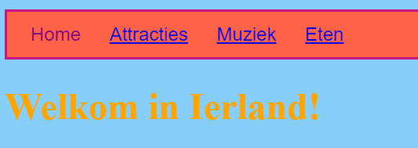
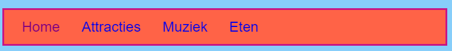
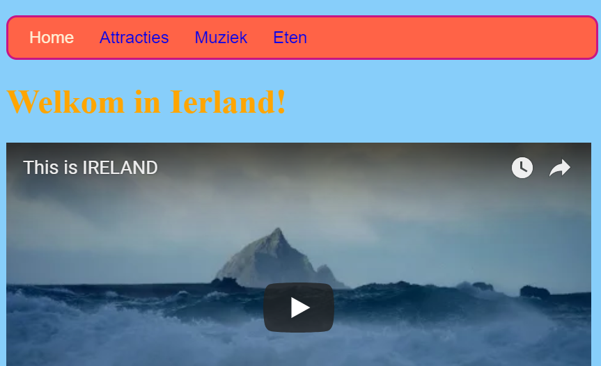

## De menubalk opmaken

Met CSS zijn de mogelijkheden om jouw menubalk er geweldig uit te laten zien eindeloos.

- Ga opnieuw naar het `styles.css` bestand - de plaats waar de coole dingen gebeuren!

- Zoek je `nav ul` selector en voeg meer regels toe zodat het er zo uitziet:

```css
  nav ul {
    background-color: tomato;
    border-style: solid;
    border-color: MediumVioletRed;
    border-width: 2px;
    padding: 10px;
  }
```

De `padding` eigenschap voegt ruimte toe. Kun jij uitvinden wat elk van de andere eigenschappen doet? Experimenteer met verschillende kleuren en aantal pixels.



- Als je de onderstrepingen van de links wilt verwijderen, voeg je op een nieuwe regel na de sluit accolade `}` maar voor de `nav ul li` regels de volgende code toe. Je zou het na elke `}` kunnen plaatsen, maar het is een goed idee om gerelateerde code bij elkaar te houden, zodat het gemakkelijker te vinden is!

```css
  nav ul li a {
      text-decoration: none;
  }
```

De bovenstaande regel is van toepassing op de `<a>`koppelingen in lijst `<li>` items in een ongeordende lijst `<ul>` in een navigatiegedeelte `<nav>`. Wauw, dat zijn vier selectors!



Weet je nog hoe je de link tags uit sommige lijstitems in `<nav>` hebt verwijderd, zodat je gemakkelijk kunt zien op welke pagina je bent? Waarom niet ook de tekstkleur van die navigatielijst items die geen koppelingen zijn veranderen!

- Zoek je `nav ul li` selector en voeg **binnen** de accolades de volgende regel toe:

```css
  color: PapayaWhip;
```

Je kunt elke gewenste kleur kiezen!

Je kunt een `color` (kleur) eigenschap voor de `nav ul li a` regel toevoegen als je wilt dat de menu links een andere kleur hebben dan de overige links op je website.

- Wat dacht je van afgeronde hoeken voor je menu? Probeer de volgende code toe te voegen aan de `nav ul` regel om te zien wat er gebeurt: `border-radius: 10px;`.

De eigenschap `border-radius` is echt een eenvoudige manier om iets cooler te laten lijken!



--- challenge ---

## Uitdaging: geef je foto's afgeronde hoeken

- Maak in je stylesheet een nieuwe set regels voor afbeeldingen met de `img` selector en voeg een `border-radius` regel toe.

--- /challenge ---