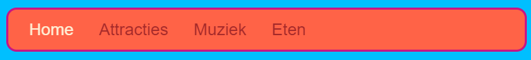
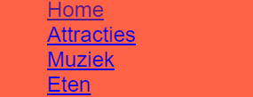
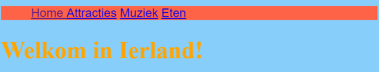
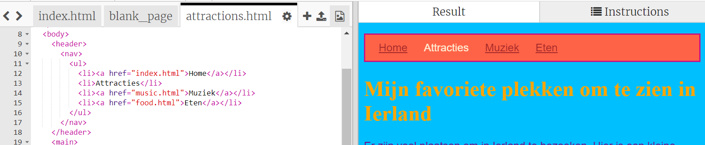

## Een menubalk maken

Op deze kaart ziet je hoe je jouw navigatiemenu kunt transformeren in een cool uitziende menubalk, gewoon door meer CSS-regels toe te voegen aan de stylesheet.



- Ga naar het stijlblad in de ` styles.css ` tab. Klik **onder ** een sluit accolade `} ` en druk op ** Enter ** om een ​​nieuwe lege regel te maken. Voeg de volgende CSS code in:

```css
    nav ul {
        background-color: tomato;
    }
```

Merk op hoe je twee selectors gebruikte in plaats van één? Als je alleen de ` ul ` selector zou hebben gebruikt, zou de regel van invloed zijn op alle ongeordende lijsten op je website. Het toeveogen van de `nav ` selector maakt het alleen van toepassing op lijsten die tussen ` nav` tags staan.



Laten we de opsommingstekens verwijderen. Dat zijn de stippen voor elk lijst item.

- Voeg de volgende code toe aan het `style.css` bestand. Typ na een `} ` opnieuw een nieuwe regel zodat het niet in een ander regelsysteem zit.

```css
    nav ul li {
        list-style-type: none;
    }
```

Merk op dat deze set regels drie selectors heeft: het selecteert alle ` li ` elementen die zich in een ` ul ` lijst bevinden, die zich binnen een ` nav ` sectie bevinden. Oef!


Laten we nu de lijst in plaats van verticaal (naar beneden) horizontaal (over de breedte) maken.

- Binnen de nieuwe CSS-regel die je zojuist hebt gemaakt, voeg je de volgende regel toe: `display: inline;`.



- De menu-items zijn nu allemaal samen geplet, dus laten we ook de eigenschappen `margin-right` (ruimte rechts) en `margin-left ` (ruimte links) toevoegen om ze een beetje te spreiden. Het blok CSS-code zou er nu als volgt uit moeten zien:

```css
    nav ul li {
        list-style-type: none;
        display: inline;
        margin-right: 10px;
        margin-left: 10px;
    }
```

Onthoud: ` 10px ` betekent tien pixels.

Hoe zou het zijn om het menu te veranderen zodat het vertelt op welke pagina je je bevindt? Dit onderdeel staat niet in de stylesheet.

- Begin met de startpagina. Ga naar de ` index.html `. Verwijder in de lijst met menu links de link-tags voor en na het woord ` Home`, zodat het lijstitem voor de startpagina alleen tekst tussen `<li> </li>` tags is, zoals deze: `<li> Home </li>`.

- Ga nu naar elk van je andere bestanden en doe hetzelfde, verwijder telkens de koppeling tags voor de pagina die je aan het bewerken bent. Dus bijvoorbeeld in het ` muziek.html ` bestand, heb ik de koppeling tags verwijderd in de ` muziek ` lijst item:

```html
    <header>
        <nav>
            <ul>
            <li><a href="index.html">Home</a></li>
            <li><a href="attractions.html">Plaatsen</a></li>
            <li>Muziek</li>
            <li><a href="food.html">Dingen om te eten</a></li>
            </ul>
        </nav>
    </header>
```

- Verken je pagina's door op de links te klikken. Zie je hoe de menubalk de pagina die je gebruikt als platte tekst weergeeft in plaats van een link? 



Op de volgende kaart leer je nog meer CSS-trucs om de menubalk er nog beter uit te laten zien.