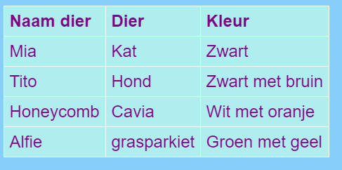

## Een tabel toevoegen

Soms kan het nuttig zijn om informatie in een tabel weer te geven. Je wilt bijvoorbeeld voor een plaatselijke sportclub of school de ledeninformatie op een website vermelden, of informatie over je top tien favoriete nummers plaatsen.

Een tabel is een raster bestaande uit **rows** (rijen) en **colums** (kolommen). De meeste tabellen bevatten ook titels bovenaan elke kolom, de **header** (kop). Hier is een voorbeeld:



- Ga naar het bestand `page_with_table.html`. Daar zie je een aantal codes tussen `<table></table>` tags.

- Selecteer alle code vanaf het begin van de tag `<table>`tot aan het einde van de sluit`</table>` tag en kopieer het. Ga dan naar een van je bestanden waar je een tabel zou willen plaatsen en plak de code er in.

Op dit moment is je tabel leeg.

- Probeer je tabel te vullen met van alles wat je maar wilt! Plaats gewoon tekst tussen de `<td></td>` tags en tussen de `<th></th>` tags. Als je ze nodig hebt Je kunt meer tags toevoegen.

--- collapse ---
---
title: Voorbeeldcode
---

De HTML-code voor de bovenstaande tabel ziet er als volgt uit:

```html
  <table>
    <tr>
      <th>Naam dier</th>
      <th>Dier</th>
      <th>Kleur</th>
    </tr>
    <tr>
      <td>Mia</td>
      <td>Kat</td>
      <td>Zwart</td>
    </tr>
    <tr>
      <td>Tito</td>
      <td>Hond</td>
      <td>Zwart met bruin</td>
    </tr>
    <tr>
      <td>Honeycomb</td>
      <td>Cavia</td>
      <td>Wit met oranje</td>
    </tr>
    <tr>
      <td>Alfie</td>
      <td>grasparkiet</td>
      <td>Groen met geel</td>
    </tr>
  </table>
```

--- /collapse ---

Om nog een **rij** toe te voegen, voeg je nog een set `<tr> </tr>` tags toe. Daartussen plaatst je hetzelfde aantal **gegevens** met `<td> </td>` tags zoals in de andere rijen.

Om nog een **kolom** toe te voegen, voeg je aan **elke** rij extra **gegevens** met een set van `<td> </td>` tags toe. Voeg ook een extra **header** met `<th> </th>` tags aan de eerste rij toe.

--- collapse ---
---
title: Hoe werkt het?
---

Laten we al die tags eens bekijken. Het lijkt een beetje op de code voor een lijst (onthoud `<ul>` en `<ol>`) maar met meer niveaus.

Elk paar `<tr> </tr>` tags is een rij, dus alles daartussen zal op één regel worden weergegeven.

De eerste rij bevat `<th> </th>` tags. Deze worden gebruikt voor de headers (koppen), dus de kolomtitels komen daar tussen in. Er is één paar voor elke kolom die je in je tabel hebt.

De `<td> </td>` tags definiëren wat tabelgegevens worden genoemd en dat geldt ook voor alle andere rijen. Deze zijn vergelijkbaar met de tags van het lijstitem `<li> </li>`: alles daartussenin is één item in je tabel rij.

--- /collapse ---

- Als je naar het einde van het ` styles.css ` bestand kijkt, zie je de CSS-code die beschrijft hoe de tabel eruit zou moeten zien. Je hoeft het niet allemaal te begrijpen! Maar je kunt experimenteren met het wijzigen van de tekst-, rand- en achtergrondkleuren om je eigen stijl te ontwerpen.

```css
  table, th, td {
    border: 1px solid HoneyDew;
    border-collapse: collapse;
  }
  tr {
    background-color: PaleTurquoise;
  }
  th, td {
    vertical-align: top;
    padding: 5px;
    text-align: left;
  }
  th {
    color: purple;
  }
  td {
    color: purple;
  }
```

Merk op dat sommige selectors komma's gebruiken, bijvoorbeeld `table, th, td`? Dat is een **lijst met selectors**: dit betekent dat het van toepassing is op alle `<th>` elementen en alle `<td>` elementen. Het bespaart het typen van dezelfde regels voor elke selector!
