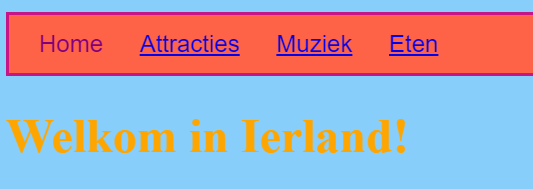
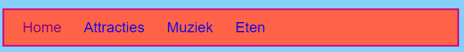
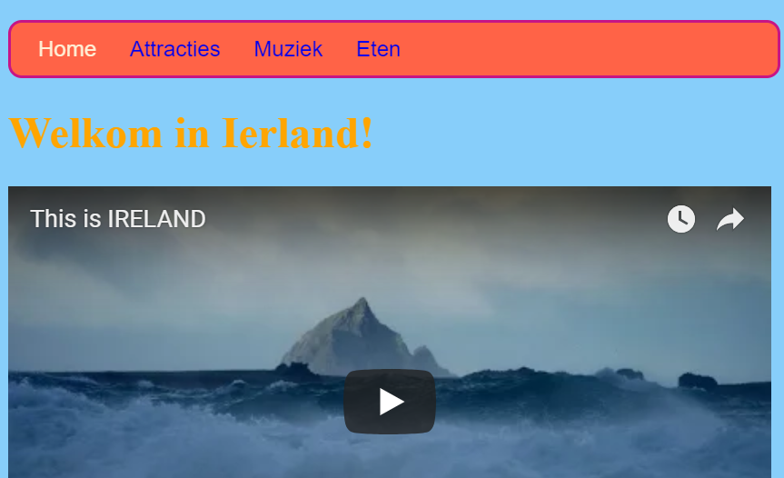

## De menubalk opmaken

Met CSS zijn de mogelijkheden om jouw menubalk er geweldig uit te laten zien eindeloos.

- Ga opnieuw naar het ` styles.css ` bestand - de plaats waar de coole dingen gebeuren!

- Zoek je ` nav ul ` selector en voeg meer regels toe zodat het er zo uitziet:

```css
  nav ul {
    background-color: tomato;
    border-style: solid;
    border-color: MediumVioletRed;
    border-width: 2px;
    padding: 10px;
  }
```

De `padding ` eigenschap voegt ruimte toe. Kun jij uitvinden wat elk van de andere eigenschappen doet? Experimenteer met verschillende kleuren en aantal pixels.



- Als je de onderstrepingen van de links wilt verwijderen, voeg je op een nieuwe regel na de sluit accolade `} `maar voor de ` nav ul li ` regels de volgende code toe. Je zou het na elke `} ` kunnen plaatsen, maar het is een goed idee om gerelateerde code bij elkaar te houden, zodat het gemakkelijker te vinden is!

```css
  nav ul li a {
      text-decoration: none;
  }
```

The above rule applies to links `<a>` inside list items `<li>` in an unordered list `<ul>` inside a navigation section `<nav>`. Wow, that's four selectors!



Remember how you removed the link tags from some list items in the `<nav>` so you can easily see what page you're on? Why not also change the text colour of those navigation list items which are not links!

- Find your `nav ul li` selector, and **inside** the curly braces add the line:

```css
  color: PapayaWhip;
```

You can choose any colour you like!

You can add the `color` property to the `nav ul li a` rule as well if you want the menu links to be a different colour from other links on your website.

- How about some rounded corners for your menu? Try adding the following code to the `nav ul` rule to see what happens: `border-radius: 10px;`.

The `border-radius` property is a really easy way to make anything look cooler!



\--- challenge \---

## Challenge: make your pictures have rounded corners

- In your style sheet, create a new set of rules for pictures using the `img` selector, and add in a `border-radius` rule there.

\--- /challenge \---