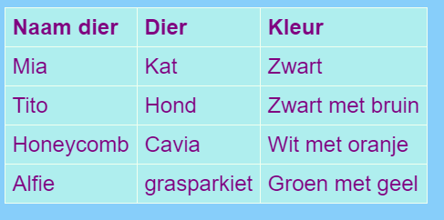

## Een tabel toevoegen

Soms kan het nuttig zijn om informatie in een tabel weer te geven. Je wilt bijvoorbeeld voor een plaatselijke sportclub of school de ledeninformatie op een website vermelden, of informatie over je top tien favoriete nummers plaatsen.

Een tabel is een raster bestaande uit ** rows ** (rijen) en ** colums ** (kolommen). De meeste tabellen bevatten ook titels bovenaan elke kolom, de **header** (kop). Hier is een voorbeeld:



- Ga naar het bestand ` page_with_table.html `. Daar zie je een aantal codes tussen `<table> </table>` tags.

- Selecteer alle code vanaf het begin van de tag `<table>` tot aan het einde van de sluit ` </table>` tag en kopieer het. Ga dan naar een van je bestanden waar je een tabel zou willen plaatsen en plak de code er in.

Op dit moment is je tabel leeg.

- Probeer je tabel te vullen met van alles wat je maar wilt! Simpel gezegd plaats tekst tussen de `<td></td>` tags en tussen de `<th></th>` tags. You can add more tags if you need them.

## \--- collapse \---

## title: Example code

The HTML code for the table shown above looks like this:

```html
  <table>
    <tr>
      <th>Name of pet</th>
      <th>Animal</th>
      <th>Colour</th>
    </tr>
    <tr>
      <td>Mia</td>
      <td>Cat</td>
      <td>Black and fluffy</td>
    </tr>
    <tr>
      <td>Tito</td>
      <td>Dog</td>
      <td>Black with brown patches</td>
    </tr>
    <tr>
      <td>Honeycomb</td>
      <td>Guinea Pig</td>
      <td>White with orange patches</td>
    </tr>
    <tr>
      <td>Alfie</td>
      <td>Budgie</td>
      <td>Green and yellow</td>
    </tr>
  </table>
```

\--- /collapse \---

To add another **row**, add another set of `<tr> </tr>` tags. In between them, you put the same number of **data** items with `<td> </td>` tags as you have in the other rows.

To add another **column**, add an extra **data** item with a set of `<td> </td>` tags to **every** row. Also add an extra **header** item to the first row, using `<th> </th>` tags.

## \--- collapse \---

## title: How does it work?

Let's have a look at all those tags. It's a bit like the code for a list (remember `<ul>` and `<ol>`) but with more levels.

Each pair of `<tr> </tr>` tags is a row, so everything in between them will be displayed on one line.

The first row contains `<th> </th>` tags. These are used for the headers, so the column titles go in between them. There is one pair for each column you have in your table.

The `<td> </td>` tags define what's called table data, and that's what goes in all the other rows. These are similar to the list item tags `<li> </li>`: everything in between them is one item in your table row.

\--- /collapse \---

- If you look at the end of the `styles.css` file, you will see the CSS code that describes how the table should look. You don't have to understand all of it! But you can experiment with changing the text, border, and background colours to design your own style.

```css
  table, th, td {
    border: 1px solid HoneyDew;
    border-collapse: collapse;
  }
  tr {
    background-color: PaleTurquoise;
  }
  th, td {
    vertical-align: top;
    padding: 5px;
    text-align: left;
  }
  th {
    color: purple;
  }
  td {
    color: purple;
  }
```

Notice how some of the selectors use commas, for example `table, th, td`? That's a **list of selectors**: it means it applies to all `<th>` elements and all `<td>` elements. It saves typing out the same set of rules for each selector!