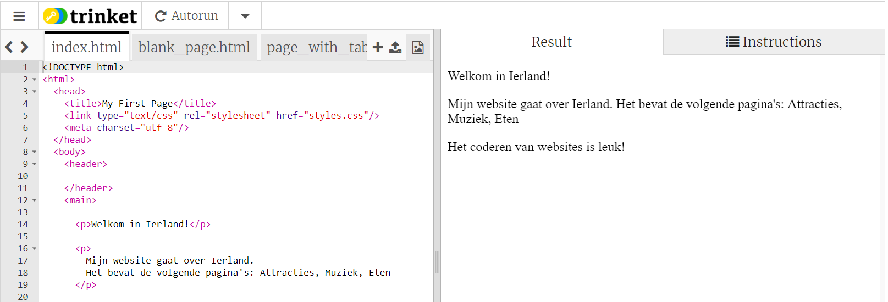
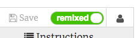

## Opstarten

- Ga naar [the starter trinket](https://trinket.io/html/7612ebf888). Je ziet een project met een voorbeeld van een website. Aan de rechterkant de website en aan de linkerkant staat de code die de website maakt. 

--- collapse ---
---
title: ik heb een Trinket-account
---

- Klik op de **remix** knop in de rechterbovenhoek van het project. Als je niet bent aangemeld, wordt gevraagd dit alsnog te doen. Nadat je bent ingelogd, moet je nogmaals op **Remix** te klikken. Als je op deze knop klikt, wordt een kopie van het project gemaakt waarmee je aan het werk kan. 

Het zou nadat je erop hebt geklikt **remixed** moeten zeggen:

--- /collapse ---

--- collapse ---
---
title: ik heb geen Trinket-account
---

Je kunt je werk opslaan met behulp van een van de opties in het menu **Share**. Je krijgt een link die je ergens kunt opslaan, bijvoorbeeld in een document, of via e-mail kunt versturen. **Opmerking:** elke keer dat je een wijziging aanbrengt, krijg je een nieuwe link.

Als je een account op Trinket wilt maken, volg je de onderstaande stappen. Hierdoor kun je eenvoudig vanaf elke computer toegang krijgen tot je werk en projecten die iemand anders met jou heeft gedeeld **remixen**. Remixen betekent dat je een kopie van een project opslaat zodat je je eigen wijzigingen kunt aanbrengen.

- Ga naar [de Trinket-website](http://dojo.soy/trinket) en klik op **Sign Up For Your Free Account**. Je hebt een e-mailadres nodig om je aan te melden.

- Geef je e-mailadres in en kies een wachtwoord, of vraag iemand om dit voor je te doen.

- Je hebt nu toegang tot al je opgeslagen of geremixte projecten door op je gebruikersnaam te klikken en naar **My Trinkets** te gaan. 

--- /collapse ---

Laten we beginnen met coderen!