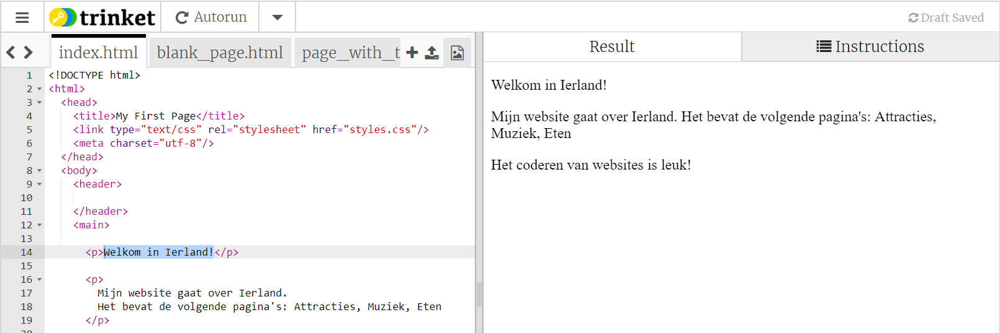
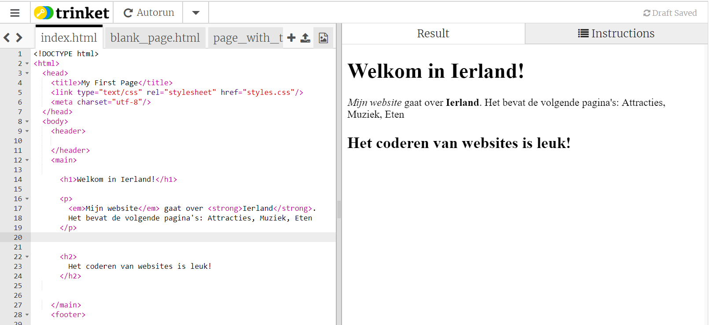

## Je eerste webpagina!

- In het linker deelvenster het **codepaneel**, klik op het tabblad met `index.html`.

- Zoek de regel met `Welcome to Ireland!` en verander het in je eigen bericht - wees voorzichtig dat je **niet** de tags `<p>` aan het begin van de regel en `</p>` aan het einde van de regel wist. Je zou de update van je webpagina in het rechter paneel moeten zien.



- Verander nu op dezelfde regel de `<p>` en ` </p>` door `<h1>` en ` </h1>`. Zie je de verandering aan de rechterkant?

```html
  <h1> Welkom in Nederland! </h1>
```

## \--- collapse \---

## titel: HTML en tags uitgelegd

**HTML** is de code die een webpagina maakt.

De `.html ` in de bestandsnaam vertelt de browser dat het bestand een webpagina is, waarna de browser naar ** -tags ** zoekt welke hem vertellen wat hij moet weergeven. (Een browser is het programma dat je gebruikt om naar websites te kijken, bijvoorbeeld Chrome of Firefox.)

HTML-tags zoals `<p>` en ` </p>` definieert verschillende delen van een pagina, bijvoorbeeld alinea's, koppen of de inhoud. Deze delen worden alle **elements (elementen)** genoemd. Zie ze als bouwstenen.

### Waarom heb ik twee tags nodig?

Je hebt een **opening** en een **closing (sluit)** tag nodig om de browser te vertellen waar de elementen **starten** en **eindigen**. Dus voor een alinea, de opening label `<p>` zegt "Hier komt wat tekst die ik wil weergeven als een alinea." De afsluitende `</p>` label vertelt de browser waar de alinea eindigt.

Alles tussen de `<body>` en ` </body>` tags is je webpagina.

- Let er op dat de afsluitende tag **altijd** een schuine streep ` / ` naar voren heeft.

\--- /collapse \---

- Probeer de cijfers in je **heading** tags te wijzigen om de verschillende mogelijkheden te laten zien. Ze kunnen gaan van `<h1>` helemaal tot aan de `<h6>`. Remember to change both the opening and closing tag so that they match.

- Find the code for the paragraph that says `My website is about Ireland.` and change it so that it looks like this:

```html
  <p>
    <em>My website</em> is about <strong>Ireland</strong>. 
    It is going to have the following pages: Attractions, Music, Food
  </p>
```

Can you work out what the `<em> </em>` and `<strong> </strong>` tags do?



\--- challenge \---

## Challenge: add some more text of your own

- Try adding a new paragraph or heading to your page using some of the tags you've learned about.

\--- hints \---

\--- hint \--- When you want to put text on a page, you need to put it in between two tags that tell your browser how to display your text. For example, the `<p> </p>` tags tell the browser that whatever is in between them is a new paragraph of text, and the `<h1> </h1>` tags tell it that the text in between is a heading.

\--- /hint \---

\--- hint \---

The code for paragraphs looks like this:

```html
  <p>This is one paragraph of text.</p>

  <p>This is another paragraph.
  Everything in between one set of p tags is 
  displayed together in one long line on the webpage.</p>
```

\--- /hint \---

\--- hint \---

The code for headings looks like this:

```html
  <h1>This is a heading.</h1>
```

Headings will normally be displayed bigger or bolder than the paragraphs.

\--- /hint \---

\--- /hints \---

\--- /challenge \---

Congratulations, you've built your first webpage! On the next card, you'll find out how to control how it looks.