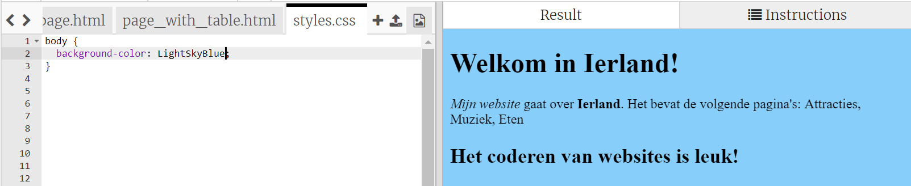
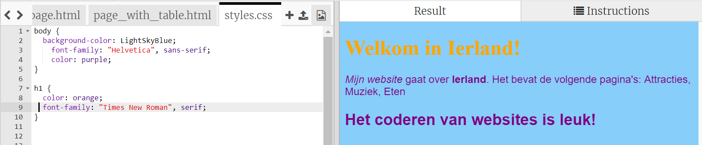

## Bepalen hoe het eruit ziet

De code die beschrijft hoe een website eruit ziet, wordt **CSS** genoemd.

- Kijk naar de tabbladen bovenaan het codepaneel en ga naar het bestand `styles.css` door op het tabblad met die naam te klikken. Het bestand bevat de volgende tekst:

```css
  body {
      background-color: white;
  }
```

- Verander de kleur `white` (wit) naar `LightSkyBlue` (lichtblauw) en kijk wat er gebeurt. Je website zou nu een blauwe achtergrond moeten hebben! 



## \--- collapse \---

## title: Hoe werkt het?

Als je naar de bovenkant van het `index.html` bestand kijkt, zie je de volgende regel:

```html
  <link type="text/css" rel="stylesheet" href="styles.css"/>
```

De bovenstaande regel vertelt de browser om te zoeken naar een speciaal bestand met de naam `styles.css`. Dit speciale bestand wordt een **style sheet** genoemd. Je kunt een style sheet (opmaakbestand) herkennen door de `.css` in de naam.

Een style sheet bevat **regels** voor hoe elk element op je webpagina eruit zou moeten zien.

De accolades `{ }` en de code ertussen is een set van **CSS-regels** . Het woord `body` betekent dat de regels voor alle `<body>` elementen op je website gelden. We noemen het woord voor de accolades een **selector**. Dus in dit geval is het de selector voor de body elementen.

Elke regel binnen de accolades bestaat uit:

- Een **property** (eigenschap) aan de linkerkant, gevolgd door een dubbele punt `:`
- Een **waarde** voor de eigenschap na de dubbele punt
- Een puntkomma `;` aan het einde

\--- /collapse \---

- Laat we regels toevoegen om de weergave van de tekst te veranderen. Voeg binnen de accolades twee nieuwe lijnen toe:

```css
  body {
    background-color: LightSkyBlue;
    font-family: "Helvetica", sans-serif;
    color: purple;
  }
```

Kijk hoe dit de webpagina heeft veranderd.

De `color` (kleur) eigenschap is altijd voor tekst. Hier stel je de kleur van alle tekst in de `body` van je webpagina in.

- Je kunt ook afzonderlijke regels schrijven voor de headings (koppen) en alinea's. Voor `<h1>`headings van gebruik je de`h1` selector. Na de sluit accolade die de CSS-regel voor de body bevat, voeg je de volgende code toe.

```css
  h1 {
    color: orange;
    font-family: "Times New Roman", serif;
  }
```

Je koptekst moet nu oranje zijn, met de alinea in het paars als voorheen.



Merk ook op hoe de letters er anders uitzien en ook een andere kleur hebben? Dit komt omdat je de **font family** (lettertype) hebt gewijzigd. Je kunt [hier](http://dojo.soy/web-font-families) meer lettertypes vinden.

- Probeer een set regels voor de `<h2>` headings toe te voegen met behulp van de `h2` selector.

- Waarom niet experimenteren met verschillende kleurencombinaties voor de tekst en achtergrond? Er zijn veel kleuren beschikbaar om te gebruiken. Vind [hier](http://dojo.soy/web-color-names) een volledige lijst.