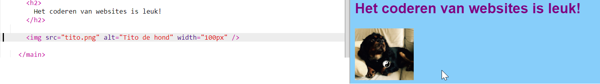
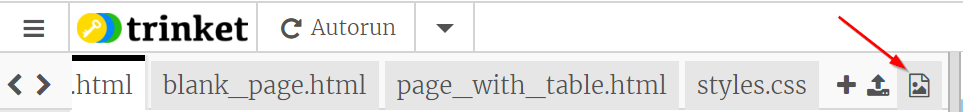
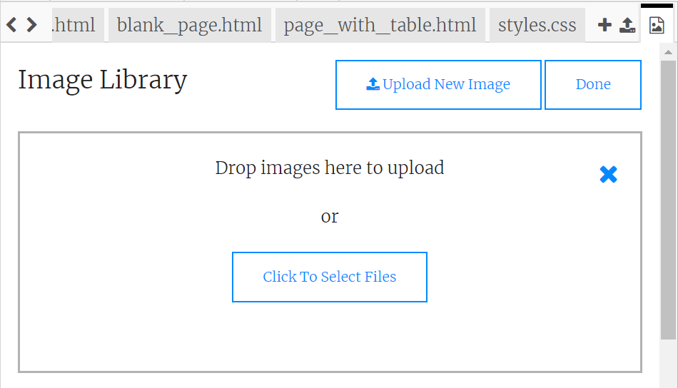

## Afbeeldingen toevoegen

Laten we een afbeelding toevoegen!

- Ga naar het tabblad met de naam `index.html`. Vind de `</main>` tag en typ het volgende **daarboven**: 

```html
    
```

Hier is hoe het resultaat eruit zou moeten zien:



Merk op dat deze tag extra stukjes informatie bevat. Ze worden **attributes** (attributen) genoemd.

- Zoek het stukje code met `width = "100px"` en probeer te experimenteren met verschillende getallen om te zien of je kunt achterhalen wat dit attribute doet. Verwijder niet de letters `px`!

--- collapse ---
---
title: Hoe de `img` tag werkt
---

Merk op dat de `` tag verschilt van de andere tags die je tot dusver hebt gebruikt, — er is geen sluit `</img>` tag. In plaats daarvan is deze tag **zelfsluitend**: het heeft `/>` aan het einde. Dit komt omdat er geen 'begin' en 'einde' aan een afbeeldingselement zit zoals er wel voor tekst op de pagina is.

De tag bevat **attributes** met extra informatie:

- Het `src` attribuut vertelt de browser welk bestand moet worden gebruikt voor de afbeelding. 
- Het `alt` attribute is een korte beschrijving die de browser zal weergeven als het de afbeelding niet kan weergeven. 'alt' is een afkorting voor 'alternatief'. Deze tekst helpt ook mensen die een schermlezer gebruiken om te weten wat de afbeelding weergeeft.
- Het `width` attribuut vertelt de browser hoe breed het de afbeelding moet weergeven. `100px` betekent honderd **pixels**, dat zijn de kleine puntjes die bepalen wat je op je scherm ziet. Als je dit kenmerk niet opneemt, wordt de afbeelding in de oorspronkelijke grootte weergegeven.

--- /collapse ---

Nu je de code kent om een ​​afbeelding op je website te plaatsen, wil je waarschijnlijk de afbeelding veranderen, toch?

- Het eerste dat je nodig hebt is natuurlijk een afbeelding of foto! Je kunt er een gebruiken die je al op je computer hebt staan, zoals een foto die je hebt gemaakt, of je kunt er een downloaden van internet.

[[[generic-get-picture-from-web]]]

**Opmerking:** niet alle afbeeldingen die je op internet vindt, zijn voor iedereen gratis te gebruiken. Als je een afbeelding downloadt, moet je ervoor zorgen dat dit er een is die je mag gebruiken. Lees hier meer over:

[[[images-permissions-to-use]]]

Zodra je een afbeelding of foto hebt, kun je het bestand **uploaden** naar Trinket:

- Klik in je trinket op het **image** pictogram naast het **+** teken. 



Dit is waar je de foto's kunt zien, die je kunt gebruiken op jouw website. Je zou de afbeelding van Tito, de CoderDojo-hond, moeten zien.

- Klik op de knop **Add Image** en klik vervolgens op **Upload**.

- Klik op de knop **Click To Select Files**. Zoek en dubbelklik op je afbeelding in het venster dat wordt geopend.

- Klik op **Done**.



Je foto wordt geüpload en moet klaar zijn voor gebruik.

- Ga naar het bestand `index.html` en zoek de `` tag. Wijzig de tekst `tito.png` zodat het precies overeenkomt met de naam van de afbeelding die je hebt gekozen. Merk op dat de naam eindigt op `.jpg` in plaats van `.png`!

De tekst die je zojuist hebt gewijzigd is het attribute met de naam `src`, die de browser vertelt welk bestand moet worden weergegeven.

**Opmerking:** de waarde die je typt voor een attribute moet tussen aanhalingstekens `""`staan!

--- challenge ---

## Uitdaging: verander de alt-tekst van de afbeelding

- Zoek het `alt` attribuut van je afbeelding en verander de tekst daarvan in een korte beschrijving van je afbeelding. 

--- /challenge ---