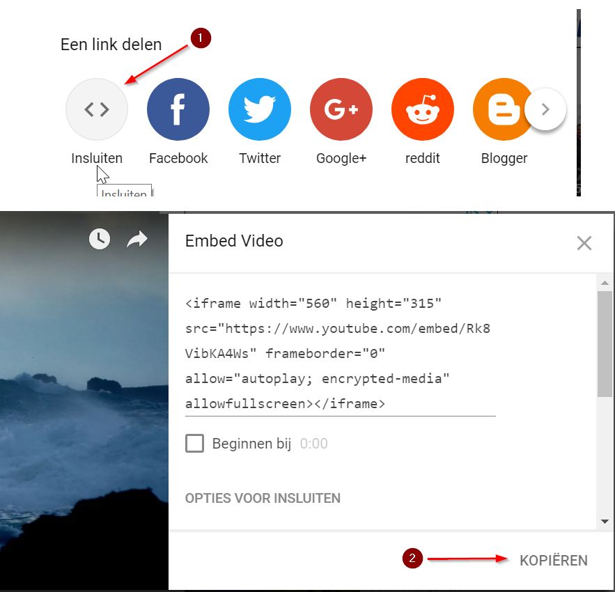
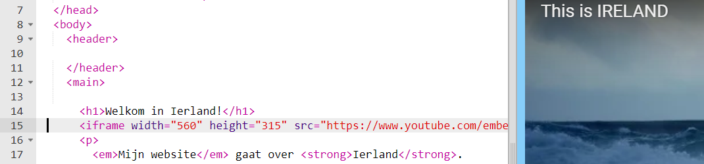
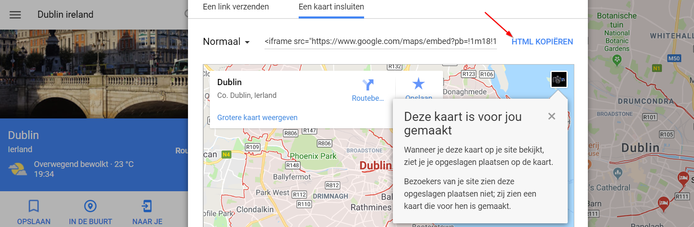
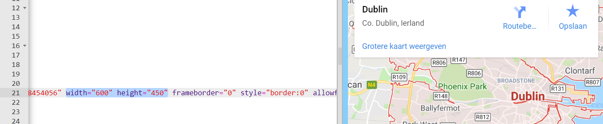

## Een kaart of video toevoegen

YouTube biedt een eenvoudige manier om video's aan je website toe te voegen. Het toevoegen van elementen uit andere online bronnen aan je website wordt ook wel **embedding** (insluiten) genoemd.

- Zoek een video op YouTube die je op je website wilt laten zien.

- Klik op de **Delen** knop onder de video. Klik op **KOPIËREN**.

Je ziet een tekstvak met: Link gekopieerd naar klembord. Als je per ongeluk de selectie van de tekst ongedaan maakt, kun je alles opnieuw selecteren door op de <kbd>Ctrl</kbd> toets (of <kbd>cmd</kbd> toets op een Mac) en de <kbd>A</kbd> toets tegelijkertijd in te drukken.

- Klik op de KOPIËREN knop om de tekst te kopiëren.

- Ga vervolgens terug naar de HTML-code van je website en klik op de plaats waar je de video wilt plaatsen, bijvoorbeeld onder een kop of alinea. **Plak** de code door tegelijkertijd op <kbd>Ctrl</kbd> (of <kbd>cmd</kbd> op een Mac) en <kbd>V</kbd> toets te drukken. Maak je geen zorgen als je de code die je zojuist hebt geplakt niet begrijpt!

Je zou de video op je webpagina moeten zien verschijnen.

Dezelfde techniek werkt ook voor Google-kaarten. Probeer het eens!

- Ga [hier](http://dojo.soy/google-maps) naartoe en zoek naar een plaats die je op je website wilt laten zien. **Opmerking:** deel **geen** persoonlijke informatie zoals je huisadres op een website!

- Klik op het menu en klik vervolgens op **kaart delen of insluiten**, vervolgens op het tabblad **Een kaart insluiten** en dan op **HTML KOPIËREN** om de code te kopiëren en voeg deze zoals hierboven toe aan je website. 

- Als je goed kijkt, vindt je `width` en `height` **attributen** in de geplakte code. Je kunt hun waarden wijzigen om de kaart groter of kleiner te maken.

