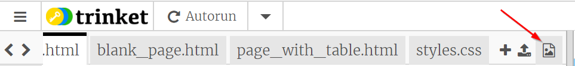

## Afbeeldingen toevoegen

Laten we een afbeelding toevoegen!

- Ga naar het tabblad met de naam ` index.html `. Vind het `</main>` label en typ het volgende **daarboven**: 

```html
    
```

Hier is hoe het resultaat eruit zou moeten zien:


Merk op dat deze tag extra stukjes informatie bevat. Ze worden ** attributes ** (attributen) genoemd.

- Zoek het stukje code met ` width = "100px" ` en probeer te experimenteren met verschillende nummers om te zien of je kunt achterhalen wat dit attribute doet. Verwijder niet de letters `px`!

\--- collapse \---

* * *

## title: Hoe het `` tag (label) werkt

Merk op dat de `` tag verschilt van de andere tags die je tot dusver hebt gebruikt, — er is geen sluit `</img>` tag. In plaats daarvan is deze tag ** zelfsluitend **: het heeft ` />` aan het einde. Dit komt omdat er geen 'begin' en 'einde' aan een afbeeldingselement zit zoals er wel voor tekst op de pagina is.

De tag bevat ** attributes ** met extra informatie:

- Het ` src ` attribuut vertelt de browser welk bestand moet worden gebruikt voor de afbeelding. 
- Het ` alt ` attribute is een korte beschrijving die de browser zal weergeven als het de afbeelding niet kan weergeven. 'alt' is een afkorting voor 'alternatief'. Deze tekst helpt ook mensen die een schermlezer gebruiken om te weten wat de afbeelding weergeeft.
- Het ` with ` attribuut vertelt de browser hoe breed het de afbeelding moet weergeven. ` 100px ` betekent honderd ** pixels **, dat zijn de kleine puntjes die beplalen wat je op je scherm ziet. Als je dit kenmerk niet opneemt, wordt de afbeelding in de oorspronkelijke grootte weergegeven.

\--- /collapse \---

Nu je de code kent om een ​​afbeelding op je website te plaatsen, wil je waarschijnlijk de afbeelding veranderen, toch?

- Het eerste dat je nodig hebt is natuurlijk een afbeelding of foto! Je kunt er een gebruiken die je al op je computer hebt staan, zoals een foto die je hebt gemaakt, of je kunt er een downloaden van internet.

[[[generic-get-picture-from-web]]]

** Opmerking: ** niet alle afbeeldingen die je op internet vindt, zijn voor iedereen gratis te gebruiken. Als je een afbeelding downloadt, moet je ervoor zorgen dat dit er een is die je mag gebruiken. Lees hier meer over:

[[[images-permissions-to-use]]]

Zodra je een afbeelding of foto hebt, kun je het bestand ** uploaden ** naar Trinket:

- Klik in je trinket op het **image** pictogram naast het ** + ** teken. 



Dit is waar je de foto's kunt zien, die je kunt gebruiken op jouw website. You should see the picture of Tito, the CoderDojo dog.

- Click the button **Add Image** and then click **Upload**.

- Click on the button **Click To Select Files**. Find and double-click your image file in the window that opens.

- Click **Done**.


Your picture will be uploaded and should be ready to use.

- Go to the file `index.html` and find the `` tag. Change the text `tito.png` so that it exactly matches the name of the image file you've chosen. Note that its name might end in `.jpg` instead of `.png`!

The text you just changed is the attribute called `src`, which tells the browser which file to display.

**Note:** the value you type for an attribute must have quotation marks `""` around it!

\--- challenge \---

## Challenge: change the alt text of the picture

- Find the `alt` attribute of your image element and change the text in it to a short description of your picture. 

\--- /challenge \---