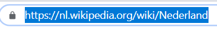
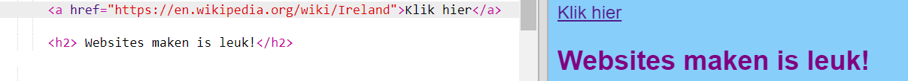

## Links maken

Op deze kaart leer je hoe je een link kunt maken die, wanneer er op wordt geklikt, je naar een andere pagina brengt.

- Voeg de volgende code toe aan het hoofdgedeelte van `index.html`:

```html
  <a href="">Klik hier</a>
```

De `<a> </a>` tags veranderen alles wat er tussenin zit in een link.

- Klik op je link om te zien wat er gebeurt. Het doet niets, toch?

Dat komt omdat het `href` attribuut momenteel leeg is. Het moet de **URL** (webadres) bevatten van de pagina waarnaar je een koppeling wilt maken.

- Ga naar Wikipedia en vind een pagina over iets op jouw website. Ik ga de pagina over Ierland gebruiken.

- Klik in de adresbalk en selecteer alle tekst erin. Dat is de volledige URL van de pagina waarop je je bevindt. Druk tegelijkertijd op de <kdb>Ctrl</kdb> (of <kdb>cmd</kdb>) en <kdb>C</kdb> toetsen om het te kopiëren.
    
    

- Klik in je trinket tussen de aanhalingstekens na `href =` en druk tegelijkertijd op de <kdb>Ctrl</kdb> (of <kdb>cmd</kdb>) en <kdb>V</kdb> toetsen om de URL die je zojuist gekopieerd hebt te plakken. Je code zou er ongeveer als volgt uit moeten zien:

```html
  <a href="https://en.wikipedia.org/wiki/Ireland">Klik hier</a>
```

Je hebt zojuist je eerste link gemaakt! Klik erop om te zien of het nu werkt.



## \--- collapse \---

## title: links naar andere websites

Trinket heeft met sommige webadressen problemen. Je kunt desgewenst URL's van andere websites dan Wikipedia proberen, maar deze werken mogelijk niet in jouw trinket. Als je echter je project zou downloaden en de bestanden in een webbrowser zou zien, zouden de koppelingen moeten werken.

\--- /collapse \---

- Probeer in plaats van de woorden `Klik hier`, een foto tussen de `<a> </a>` tags te plaatsen, zoals hier:

```html
  <a href="https://en.wikipedia.org/wiki/Ireland">
      
  </a>
```

- Klik op de afbeelding. Zie je dat het een link is geworden?

Je kunt ook een link naar andere elementen van je webpagina plaatsen, zoals naar een alinea of ​​zelfs naar een lijst. Hier is een voorbeeld van een zin met een link erin:

```html
  <p>
    <a href="https://en.wikipedia.org/wiki/Ireland">Klik hier</a> om de Wikipedia-pagina te lezen!
  </p>
```

\--- challenge \---

## Uitdaging: zet een link in een lijst

- Kijk of je een lijst kunt maken met een link in een van de cellen van de lijst.

\--- /challenge \---