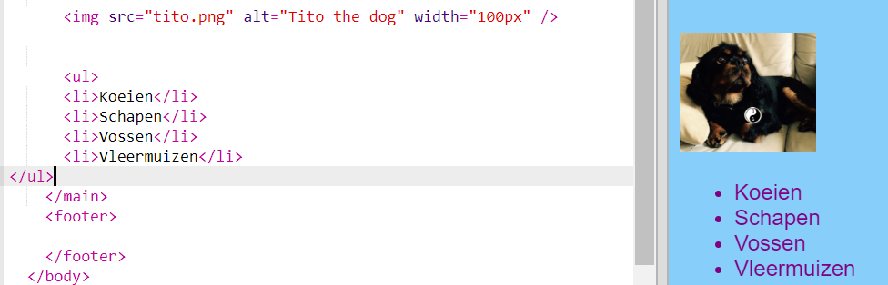
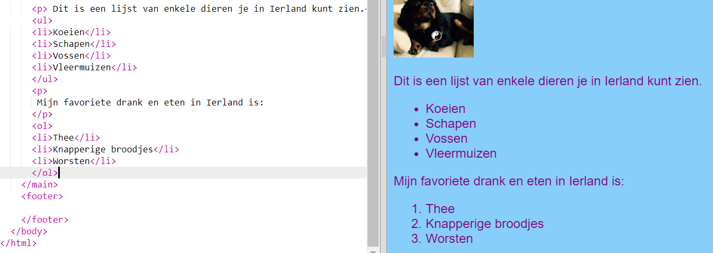

## Een lijst maken

Nu leer je hoe je een lijst met items, zoals "eenhoorns, robots, katten", in een mooier uitziende lijst kunt veranderen zodat je er later heel leuke dingen mee kan doen.

- Voeg in het `index.html` bestand, net boven de regel met `</main>` de volgende code toe:

```html
    <ul>
        <li>Koeien</li>
        <li>Schapen</li>
        <li>Vossen</li>
        <li>Vleermuizen</li>
</ul>
```

Het resultaat zou een mooie lijst als deze moeten zijn:



Merk steeds een aparte paar `<li></li>` tags rond elk item in de lijst op.

Dit is een lijst van enkele dieren je in Ierland kunt zien. Je kunt de items in de lijst wijzigen in dingen die logisch zijn voor jouw website, en een alinea boven de lijst toevoegen om te beschrijven wat de lijst bevat, als je dat wilt!

Wat dacht je ervan een genummerde lijst te maken? Het is bijna hetzelfde, maar in plaats van `<ul>`gebruikt je`<ol>`. Een genummerde lijst wordt ook wel een **ordered** (gerangschikte) lijst genoemd.

- Voeg onder de code die je zojuist geschreven hebt, de onderstaande code toe - zorg ervoor dat deze ** onder** het `</ul>` label staat!

```html
    <p>
        Mijn favoriete drank en eten in Ierland is:
    </p>
    <ol>
        <li>Thee</li>
        <li>Knapperige broodjes</li>
        <li>worsten</li>
    </ol>
```

Zo zou het er nu uit zou moeten zien:



\--- challenge \---

## Uitdaging: voeg stijl toe aan je lijsten

- Kijk of je ** CSS-regels** aan je stylesheet kunt toevoegen om je lijsten er anders uit te laten zien.

\--- /challenge \---