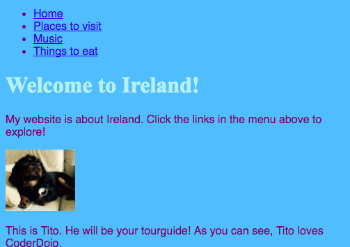

## Navigarea pe site-ul dvs. web

Multe site - uri au un **de navigare** meniu pentru a ajuta vizitatorii deplasa între pagini. Acum, că aveți o mulțime de pagini, o pagină de pornire și linkuri către fiecare pagină, hai să mutăm lista de linkuri către o secțiune de navigare din partea de sus a fiecărei pagini.



- Găsiți codul pentru lista dvs. de linkuri pe care le-ați creat în etapa anterioară.

- Chiar înainte de eticheta de deschidere `<ul>` , apăsați **Enter** pentru a crea o linie nouă, apoi pe noua linie introduceți următoarea etichetă: `<nav>`. Trinket adaugă automat eticheta de închidere imediat după, dar o puteți șterge - nu este în locul potrivit.

- Doar **după** eticheta de închidere `</ul>` , apăsați **Introduceți** pentru a crea o linie nouă și introduceți eticheta de închidere `</nav>` acolo.

- Now select your entire `<nav>` section and list by clicking just before the opening `<nav>` tag and dragging the mouse all the way down to just after the closing `</nav>` tag, so that all of the text including the opening and closing tags becomes highlighted. Make sure all of the **angle brackets** `<` and `>` at the start and end are highlighted as well!


- You are going to **cut** this time instead of copying. Hold down the <kbd>Ctrl</kbd> (or <kbd>cmd</kbd>) key, and while holding it, press the <kbd>X</kbd> key. The highlighted code will disappear, but don't panic!

- At the top of the file, click in the space between the `<header> </header>` tags. Make sure you see the cursor flashing there. Now paste in the code by pressing <kbd>Ctrl</kbd> (or <kbd>cmd</kbd>) and <kbd>V</kbd> as usual. The code should look something like this:

```html
    <header>
        <nav>
            <ul>
            <li><a href="index.html">Home</a></li>
            <li><a href="attractions.html">Places to visit</a></li>
            <li><a href="music.html">Music</a></li>
            <li><a href="food.html">Things to eat</a></li>
            </ul>
        </nav>
    </header>
```

## \--- collapse \---

## title: Undo!

If you make a mistake, you can **undo** it by pressing <kbd>Ctrl</kbd> (or <kbd>cmd</kbd>) and <kbd>Z</kbd> together. You can usually press this key combination a few times to undo the last few changes. This is another handy keyboard shortcut that you can use in many programs!

\--- /collapse \---

- Try out your links to make sure they are still working.

\--- challenge \---

## Challenge: navigation menus for all pages

- Put this code section into the header section of each HTML file that you've created. This will make the navigation menu appear at the top of every page on your website.
    
    \--- hints \---
    
    \--- hint \--- Select the entire `<nav>` section like you did before, and press the <kbd>Ctrl</kbd> (or <kbd>cmd</kbd>) and <kbd>C</kbd> keys together to copy it.

Then, in each of your `.html` files, click inside the `<header> </header>` section and paste the code exactly like you did earlier. \--- /hint \---

\--- /hints \---

Now you will be able to click the links no matter which page you are on.

\--- /challenge \---