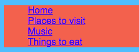

## Efectuarea unei bare de meniu

Pe acest card veți vedea cum puteți transforma meniul de navigare într-o bară de meniu interesantă, adăugând mai multe reguli CSS în foaia de stil.


- Accesați fișierul foaie de stil din fila `styles.css`. Dați clic pe **mai jos** o breșă de încheiere curată `}`și apăsați **Introduceți** pentru a crea o linie nouă. Adăugați următoarea regulă CSS:

```css
    nav ul {culoare-fundal: tomate; }
```

Observați cum ați folosit doi selectori în loc de unul? Dacă ați folosit selectorul `ul` singur, regula ar afecta toate listele neordonate de pe site-ul dvs. Web. Adăugarea selectorului `nav` face ca acesta să se aplice numai listelor care se află între `etichete nav`.


Să scăpăm de punctele glonțului. Acestea sunt punctele din fața fiecărui element din listă.

- Adăugați următoarele în fișierul `styles.css`. Din nou, tastați-l pe o linie nouă după un `}` deci nu este în interiorul niciunui alt bloc de reguli.

```css
    nav ul li {lista-tip-tip: nici unul; }
```

Observați că acest set de reguli are trei selectori: selectează toate cele `li` elemente care se află într-o listă de `ul` care se află în interiorul unei secțiuni `nav`. Pfiu!



Acum să facem lista orizontală (peste) în loc de verticală (în jos).

- În noua regulă CSS pe care tocmai ați creat-o, adăugați următoarea linie: `afișare: inline;`.


- Elementele de meniu sunt acum toate combinate, deci, să adăugăm și proprietățile `margin-right` și `margin-left` pentru a le distanța puțin. Blocul codului CSS ar trebui să arate astfel:

```css
    nav ul li {lista-tip-tip: nici unul; afișare: inline; margin-dreapta: 10px; margin-stânga: 10px; }
```

Amintiți-vă: `10px` înseamnă 10 pixeli.

Cum de a face schimbarea meniului pentru a vă spune care este pagina pe care vă aflați? Această parte nu va fi în foaia de stil.

- Începeți cu pagina de pornire. Accesați fișierul index.html ``. În lista de link-uri de meniu, eliminați etichetele de legătură înainte și după cuvântul `Pagina principală`, astfel încât elementul de listă pentru pagina de pornire să fie doar text între `<li> </li>` etichete, după cum urmează: `<li>Home</li>`.

- Acum mergeți la fiecare dintre celelalte fișiere ale dvs. și faceți același lucru, de fiecare dată când eliminați etichetele de legătură pentru pagina pe care o editați. Deci, de exemplu, pe `muzică.html` dosar, l - am eliminat etichetele link - ul din `Muzică` elementul listă:

```html
    <header>
        <nav>
            <ul>
            <li><a href="index.html">Acasă</a></li>
            <li><a href="attractions.html">Locuri de vizitat</a></li>
            <li>Muzică</li>
            <li><a href="food.html">Lucruri de mâncare</a></li>
            </ul>
        </nav>
    </header>
```

- Explorați paginile făcând clic pe link-uri. Vedeți cum arată bara de meniuri pagina în care vă aflați ca text simplu în locul unui link? 


Pe următoarea carte veți afla mai multe trucuri CSS pentru a face bara de meniu să arate minunat.